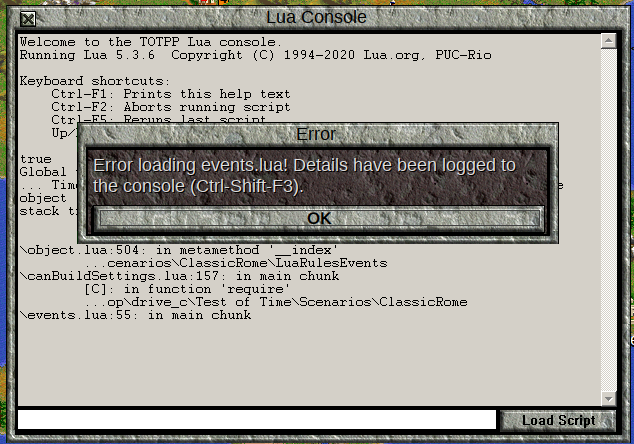
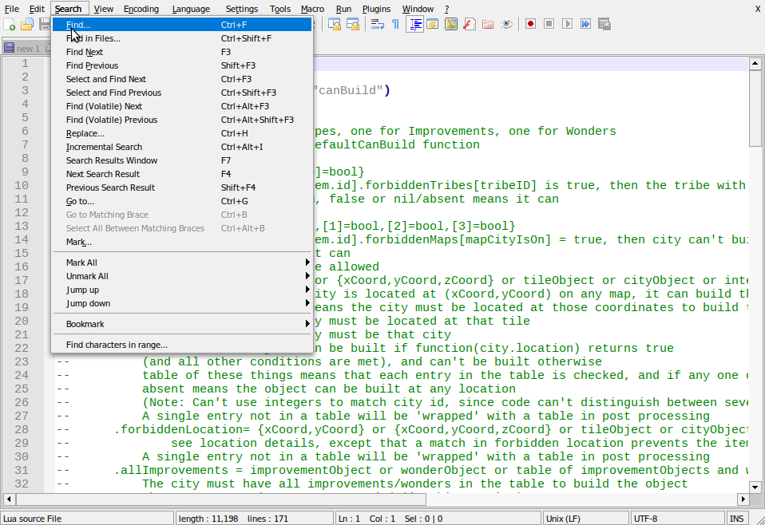
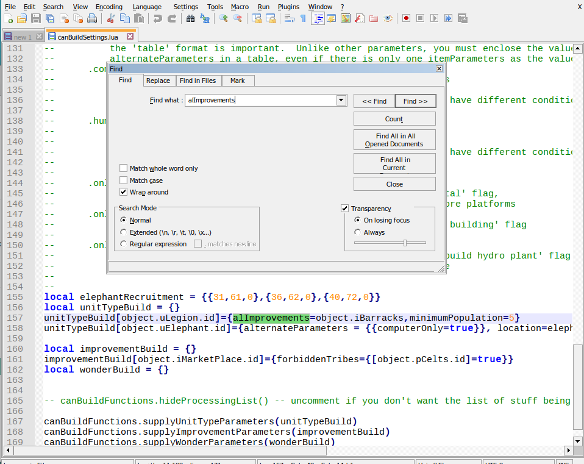

[&larr;Lua Basics](LuaBasics.md) | [Home](index.md) | [Building Our First Event&rarr;](BuildingFirstEvent.md)

# Buildability Settings and Errors
## Changing Buildabilty Settings

With this our knowledge of tables, we can now return to the `canBuildSettings.lua` file in the `LuaRulesEvents` folder.

The way this file works is that there are 3 tables that provide all the information for what can and can't be built.  `unitTypeBuild` is for units, `improvementBuild` is for improvements, and `wonderBuild` is for Wonders of the World.  All three of these tables are indexed (key) by the `id` number of their respective `object`.  That is to say, if you want to set the buildability settings for an object, you place the table expressing those settings with the key given by that object's `id` number.  The example we already have will make this clearer:

```lua
unitTypeBuild[object.uLegion.id]={allImprovements={object.iBarracks}}
```
We want to restrict legions to be built only in towns with a Barracks, so we make a key in the `unitTypeBuild` table, and that key is the `id` of the Legion `unitType`, which we get from `object.uLegion.id`.  Why is this?

In the file `object.lua` (in `LuaParameterFiles` directory), all the unit type objects are put into a table, indexed by appropriate keys:

```lua
-- Unit Types
-- recommended key prefix 'u'

object.uSettlers                = civ.getUnitType(0)
object.uEngineers               = civ.getUnitType(1)   --Engineers
object.uWarriors                = civ.getUnitType(2)
object.uPhalanx                 = civ.getUnitType(3)
object.uArchers                 = civ.getUnitType(4)
object.uLegion                  = civ.getUnitType(5)
object.uPikemen                 = civ.getUnitType(6)
object.uMusketeers              = civ.getUnitType(7)
object.uFanatics                = civ.getUnitType(8)
object.uPartisans               = civ.getUnitType(9)
object.uAlpineTroops            = civ.getUnitType(10)
object.uRiflemen                = civ.getUnitType(11)
object.uMarines                 = civ.getUnitType(12)
object.uParatroopers            = civ.getUnitType(13)
object.uMechInf                 = civ.getUnitType(14)
```
The keys are based on the name of the unit type, since that was how they were generated.  The keys don't *have* to be the unit name, as long as they are valid variable names (note `uMechInf`), but it makes sense to be similar for ease of use.  So, the legion `unittype` is stored in `object.uLegion`, and we access it that way, so our code is readable.  Finally, using `.id` (`object.uLegion.id`), we get the relevant id number to provide as the key for `unitTypeBuild`.

  Note that for the `object` table to be available in the `canBuildSettings.lua` file, there is a line at the top of the file:

```lua
local object = require("object")
```
We'll see more about the `require` function later.

Returning to our example, we would now like to know why 
```lua
{allImprovements={object.iBarracks}}
```
restricts the construction of the Legion to cities with Barracks improvements.

To understand, we must first look at the documentation comments in the file:
```lua
-- canBuildParameters
--      Three tables, one for unitTypes, one for Improvements, one for Wonders
--      absent entry means use the defaultCanBuild function
-- canBuildObjectType[item.id]= {
```
This tells us that there are 3 separate tables, as mentioned before, and that if there is no entry in the table for a particular item, the game's default behaviour is used.
`canBuildObjectType[item.id]=` indicates that the keys for the tables are the item id numbers.  `={` indicates that the item's settings table has the following form.
```lua
--      .allImprovements = improvementObject or wonderObject or table of improvementObjects and wonderObjects
--          The city must have all improvements/wonders in the table to build the object
--          absent means no improvements needed (in this section)
--          A single entry not in a table will be 'wrapped' with a table in post processing
```
```lua
--      .allImprovements = improvementObject or wonderObject or table of improvementObjects and wonderObjects
```
This line means that we're discussing the "allImprovements" key for the table.  On the right hand side of the `=` is the possible values that can be validly assigned to this key.  In this case, it can be an improvementObject, a wonderObject, or a table of those objects.  Note that strings with the names of the improvements, or the improvement id numbers are not acceptable.  You must use the corresponding `object`.  If the value is a table, the keys don't matter, since they were not specified. 

Based on this, we select `object.iBarracks` from `object.lua` to specify that we want to require a Barracks in the city.

```lua
--          The city must have all improvements/wonders in the table to build the object
```
This explains the effect this key has on the buildability of the item in question.  In this case, it explains that all improvements and wonders in the table are required in the city to be able to build the object.
```lua
--          absent means no improvements needed (in this section)
```
This explains what happens if this particular key is left as `nil` (i.e. not provided)
```lua
--          A single entry not in a table will be 'wrapped' with a table in post processing
```
This is documenting what happens if you provide a single item instead of a table of items.  You don't need to worry about this, it is 'maintenance' information, but there is at least one key where you *must* wrap even a single item in a table, so keep an eye out for `alternateParameters`, where the message is different.

All this information means that we could have instead written

```lua
unitTypeBuild[object.uLegion.id]={allImprovements=object.iBarracks}
```
but we would have to remember to add in the `{}` around `object.iBarracks` if we add a second building requirement.

Now, let us make some other restriction.  We will require a population of 5 in a city in order to build legions.

```lua
--      .minimumPopulation = integer
--          the city must have at least this many citizens to build the item
--          absent means 0
```
From this information, we change the Legion table as follows:
```lua
unitTypeBuild[object.uLegion.id]={allImprovements=object.iBarracks,minimumPopulation=5}
```
Save `canBuildSettings.lua` and open the game to check this new restriction.  (If you get an error while loading, just cut and paste the code from this guide.  We'll deal with errors in the next section.)  Only one city has a barracks, so you'll have to cheat a couple more in to verify that this works.  Now, let us restrict construction of Elephants to certain cities:

```lua
--      .location = {xCoord,yCoord} or {xCoord,yCoord,zCoord} or tileObject or cityObject or integer or function(tileObject)-->boolean or table of these kinds of objects
--          {xCoord,yCoord} if the city is located at (xCoord,yCoord) on any map, it can build the object
--          {xCoord,yCoord,zCoord} means the city must be located at those coordinates to build the object
--          tileObject means the city must be located at that tile
--          cityObject means the city must be that city
--          function means object can be built if function(city.location) returns true 
--          (and all other conditions are met), and can't be built otherwise
--          table of these things means that each entry in the table is checked, and if any one of them means the object can be built, then it can be built
--          absent means the object can be built at any location
--          (Note: Can't use integers to match city id, since code can't distinguish between several cities and a coordinate triple)
--          A single entry not in a table will be 'wrapped' with a table in post processing
```

This tells us there are a number of ways to specify that an object can only be built in certain locations.  For now, we will restrict elephant construction to Hippo Regius, Carthage, and Leptis.  We'll specify these locations using coordinate triples:

```lua
local elephantRecruitment = { {31,61,0},{36,62,0},{40,72,0} }
local unitTypeBuild = {}
unitTypeBuild[object.uLegion.id]={allImprovements=object.iBarracks, minimumPopulation=5}
unitTypeBuild[object.uElephant.id]={location=elephantRecruitment}

local improvementBuild = {}
local wonderBuild = {}
```
Note that elephantRecruitment is defined in a table stored as a local variable, and we access it later.  This is convenient if we want to reuse the elephantRecruitment information, and it may also make the code a bit more readable.

Save `canBuildSettings.lua` and re-load the game.  Reveal the map, and check that Hippo Regius, Carthage, and Leptis can build Elephants, but the other Carthaginian cities can't.

Now, let us make this last restriction apply only to human players.  We'll do this using alternateParameters and computerOnly.

```lua
--      .alternateParameters = table of itemParameters
--          itemParameters is this table of restrictions on whether a given item can be produced
--          if the item in question satisfies any of the itemParameters in the table, it can be produced,
--          regardless of whether the 'top' itemParameters are satisfied
--          use this (or overrideFunction) if you want to have more than one valid way to produce the item
--          the 'table' format is important.  Unlike other parameters, you must enclose the value of 
--          alternateParameters in a table, even if there is only one itemParameters as the value
--      .computerOnly = bool or nil
--          if true, item can only be built by computer controlled players
--          if false or nil, either human or AI players can build
--          (in conjunction with alternateParameters, this can be used to have different conditions for the
--          ai and human players)
```
The `computerOnly` restriction is easy enough to understand.  For `alternateParameters`, you provide the exact same kind of table that you would provide to specify buildability if you weren't having alternate legitimate ways of building the item.  Note that even if you only provide one table of alternate parameters, you must wrap it in a table.  (This is to make the code in `canBuild.lua` work properly.)

```lua
unitTypeBuild[object.uElephant.id]={alternateParameters = { {computerOnly=true} }, location=elephantRecruitment}
```

Change the Elephant restriction as shown above, save the settings, and re-load the game.  Elephants should now be buildable everywhere by the Carthaginians.  Set yourself to the Carthaginian player, and see the restriction apply to you.

Now, let us forbid the Celts from building marketplaces.

```lua
--      .forbiddenTribes = {[tribeID]=bool}
--          if canBuildObjectType[item.id].forbiddenTribes[tribeID] is true, then the tribe with
--          tribeID can't build item, false or nil/absent means it can
```
What this means, is we must supply a table for this parameter.  The keys of the table will be tribe id numbers, and if the corresponding value is true, they can't build that item.

Since we're making a restriction on Market Places, we use the `improvementBuild` table:
```lua
improvementBuild[object.iMarketPlace.id]={forbiddenTribes={[object.pCelts.id]=true}}
```
Reload, and check that the Celts can't build Market Places (they *do* have currency at the start of the scenario).

## Errors with the Can Build Event Settings

When programming, you will frequently run into errors.  We will now begin examining errors and fixing them.  We will begin by 'mistyping' `object.iBarracks`.  Change
```lua
unitTypeBuild[object.uLegion.id]={allImprovements=object.iBarracks,minimumPopulation=5}
```
to
```lua
unitTypeBuild[object.uLegion.id]={allImprovements=object.iBarrack,minimumPopulation=5}
```
(remove the `s` from `iBarracks`).
Save the file, and load the game.  You should immediately get an error:



If the console doesn't stay open when you press `OK`, open it.  You should get this information:

```
true
Global variables are disabled
... Time\Scenarios\ClassicRome\LuaParameterFiles\object.lua:504: The object table doesn't have a value associated with iBarrack.
stack traceback:
	[C]: in function 'error'
	... Time\Scenarios\ClassicRome\LuaParameterFiles\object.lua:504: in metamethod '__index'
	...cenarios\ClassicRome\LuaRulesEvents\canBuildSettings.lua:157: in main chunk
	[C]: in function 'require'
	...op\drive_c\Test of Time\Scenarios\ClassicRome\events.lua:55: in main chunk
```
```
... Time\Scenarios\ClassicRome\LuaParameterFiles\object.lua:504: The object table doesn't have a value associated with iBarrack.
```
For many errors, the error is triggered on purpose by the programmer, using the `error` function.  That is the case here.  The `\object.lua:504:` tells that the error was triggered at line 504 in the `object.lua` file.  (Your `object.lua` file might be slightly different, so the lines might not match up.)  The message is

>The object table doesn't have a value associated with iBarrack.

This tells us that we've probably mistyped something somewhere.  Either we want an entry `iBarrack` in the `object` table and don't have one, or, as is the case here, we typed `iBarrack` when we should have typed something else.

But, how do we find out where the error is?  For that, we check the rest of the error message:


>stack traceback:
>
>	[C]: in function **'error'**
>
>	... Time\Scenarios\ClassicRome\LuaParameterFiles\\**object.lua:504:**
>
> in **metamethod '__index'**
>
>	...cenarios\ClassicRome\LuaRulesEvents\\**canBuildSettings.lua:157:** in main chunk
>
>	[C]: in **function 'require'**
>
>	...op\drive_c\Test of Time\Scenarios\ClassicRome\\**events.lua:55:** in main chunk

The bold tells us what the Lua Interpreter was doing at the time of the error, and what file and line that corresponds to.  `events.lua` isn't a file we should be modifying, so we won't look there unless we either need clues to solve our problem, or we're pretty sure the rest of our code is correct.  If we look in object.lua near line 504, we get

```lua
-- this will give you an if you try to access a key not entered into
-- the object table, which could be helpful for debugging, but it
-- means that no nil value can ever be returned for table object
-- If you need that ability, comment out this section
setmetatable(object,{__index = function(myTable,key)
    error("The object table doesn't have a value associated with "..tostring(key)..".") end})

return object
```
The line beginning with `error` happens to be line 504.  The comments here say this produces an error supposed to produce the error, so it is probably not what we want.  Let's look at `canBuildSettings.lua` line 157:

```lua
unitTypeBuild[object.uLegion.id]={allImprovements=object.iBarrack,minimumPopulation=5}
```
This line has the `iBarrack` in it.  This is where the typo is.  We search `object.lua` and find that it is supposed to be `iBarracks`, so we correct the spelling mistake, and load the game again to make sure everything works.  If there was nothing like `iBarrack` in the `object.lua` file, the solution might have been to add the reference there, instead, since it seems we want it.

Next, let us misspell `allImprovements` in the Legion settings.  We'll call it `alImprovements`.

```lua
unitTypeBuild[object.uLegion.id]={alImprovements=object.iBarracks,minimumPopulation=5}
```
The console gives us the following information:
```
true
Global variables are disabled
Unit Type Parameters entry 5 has invalid parameter: alImprovements
...\Test of Time\Scenarios\ClassicRome\LuaCore\canBuild.lua:330: Unit Type Parameters has invalid parameters.  See the list printed above.
stack traceback:
	[C]: in function 'error'
	...\Test of Time\Scenarios\ClassicRome\LuaCore\canBuild.lua:330: in upvalue 'parameterTableErrorCheck'
	...\Test of Time\Scenarios\ClassicRome\LuaCore\canBuild.lua:346: in function 'canBuild.supplyUnitTypeParameters'
	...cenarios\ClassicRome\LuaRulesEvents\canBuildSettings.lua:167: in main chunk
	[C]: in function 'require'
	...op\drive_c\Test of Time\Scenarios\ClassicRome\events.lua:55: in main chunk
```
Our message this time is

>Unit Type Parameters has invalid parameters.  See the list printed above.

The 'list' (of one item) above is:

>Unit Type Parameters entry 5 has invalid parameter: alImprovements

This tells us that the Unit Type Parameters for key 5 has an invalid parameter, called `alImprovements`.

In this instance, none of the 4 locations in the code will help us fix this problem.  The line 167 in `canBuildSettings.lua` is the line that supplies the buildability parameters for units.  The error is generated as part of a check to make sure the data provided is correct.  The error does tell us where the problem is, sort of.  We know the relevant key is `5` in the unitTypeTable.  We can go to `object.lua` to find the unit type with id number 5:

```lua
object.uArchers                 = civ.getUnitType(4)
object.uLegion                  = civ.getUnitType(5)
object.uPikemen                 = civ.getUnitType(6)
```
This tells us the problem is in the Legion setting.

Alternatively, since we know what the invalid parameter is, we can search for `alImprovements` and discover where it is, and fix it.  If your text editor doesn't have a search feature, get a different one.  Seriously.  (But it probably does, so just find it.)  In Notepad++, the search looks like this:





Make the fix, and load the game again to check that it works.

For our next error, we'll misspell elephantRecruitment (we'll forget the t in elephant) when we define it:
```lua
local elephanRecruitment = { {31,61,0},{36,62,0},{40,72,0} }
```

The console gives a lot of information this time:

```
true
Global variables are disabled
...of Time\Scenarios\ClassicRome\LuaCore\generalLibrary.lua:2791: 
The variable name 'elephantRecruitment' doesn't match any available local variables.
Consider the following possibilities:
Is 'elephantRecruitment' misspelled?
Was 'elephantRecruitment' misspelled on the line where it was defined?
(That is, was 'local elephantRecruitment' misspelled?)
Was 'local elephantRecruitment' defined inside a lower level code block?
For example:
if x > 3 then
    local elephantRecruitment = 3
else
    local elephantRecruitment = x
end
print(elephantRecruitment)
If so, define 'elephantRecruitment' before the code block:
local elephantRecruitment = nil -- add this line
if x > 3 then
    elephantRecruitment = 3 -- remove local from this line
else
    elephantRecruitment = x -- remove local from this line
end
print(elephantRecruitment)
If you really did mean to access a global variable, write:
_global.elephantRecruitment
If you are trying to work in the console, use the command:
console.restoreGlobal()
to restore access to global variables (locals don't work well in the console)
stack traceback:
	[C]: in function 'error'
	...of Time\Scenarios\ClassicRome\LuaCore\generalLibrary.lua:2791: in metamethod '__index'
	...cenarios\ClassicRome\LuaRulesEvents\canBuildSettings.lua:158: in main chunk
	[C]: in function 'require'
	...op\drive_c\Test of Time\Scenarios\ClassicRome\events.lua:55: in main chunk
```
The line in the `generalLibrary` is the function alerting us to the misspelling, and we don't need to check `events.lua` either.  The relevant file and line is `canBuildSettings.lua:158:`.  However, since elephantRecruitment wasn't misspelled here, we're just going to have to search the file manually until we find the misspelling.  If you're pretty sure that the first couple letters are OK, you might search for `local ele`, to try to find the definition line.

Fix the error, and load to make sure it is fixed.

Now, omit the `local` on that line:
```lua
elephantRecruitment = { {31,61,0},{36,62,0},{40,72,0} }
```
The console tells us:
```
true
Global variables are disabled
...of Time\Scenarios\ClassicRome\LuaCore\generalLibrary.lua:2820: 
You appear to have forgotten to put 'local' before 'elephantRecruitment' the first time you used it.
If you really did mean to make a global variable, write:
_global.elephantRecruitment
If you are trying to define a variable in the console, use the command:
console.restoreGlobal()
to restore access to global variables (locals don't work well in the console)
stack traceback:
	[C]: in function 'error'
	...of Time\Scenarios\ClassicRome\LuaCore\generalLibrary.lua:2820: in metamethod '__newindex'
	...cenarios\ClassicRome\LuaRulesEvents\canBuildSettings.lua:155: in main chunk
	[C]: in function 'require'
	...op\drive_c\Test of Time\Scenarios\ClassicRome\events.lua:55: in main chunk
```

The message is straightforward here:
```
You appear to have forgotten to put 'local' before 'elephantRecruitment' the first time you used it.
```
To find where the problem is, we again look at lines where the error was discovered, and the only file we've been working on is `canBuildSettings.lua:155:`, and sure enough, that is the line where we forgot to put the `local`.  Fix it.

For our next error, we'll forget to wrap our alternateParameters in a table.  That is:
```lua
unitTypeBuild[object.uElephant.id]={alternateParameters = { {computerOnly=true} }, location=elephantRecruitment}
```
Will become
```lua
unitTypeBuild[object.uElephant.id]={alternateParameters = {computerOnly=true}, location=elephantRecruitment}
```
The console shows:
```
true
Global variables are disabled
Currently Processing Elephant (17)
...\Test of Time\Scenarios\ClassicRome\LuaCore\canBuild.lua:217: attempt to index a boolean value (local 'parameters')
stack traceback:
	...\Test of Time\Scenarios\ClassicRome\LuaCore\canBuild.lua:217: in upvalue 'postProcessParameters'
	...\Test of Time\Scenarios\ClassicRome\LuaCore\canBuild.lua:254: in local 'postProcessParameters'
	...\Test of Time\Scenarios\ClassicRome\LuaCore\canBuild.lua:263: in upvalue 'postProcessParameterTable'
	...\Test of Time\Scenarios\ClassicRome\LuaCore\canBuild.lua:347: in function 'canBuild.supplyUnitTypeParameters'
	...cenarios\ClassicRome\LuaRulesEvents\canBuildSettings.lua:167: in main chunk
	[C]: in function 'require'
	...op\drive_c\Test of Time\Scenarios\ClassicRome\events.lua:55: in main chunk
```
Unfortunately, all this kind of error will tell you is that there is *something* wrong with the Elephant settings, but not *what*.  What has happened here is that an error (in this case, a boolean when a table was expected) happened in the background processing.  If the list were longer, the *last* item on the list would be the one to check.

We'll now generate an error during the game.  Change the allImprovements value to object.uLegion:
```lua
unitTypeBuild[object.uLegion.id]={allImprovements=object.uLegion,minimumPopulation=5}
```
This time, the events loaded without error.  Open the Rome city screen, and change production.  You should get this error:
```
true
Global variables are disabled
Currently Processing Elephant (17)
Currently Processing Legion (5)
Currently Processing MarketPlace (5)
WARNING: setGuaranteeUnitActivationType was set to nil.  The functionality to guarantee that a tribe will have an active unit is disabled.  Some events may not work properly until a unit type is specified.
File number 1 event ending at line 12 successfully parsed.  Event number is 1.
File number 1 event ending at line 24 successfully parsed.  Event number is 2.
Enter console.commands() to see a list of keys in the console table.  Some give access to functions in modules, others will run event code.
...\Test of Time\Scenarios\ClassicRome\LuaCore\canBuild.lua:488: bad argument #1 to 'hasImprovement' (civ.improvement expected, got civ.unittype)
stack traceback:
	[C]: in function 'civ.hasImprovement'
	...\Test of Time\Scenarios\ClassicRome\LuaCore\canBuild.lua:488: in function 'canBuild.parametersSatisfied'
	(...tail calls...)
```
Much of this was other stuff printed to the console, but not relevant to what we are doing.  Here are the relevant parts:
```
...\Test of Time\Scenarios\ClassicRome\LuaCore\canBuild.lua:488: bad argument #1 to 'hasImprovement' (civ.improvement expected, got civ.unittype)
stack traceback:
	[C]: in function 'civ.hasImprovement'
	...\Test of Time\Scenarios\ClassicRome\LuaCore\canBuild.lua:488: in function 'canBuild.parametersSatisfied'
	(...tail calls...)
```
This tells us that something happened in the `canBuild.lua` file where an improvement object (`civ.improvement`) was expected, but a unitType object (`civ.unittype`) was provided instead.  We can look inside `canBuild.lua` and see if the nearby code gives us any hints:
```lua
    if itemParameters.allImprovements then
        --if type(itemParameters.allImprovements)~="table" then
        --    print(itemParameters.allImprovements.name)
        --end
        for __,improvementOrWonder in pairs(itemParameters.allImprovements) do
            if civ.isWonder(improvementOrWonder) then
                if city ~= improvementOrWonder.city then
                    return false
                end
            else
Line 488        if not city:hasImprovement(improvementOrWonder) then
                    return false
                end
            end
        end
    end
```
This suggests that the error in an `allImprovements` restriction, so we could look at recent changes to our `canBuildSettings.lua` file and see if anything had an `allImprovements` added or changed.  If we're not sure, we can comment out certain restrictions, load the game, and see if the error still occurs.  In this case, our most recent change was to the Legion restrictions, so we examine that, find our error and fix it.

If you ever get stuck on an error, it doesn't hurt to post your code to the forums and ask for help.  Sometimes, a second (more experienced) pair of eyes can figure out what you've missed.

## Next Lesson:  [Building Our First Event](BuildingFirstEvent.md)

[&larr;Lua Basics](LuaBasics.md) | [Home](index.md) | [Building Our First Event&rarr;](BuildingFirstEvent.md)