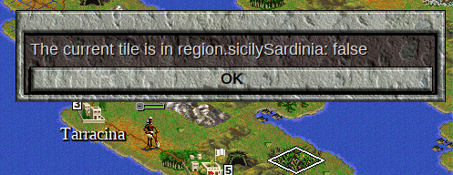
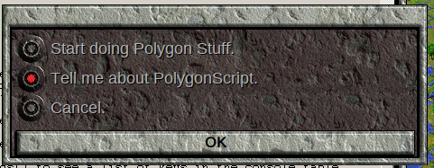
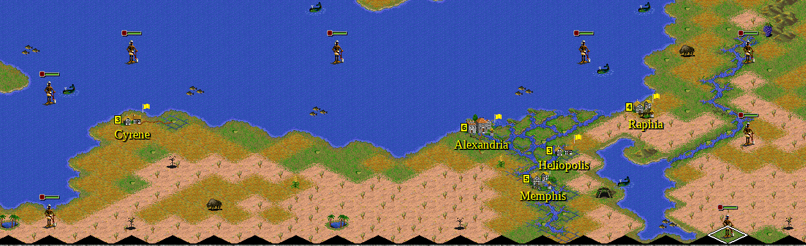
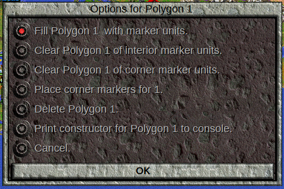
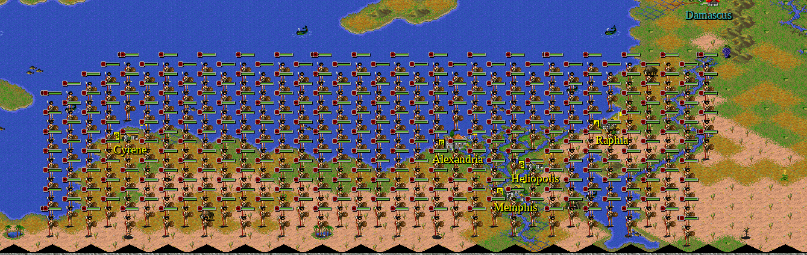
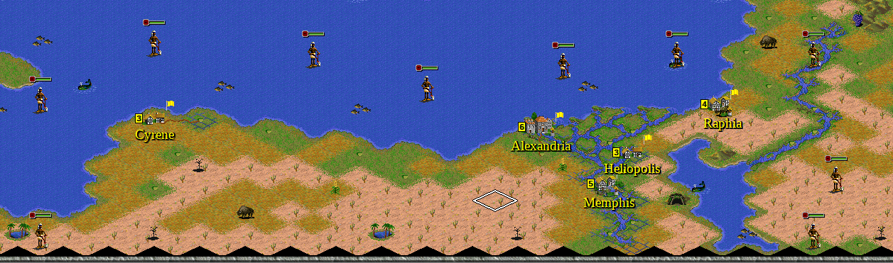
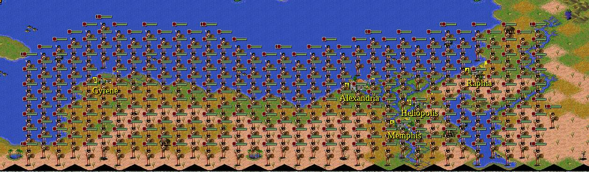
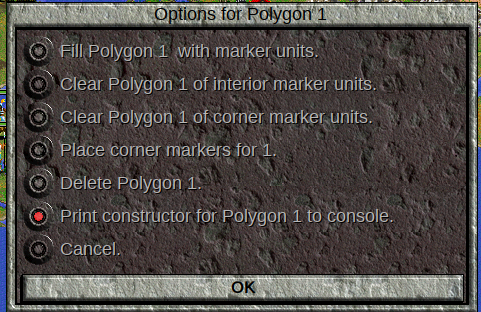
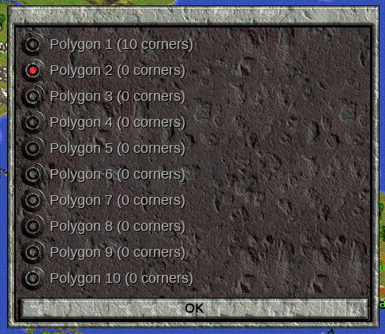
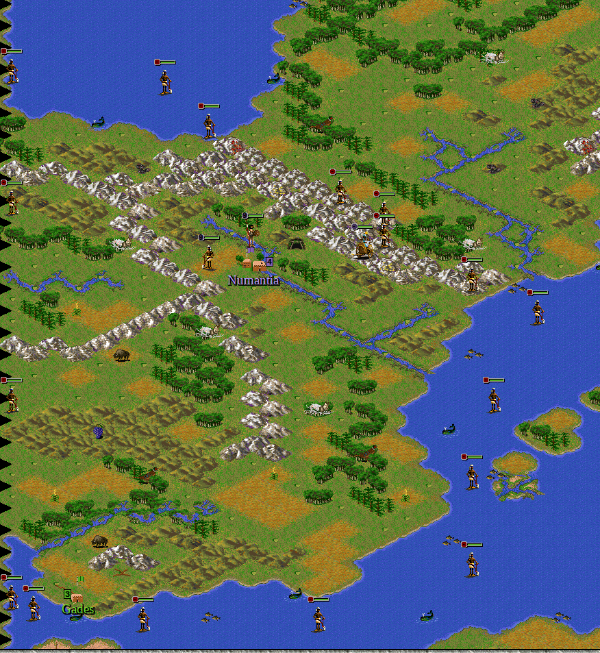

<style>
  code {
    white-space : pre-wrap !important;
    word-break: break-word;
  }
</style>

[&larr;MoreLogic](MoreLogic.md) | [Home](index.md) | [Example Events&rarr;](Examples1.md)


# Example Events

We now know enough about how Lua works to start writing more events. We will continue using the Classic Rome Scenario.  Your existing scenario should be fine, but if you think you are running into problems due to an earlier mistake, you can download a good version of events [here](ClassicRome3.zip).

[Capturing an Enemy Unit](#capturing-an-enemy-unit)  
[Distance in Civilization II](#distance-in-civilization-ii)  
[Finding the Nearest City](#finding-the-nearest-city)  
[Counting Things](#counting-things)  
[Specifying a Region](#specifying-a-region)  
* [Specifying a Region using Rectangles](#specifying-a-region-using-rectangles)    
* [Specifying a Region using Polygons](#specifying-a-region-using-polygons)   
* [Specifying a Region using Cities](#specifying-a-region-using-cities)   

[Undisciplined Troops](#undisciplined-troops)

## Capturing an Enemy Unit

In many situations, we would like to be able to "capture" units instead of kill them. In an Age of Sail scenario, for example, we might like to capture a defeated ship instead of sink it. Perhaps we would like to "plunder" a city or unit, and have a "treasure" to transport home to be disbanded. Maybe we would like to capture "slaves".

In our Classic Rome scenario, we will allow military units to "capture" settlers instead of kill them. To do this, we will once again use the [Unit Killed in Combat](LuaExecutionPoints.md#unit-killed-in-combat) execution point. 

The first step of this unit killed event is to activate it when a settler is killed. Therefore, we wrap everything in an appropriate if statement:

```lua
if loser.type == object.uSettlers then
end
```

Now, we create the unit at the location of the winner:

```lua
if loser.type == object.uSettlers then
    local newSettler = civ.createUnit(object.uSettlers, winner.owner, winner.location)
end
```
As it stands, this code will create a settler for the winning unit's tribe at that unit's location.  Add this code to the appropriate file and try it.  (If you don't know where, reference the [Unit Killed in Combat](LuaExecutionPoints.md#unit-killed-in-combat) execution point documentation.)

If this is the entire function, we do not need to include `local newSettler =` in the code.  However, we might like to change the characteristics of the settler that has just been created.

The `civ.createUnit` function sets the home city to the 'nearest' city, the same way a city is assigned to a unit created via the cheat menu. Perhaps we do not like this, and would like for the new settler not to have a home city. Perhaps, also, we wish for the created unit not to have any movement points for this turn, to give the other side a chance to liberate the settlers again. Finally, perhaps we would like the new settler to have only 5 hitpoints remaining after capture.  Use what you have learned and any resources at your disposal (such as the [TOTPP Lua Function Reference](https://forums.civfanatics.com/threads/totpp-lua-function-reference.557527/)) to make these three changes to the newly created settler.

<details><summary> Solution </summary>

We add the following three lines:

<code>
newSettler.homeCity = nil
newSettler.moveSpent = 255
newSettler.damage = newSettler.type.hitpoints - 5
</code>


Now let us look at each line to make sure we understand.


<code>
newSettler.homeCity = nil
</code>


Not much to say about this. <code>nil</code> is how to make a unit not have a home city.


<code>
newSettler.moveSpent = 255
</code>


This will guarantee that the unit can't move, since 255 is the maximum amount of movement points a unit can have. Another valid option is


<code>
newSettler.moveSpent = newSettler.type.move
</code>


Which will set the expended movement points equal to the maximum movement points the unit has.  (Note that both <code>unit.moveSpent</code> and <code>unitType.move</code> use <a href="Jargon.html#atomic-movement-points"> "atomic" movement points</a>.)  Beware, however, that this will not work for a ship whose owner has Lighthouse, Magellan's or Nuclear Power, since that unit will have extra movement points that are not caught by <code>unitType.move</code>.  (You could, however, use <a href="GeneralLibrary.html#genmaxmoves"> <code>gen.maxMoves</code></a>.)


<code>newSettler.damage = newSettler.type.hitpoints - 5</code>


We can't use <code>unit.hitpoints</code>, since that is only a 'get' command. We must set damage, and in order to do that, we must get the hitpoints for the settler type, which we do by newSettler.type.hitpoints, and then subtract 5 from that for the answer.

Also, using <code>object.uSettlers</code> in place of <code>newSettler.type</code> is fine.

All together, then, is

<code>
if loser.type == object.uSettlers then
    local newSettler = civ.createUnit(object.uSettlers, winner.owner, winner.location)
    newSettler.homeCity = nil
    newSettler.moveSpent = 255
    newSettler.damage = newSettler.type.hitpoints - 5
end
</code>
</details>

## Distance in Civilization II

For our next event, we are going to find the distance to the nearest city.  Before we do that, however, we need to talk about what we mean by "distance."

At some point in school, you probably learned that the distance between two points (x<sub>1</sub>,y<sub>1</sub>) and (x<sub>2</sub>,y<sub>2</sub>) is given by the formula

<span style="font-size: 20px">distance = &radic;</span><span style="border-top: 1px solid #000000; font-size: 17px;">(x<sub>1</sub>-x<sub>2</sub>)<sup>2</sup>+(y<sub>1</sub>-y<sub>2</sub>)<sup>2</sup></span>

This is known as the ["Euclidean Distance"](https://en.wikipedia.org/wiki/Euclidean_distance), and, generally speaking, when a Civ II game mechanic needs a distance measure of some sort, it will use an approximation of this calculation.
Moving "diagonally" (using the 1,3,7, or 9 key) has a cost of 1, while moving horizontally or vertically (using the 2,4,6, or 8 key) has a distance of 1.5.
Using the above formula, the horizontal and vertical distances "should" be about 1.41 if a diagonal move is scaled to have a distance of 1.
However, this means that when units move, the "distance" they move in one "step" will be different depending on the direction of the step.
This can make thinking about distance in Civ II difficult, especially if you want to think in terms of unit "steps".

It turns out that mathematicians have other notions of "distance" than <span style="font-size: 17px">&radic;</span><span style="border-top: 1px solid #000000; font-size: 14px;">(x<sub>1</sub>-x<sub>2</sub>)<sup>2</sup>+(y<sub>1</sub>-y<sub>2</sub>)<sup>2</sup></span>, and one of them happens to be extremely convenient for Civilization II:

<span style="font-size: 20px">distance = |x<sub>1</sub>-x<sub>2</sub>|+|y<sub>1</sub>-y<sub>2</sub>|</span>

This is typically known as the ["Taxicab Distance"](https://en.wikipedia.org/wiki/Taxicab_geometry) or "Manhattan Distance," because it is the distance between two points when you have to travel on a grid road system. Under this distance system, all unit "steps" have a distance of 2, regardless of direction.  Simply dividing by 2 changes the distance scale so that adjacent squares have a "distance" of 1 between them.

"Circles" (by which we mean all the points which are located at a specified distance from a "center") are "diamond" shaped by this distance measure, which is the same shape as all the tiles an air unit can reach in a turn from its own tile.

If you need a distance measure in your scenario, it is highly likely that the Taxicab distance will be as good, if not better better, than the ordinary "Euclidean" distance you are used to. I'm pretty sure that every time I needed a "distance" in Over the Reich, I used the Taxicab distance.

The General Library provides the following distance functions:  
[`gen.distance`](GeneralLibrary.md#gendistance)  
[`gen.tileDistance`](GeneralLibrary.md#gentiledist)    
[`gen.gameMechanicDistance`](GeneralLibrary.md#gengamemechanicdistance)  

## Finding the Nearest City

Now, we're going to build an event to plunder caravans.  In this event, when a caravan is killed, the nearest friendly city gets some shields added to the production box.  In order to implement this event, we are going to have to actually *find* the nearest friendly city.

Finding the nearest friendly city seems like something we might want to do a lot, so we will build a separate "helper function."  Our helper function will need a location to find the nearest city to, and it will also need a tribe, so we can find a city owned by that tribe.  Our function will return the `cityObject` for the city we find, and return `nil` if there are no friendly cities.

```lua
-- nearestFriendlyCity(tile,tribe) --> cityOjbect or nil
-- Finds the nearest city to tile, that is owned by tribe
--    tile is a tileObject
--    tribe is a tribeObject
local function nearestFriendlyCity(tile,tribe)

end
```
Before the function definition, we write some comments to plan how the function will work, and remind us later how to use it, if we want to use it elsewhere. This sort of plan is especially useful if we don't know how to write our entire event.  If we were unsure how to write a `nearestFriendlyCity` function, we could use `nearestFriendlyCity` in our code, and write it later, once we've had more time to think about it, or gotten help.  Our comments would remind us what kinds of arguments (objects vs ID numbers) to expect, and what kind of value to return.

To find the nearest city, we're going to use a technique that is applicable any time we're trying to find the "best" item in a list.  The strategy is to check all the elements of the list, and record the best item we've found *so far*.  For each element, we compare it to the best we've found, and if the current element is better, we update the best so far.

Let's see that in actual code:

```lua
local function nearestFriendlyCity(tile,tribe)
  local nearestCitySoFar = nil
  local bestDistanceSoFar = 100000
  for city in civ.iterateCities() do
    if city.owner == tribe and gen.distance(tile,city) < bestDistanceSoFar then
      nearestCitySoFar = city
      bestDistanceSoFar = gen.distance(tile,city)
    end
  end
  return nearestCitySoFar
end
```

Let's look at each part of this code:

```lua
  local nearestCitySoFar = nil
  local bestDistanceSoFar = 100000
```
We're going to store the relevant information about the best city found so far in these two variables.  We need the city itself, since we want to return it, and we also need the distance from the tile to that city, in order to make comparisons with other cities.

We initialize the nearest city as `nil`, since we don't know any cities yet, and initialize the distance as 100,000.  The distance between any two points on a Civilization II map is less than 100,000, so if any city is found, it will be "better" than the "nil city" we have specified here.

```lua
  for city in civ.iterateCities() do
```
This for loop is the "list" of cities that we are checking, and `city` is the name of the variable of each `cityObject` processed by the loop.

```lua
    if city.owner == tribe and gen.distance(tile,city) < bestDistanceSoFar then
      nearestCitySoFar = city
      bestDistanceSoFar = gen.distance(tile,city)
    end
```
Here, we check two things.  First, that the city is actually a friendly city (since we don't want to consider other cities), and second that the distance from the `tile` to the city is less than the best distance found so far.  If both these things are true, then we update the information for the nearest city found so far.  Otherwise, nothing is done, and the code moves on to the next city.

Note that `gen.distance` accepts tileObjects, unitObjects, and cityObjects as arguments, so we don't have to use `city.location`.

```lua
  return nearestCitySoFar
```

After the loop completes, the nearestCitySoFar is now the nearest city (otherwise a nearer city would have been selected).  If there are multiple nearest cities, the first one found will be returned.  If there were no cities owned by the tribe, then `nearestCitySoFar` will not have been changed from `nil`, and we want to return `nil` in this case anyway.

Open `onUnitKilled.lua`, and copy this code into the file (before unitKilledEvents.unitKilledInCombat):
```lua
local function nearestFriendlyCity(tile,tribe)
  local nearestCitySoFar = nil
  local bestDistanceSoFar = 100000
  for city in civ.iterateCities() do
    if city.owner == tribe and gen.distance(tile,city) < bestDistanceSoFar then
      nearestCitySoFar = city
      bestDistanceSoFar = gen.distance(tile,city)
    end
  end
  return nearestCitySoFar
end
console.nearestFriendlyCity = nearestFriendlyCity
```
The last line will make this function available to us in the console, so we can test it there.

Load the Classic Rome saved game, and switch to view mode.  Move the cursor to (40,30) (south of Rome).  Open the Lua Console.  Type the command:
```lua
civ.getCurrentTile()
```
The output to the console will be
```
> civ.getCurrentTile()
Tile<x=40, y=30, z=0, terrainType=2, owner=1, improvements=20>
```
The `civ.getCurrentTile` function returns the tileObject for whatever tile the cursor is on (the console displays some information about the tile when it "prints" a tileObject).  This can be useful when using the console to test things, and also when using the [`key press`](LuaExecutionPoints.md#key-press) execution point.  Move the cursor around, and apply `civ.getCurrentTile()` again a couple times.

We can use the result of this function in other commands.  Move the cursor over Rome, and make the following command:
```lua
civ.getCurrentTile().city
```
You will see:
```
> civ.getCurrentTile().city
City<name="Rome", size=6, x=40, y=28, z=0>
```
Another function we will use for our testing is:
```
civ.getCurrentTribe()
```
which gives the result:
```
> civ.getCurrentTribe()
Tribe<id=1, name="Romans", leader="Scipio", money=250, cities=6, units=0, techs=20>
```
Now, we will use the following command to test our new `nearestFriendlyCity` function:
```lua
console.nearestFriendlyCity(civ.getCurrentTile(),civ.getCurrentTribe())
```
Try this out.  You will probably get an error.  We've seen this kind of error before, so try figuring out how to fix it before looking below:

<details><summary>Solution</summary>
The error is
<code>
The variable name 'gen' doesn't match any available local variables.
Consider the following possibilities:
...
</code>
"gen" is the usual prefix for General Library functions, so we need to include this line at the top of <code>onUnitKilled.lua</code>:
<code>
local gen = require("generalLibrary")
</code>
We saw this in the <a href="MoreLogic.html#missingrequire"> More Logic </a> tutorial, though that time we forgot to require <code> object.lua </code>.
</details>

Load the console again, and move the cursor around to test `nearestFriendlyCity`.

Now that we can find the nearest city, let us complete our event to plunder captured caravans.

We will first specify how many shields should be added to the city production box.  70% of the caravan construction cost seems fine, so we write a parameter for that:
```lua
local caravanShieldFraction = 0.7
```
Instead of plundering caravans specifically, let us plunder all trade units.  To do this, we use `unitType.role`.
```lua
if loser.type.role == 7 then
  local nearestCity = nearestFriendlyCity(loserLocation,winner.owner)
  local shieldBonus = math.floor(loser.type.cost*civ.cosmic.shieldRows*caravanShieldFraction)
  nearestCity.shields = nearestCity.shields+shieldBonus
  text.simple(text.substitute("Our %STRING1 unit has defeated a %STRING2 unit.  %STRING3 shields of plunder has been added to %STRING4's production box.",{winner.type.name,loser.type.name,shieldBonus,nearestCity.name}))
end
```
Let's look at the individual lines:
```lua
if loser.type.role == 7 then
```
Trade units have role 7 (see the rules.txt), and this event is supposed to trigger for all trade units, and nothing else.

```lua
  local nearestCity = nearestFriendlyCity(loserLocation,winner.owner)
```
This uses the code we wrote earlier to find the nearest friendly city.  I arbitrarily decided to use the location of the loser rather than the winner.  The `loserLocation` argument is used instead of `loser.location`, since if the attacker was the loser, `loser.location` doesn't exist.  At the moment, this doesn't matter since caravans can't attack, but it is good practice to use the loserLocation argument anyway (we might decide to give caravans an attack value and forget that this event assumed they only defend).

```lua
  local shieldBonus = math.floor(loser.type.cost*civ.cosmic.shieldRows*caravanShieldFraction)
```
Here we compute the shieldBonus.  `unitType.cost` gives the cost of a unit in *rows*, so we must multiply by the parameter `civ.cosmic.shieldRows` to get the actual cost in shields.  We then multiply by our `caravanShieldFraction` parameter to determine the actual shield bonus, taking the floor to ensure we have an integer.

```lua
  nearestCity.shields = nearestCity.shields+shieldBonus
```
`city.shields` accesses the accumulated shields for the city.  Here, we add the bonus to the nearest city, which we found earlier.

```lua
  text.simple(text.substitute("Our %STRING1 unit has defeated a %STRING2 unit.  %STRING3 shields of plunder has been added to %STRING4's production box.",{winner.type.name,loser.type.name,shieldBonus,nearestCity.name}))
```
Here, we display text with `text.simple`.  We create the text using `text.substitute`.  "%STRING1" is replaced by the name of the winner's type (remember to get the name of the type, it is a common error to use `winner.name`, which is nil).  Similarly, "%STRING2" is replaced by the loser's unit type name.  "%STRING3" is replaced by the shield bonus, and "%STRING4" is replaced by the name of the nearest city.

Add this event to `unitKilledEvents.unitKilledInCombat`, and test it out.  Create a freight and kill it to test as well.  Now, create a Roman caravan, and put it in a position to be killed by a barbarian unit.  End the turn.

You will get the following error:
```
...LuaTriggerEvents\UniversalTriggerEvents\onUnitKilled.lua:61: attempt to index a nil value (local 'nearestCity')
stack traceback:
	...LuaTriggerEvents\UniversalTriggerEvents\onUnitKilled.lua:61: in function 'UniversalTriggerEvents\onUnitKilled.unitKilledInCombat'
	...Scenarios\ClassicRome\LuaTriggerEvents\triggerEvents.lua:115: in function 'triggerEvents.unitKilledInCombat'
	...op\drive_c\Test of Time\Scenarios\ClassicRome\events.lua:231: in upvalue 'doOnUnitDefeatedInCombat'
	...op\drive_c\Test of Time\Scenarios\ClassicRome\events.lua:299: in function <...op\drive_c\Test of Time\Scenarios\ClassicRome\events.lua:282>
```

```lua
    if loser.type.role == 7 then
        local nearestCity = nearestFriendlyCity(loserLocation,winner.owner)
        local shieldBonus = math.floor(loser.type.cost*civ.cosmic.shieldRows*caravanShieldFraction)
--[[61]]nearestCity.shields = nearestCity.shields+shieldBonus
        text.simple(text.substitute("Our %STRING1 unit has defeated a %STRING2 unit.  %STRING3 shields of plunder has been added to %STRING4's production box.",{winner.type.name,loser.type.name,shieldBonus,nearestCity.name}))
    end
```
At line 61 (in my file, yours will probably have a different line), this is the code
```lua
        nearestCity.shields = nearestCity.shields+shieldBonus
```
The error is an attempt to index a nil value, called "local nearestCity".  Can you figure out why this error occurred?

<details><summary>Reason for the error</summary>
The error occurred because the barbarians have no cities, therefore the nearestFriendlyCity function returned nil, and so nearestCity was nil and not a cityObject.
</details>

Can you think of a way to fix this bug?

<details><summary>Solution</summary>
We should only run the code if the nearestCity is not nil.  For example:
<code>
    if loser.type.role == 7 then
        local nearestCity = nearestFriendlyCity(loserLocation,winner.owner)
        if nearestCity then
          local shieldBonus = math.floor(loser.type.cost*civ.cosmic.shieldRows*caravanShieldFraction)
--[[61]]  nearestCity.shields = nearestCity.shields+shieldBonus
          text.simple(text.substitute("Our %STRING1 unit has defeated a %STRING2 unit.  %STRING3 shields of plunder has been added to %STRING4's production box.",{winner.type.name,loser.type.name,shieldBonus,nearestCity.name}))
        end
    end
</code>
</details>

With the fix in place, run the test again.

There is no error, and no message, so we have fixed that problem.  Now, put a caravan in place to be destroyed by the Celts.

You will now notice that we receive a message when the Celts defeat the caravan.  It only makes sense to show this message when the winner is the current human player.  The function `civ.getPlayerTribe()` returns the tribe owned by the current human player.  How would you make sure that the message is only shown when the winner is the current player?
<details><summary>Solution</summary>
<code>
    if loser.type.role == 7 then
        local nearestCity = nearestFriendlyCity(loserLocation,winner.owner)
        if nearestCity then
          local shieldBonus = math.floor(loser.type.cost*civ.cosmic.shieldRows*caravanShieldFraction)
          nearestCity.shields = nearestCity.shields+shieldBonus
          if winner.owner == civ.getPlayerTribe() then
            text.simple(text.substitute("Our %STRING1 unit has defeated a %STRING2 unit.  %STRING3 shields of plunder has been added to %STRING4's production box.",{winner.type.name,loser.type.name,shieldBonus,nearestCity.name}))
          end
        end
    end
</code>

</details>

Again, set up a caravan to be defeated by the Celts, and make sure the message is not shown.  Defeat a caravan as the Romans to make sure it *does* show in that case.

## Counting Things

Now, let us consider the following event: If the Romans have fewer than 6 Legions when they lose a city, new Legions are created in Rome so they have at least 6.  Since we want to do this when a city is captured, we use the [City Captured](LuaExecutionPoints.md#city-captured) execution point, which means using the `onCityTaken.lua` file, found in the `UniversalTriggerEvents` directory.

Let us first add a couple require lines:
```lua
local gen = require("generalLibrary")
local object = require("object")
local text = require("text")
```

Now, let us write the actual event.  Counting things, it turns out, is very similar to to finding the "best" thing, except that instead of keeping track of the "best" so far, we keep track of the count so far instead.

```lua
-- countUnits(unitType,tribe) --> integer
-- counts the number of unitType owned by the tribe
--  unitType is a unitTypeObject
--  tribe is a tribeObject
local function countUnits(unitType,tribe)
  local countSoFar = 0
  for unit in civ.iterateUnits() do
    if unit.owner == tribe and unit.type == unitType then
      countSoFar = countSoFar+1
    end
  end
  return countSoFar
end
```

In this code, we initialize the `countSoFar` to be 0, since we haven't counted anything yet.  We loop over all the units in the game using `civ.iterateUnits`.  When we find a unit owned by the tribe and of the correct unit type, we increment our count by 1.  Once the loop is completed, we've counted everything, and the `countSoFar` is the total count, so we can return that.

With our counting helper function, we can now write the event:
```lua
local minimumLegions = 6
```

```lua
if defender == object.pRomans and 
  object.lRome.city and 
  object.lRome.city.owner == object.pRomans then
  local legionCount = countUnits(object.uLegion,object.pRomans)
  if legionCount < minimumLegions then
    gen.createUnit(object.uLegion,object.pRomans,object.lRome,
                {count = minimumLegions-legionCount})
    if city.owner == civ.getPlayerTribe() or defender == civ.getPlayerTribe() then
      text.simple(text.substitute("Alarmed by the loss of %STRING1, the %STRING2 quickly raise %STRING3 new %STRING5 units to face the %STRING4 threat.",
        {city.name, object.pRomans.name, minimumLegions-legionCount,city.owner.adjective,
        object.uLegion.name}))
    end
  end
end
```

```lua
if defender == object.pRomans and 
  object.lRome.city and 
  object.lRome.city.owner == object.pRomans then
```
Here, we check if the tribe that lost the city (the `defender`) was the Romans.  We also check that the Romans still control Rome.
```lua
  local legionCount = countUnits(object.uLegion,object.pRomans)
```
Here, we count the number of existing legions.
```lua
  if legionCount < minimumLegions then
```
The event should only happen if the Romans will receive extra legions.
```lua
    gen.createUnit(object.uLegion,object.pRomans,object.lRome,
                {count = minimumLegions-legionCount})
```
The [`gen.createUnit` function](GeneralLibrary.md#gencreateunit) is one way to create units.  Among other things, it offers an option table where the number of units to be created is set, using the `count` key.  Since the `homeCity` key is `nil`, the units will be created without a home city.  We could have used `civ.createUnit` and a [numeric for loop](Loops.md#numeric-for-loops) instead.

```lua
    if city.owner == civ.getPlayerTribe() or defender == civ.getPlayerTribe() then
```
This code checks if either of the tribes involved in the city capture are the current player.  If so, the message below is shown.  Of course, in this case it might make sense for everyone in the world to get this message, or, perhaps, only the Romans should get the message.

```lua
      text.simple(text.substitute("Alarmed by the loss of %STRING1, the %STRING2 quickly raise %STRING3 new %STRING5 units to face the %STRING4 threat.",
        {city.name, object.pRomans.name, minimumLegions-legionCount,city.owner.adjective,
        object.uLegion.name}))
```
This is the text of the message.  Of note, is that the %STRINGX substitutions don't have to be in order.  I decided to use the name of the legion unit rather than "Legion" after the fact, and it was easier to use %STRING5 than to use %STRING4 and change the other %STRING4, and the order of the substitution table.

All together, the `onCityTaken.lua` file should look like this:

```lua
local gen = require("generalLibrary")
local object = require("object")
local text = require("text")

local cityTaken = {}


-- countUnits(unitType,tribe) --> integer
-- counts the number of unitType owned by the tribe
--  unitType is a unitTypeObject
--  tribe is a tribeObject
local function countUnits(unitType,tribe)
  local countSoFar = 0
  for unit in civ.iterateUnits() do
    if unit.owner == tribe and unit.type == unitType then
      countSoFar = countSoFar+1
    end
  end
  return countSoFar
end

local minimumLegions = 6

function cityTaken.onCityTaken(city,defender)
    if defender == object.pRomans and 
      object.lRome.city and 
      object.lRome.city.owner == object.pRomans then
      local legionCount = countUnits(object.uLegion,object.pRomans)
      if legionCount < minimumLegions then
        gen.createUnit(object.uLegion,object.pRomans,object.lRome,
                    {count = minimumLegions-legionCount})
        if city.owner == civ.getPlayerTribe() or defender == civ.getPlayerTribe() then
          text.simple(text.substitute("Alarmed by the loss of %STRING1, the %STRING2 quickly raise %STRING3 new %STRING5 units to face the %STRING4 threat.",
            {city.name, object.pRomans.name, minimumLegions-legionCount,city.owner.adjective,
            object.uLegion.name}))
        end
      end
    end

end

return cityTaken

```

Test this event.  The Romans start with 9 Legions, so you will have to delete some, or change the minimumLegions parameter.


## Specifying a Region

### Specifying a Region using Rectangles

Sometimes, we have events that we only want to take place for units (or cities) in a certain region. If our region is a rectangle, it is very easy to determine if a tile is within the region:

```lua
 local function inRectangle(tile,xMin,xMax,yMin,yMax)
    local x = tile.x
    local y = tile.y
    return xMin <= x and x <=xMax and yMin <= y and y <=yMax
end
```
This function will only return true if the tile is within the x and y limits specified. This function will return true if the unit is within the specified rectangle on any map, though it is straightforward to extend the function to limit the acceptable z coordinates.

If you want something more complicated than a rectangle, you can combine several rectangles together. For example:

```lua
local function inMyRegion(tile)
  if inRectangle(tile,xMin1,xMax1,yMin1,yMax1) then
      return true
  elseif inRectangle(tile,xMin2,xMax2,yMin2,yMax2) then
      return true
  else
    return false
  end
end
```

You add as many inRectangle if statements as you need to specify the region, and if any of them are satisfied, the function will return true. Overlap of the rectangles is acceptable.

However, writing a full function for each region might be a little much. We might prefer to specify the rectangles that make up a region in a table, and simply pass that table to a function.

We can specify our function to take tables of rectangle specifications in 2 ways:

```lua
 local region={}
region.italy = {
{xMin=36 , xMax=44, yMin=18 , yMax=38 },
{xMin=38 , xMax=50 , yMin=28 , yMax=46 },
{xMin=46 , xMax=54 , yMin=40 , yMax=54 },
}    

region.sicilySardinia = {
{38,46,50,58},
{31,37,33,47},
}
```
In the second format, the first entry in the table gives `xMin`, the second `xMax`, the third `yMin`, and the fourth `yMax`.
```lua
local function inRegion(object, regionTable)
	local tile = nil
	if civ.isTile(object) then
		tile = object
	elseif civ.isCity(object) then
		tile = object.location
	elseif civ.isUnit(object) then
		tile = object.location
	else
		error("inRegion expected a tile, city, or unit as the first argument.")
	end
	for __,rectangleSpec in pairs(regionTable) do
		if inRectangle(tile,rectangleSpec.xMin or rectangleSpec[1],
			rectangleSpec.xMax or rectangleSpec[2],
			rectangleSpec.yMin or rectangleSpec[3],
			rectangleSpec.yMax or rectangleSpec[4]) then
			return true
		end
	end
	return false
end
```
Now, let's examine each part of the code.
```lua
	local tile = nil
	if civ.isTile(object) then
		tile = object
	elseif civ.isCity(object) then
		tile = object.location
	elseif civ.isUnit(object) then
		tile = object.location
	else
		error("inRegion expected a tile, city, or unit as the first argument.")
	end
```
This part of the code allows us to accept multiple kinds of objects as input, so we don't have to worry about making sure the first argument is a tile. This can make some sense, since it is natural to ask if a unit or city is in a region. The `error` function in Lua brings up the console with an error message. We may want this in some cases, since it tells us we made a mistake somewhere, and, hopefully, what the mistake is. Other times, we might not want it, so that a bug doesn't break our scenario.
```lua
	for __,rectangleSpec in pairs(regionTable) do
		if inRectangle(tile,rectangleSpec.xMin or rectangleSpec[1],
				rectangleSpec.xMax or rectangleSpec[2],
				rectangleSpec.yMin or rectangleSpec[3],
				rectangleSpec.yMax or rectangleSpec[4]) then
			return true
		end
	end
	return false
```
Here, we go through every rectangle defined in the "region table" and see if the input tile is in the rectangle. To handle the two kinds of table format, `or` operators are used to find the table entry actually specified.

We can test this function by using the [key press](LuaExecutionPoints.md#key-press) execution point.  We can access this execution point using `keyPressEvents.lua` which is found in the `LuaRulesEvents` directory.

The `keyPressEvents.lua` file already contains a bunch of require lines, including for the Text Module, Object File, and General Library.  This file is organized a bit differently from the others.

```lua
keyPressFunctions[keyboard.zero] = function()

end

keyPressFunctions[keyboard.one] = function()
    text.openArchive()
end
keyPressFunctions[keyboard.two] = function()
    diplomacySettings.diplomacyMenu()
end
keyPressFunctions[keyboard.three] = function()

end
keyPressFunctions[keyboard.four] = function()

end
keyPressFunctions[keyboard.five] = function()

end
keyPressFunctions[keyboard.six] = function()

end
keyPressFunctions[keyboard.seven] = function()

end
keyPressFunctions[keyboard.eight] = function()

end
```

If you want something to happen for a particular key, you choose the function which is a value for the corresponding key in `keyPressFunctions` table.  That is, if you want an event to happen when 6 (above the letter keys) is pressed, you change this function: 

```lua
keyPressFunctions[keyboard.six] = function()

end
```
Note that thus far we have defined functions using the following syntax:
```lua
local function myFunction(arg1,arg2)

end
```
However, a function can also be defined with this syntax:
```lua
local myFunction = function(arg1,arg2)

end
```
In fact, if we just want to have a function as a value, without assigning it to a variable or table, we can write, for example:
```lua
function (arg1,arg2) return arg1 > arg2 end
```
This can be useful if a function takes another function as an argument, which we will see eventually.

Returning to the present discussion about key press events, if the key you want to use isn't already in this file, you can just add a new entry for `keyPressFunctions`.  Also, if your function activates for multiple keys, you can change
```lua
local function generalKeyPress(keyID)

end
```

For our purposes, we will test if the current tile is within `region.italy` when pressing key 8, and if it is in `region.sicilySardinia` using key 9.

```lua
keyPressFunctions[keyboard.eight] = function()
  civ.ui.text("The current tile is in region.italy: "..tostring(
    inRegion(civ.getCurrentTile(),region.italy)))
end
keyPressFunctions[keyboard.nine] = function()
  civ.ui.text("The current tile is in region.sicilySardinia: "..tostring(
    inRegion(civ.getCurrentTile(),region.sicilySardinia)))
end
```
Add the above code, along with the following data and helper functions to `keyPressEvents.lua`.  You may have noticed the `tostring` function, which converts its argument (in this case `true` or `false`) to an appropriate string.

```lua
local function inRectangle(tile,xMin,xMax,yMin,yMax)
    local x = tile.x
    local y = tile.y
    return xMin <= x and x <=xMax and yMin <= y and y <=yMax
end

local region={}
region.italy = {
{xMin=36 , xMax=44, yMin=18 , yMax=38 },
{xMin=38 , xMax=50 , yMin=28 , yMax=46 },
{xMin=46 , xMax=54 , yMin=40 , yMax=54 },
}    

region.sicilySardinia = {
{38,46,50,58},
{31,37,33,47},
}

local function inRegion(object, regionTable)
	local tile = nil
	if civ.isTile(object) then
		tile = object
	elseif civ.isCity(object) then
		tile = object.location
	elseif civ.isUnit(object) then
		tile = object.location
	else
		error("inRegion expected a tile, city, or unit as the first argument.")
	end
	for __,rectangleSpec in pairs(regionTable) do
		if inRectangle(tile,rectangleSpec.xMin or rectangleSpec[1],
			rectangleSpec.xMax or rectangleSpec[2],
			rectangleSpec.yMin or rectangleSpec[3],
			rectangleSpec.yMax or rectangleSpec[4]) then
			return true
		end
	end
	return false
end
```
You can press keys 8 and 9 to test if the current tile is within one of the regions.



### Specifying a Region using Polygons

Specifying a region in terms of rectangles is a bit of a hassle.  However, the General Library provides a way to check if a tile is within a polygon, through use of [gen.inPolygon](GeneralLibrary.md#geninpolygon).

```lua
gen.inPolygon(tile,tableOfCoordinates) --> boolean
```
To use inPolygon, you must come up with a table of coordinates, which represent the "corners" of the polygon.  The corners are ordered, and must be in the order that you would reach them if you were drawing the polygon without lifting your pen off the map.

The Lua Scenario Template comes with a script which will create coordinate tables for you.  Make sure to save the changes to your scenario first, however, since it will place units on the map.  That won't matter for us, however.  Open the Lua Console, and use the Load Script Button to load `PolygonScript.lua`, which can be found in the `Scripts` directory.



You can read the instructions under the second option, but I will guide you through the process of making polygons anyway.

We are first going to make a polygon representing "Egypt."  Choose some suitable corners and press `k` while the cursor is over each of them.  Each corner will have a barbarian settler placed on that tile.



Now, we want to check what our polygon covers, to make sure we did it correctly.  Press Backspace to get a list of options.



Select the option to fill Polygon 1 with marker units.



Notice that the bottom row of the map isn't covered by the polygon.  We will have to re-draw it.  Use Backspace, and clear Polygon 1 of interior and corner marker units.  Then, delete Polygon 1.  (Do this last, otherwise you won't be able to remove marker units.)

Now, re-create an Egypt polygon, with corners on the very last row of the map.




Now, use backspace and select "Print constructor for Polygon 1 to console.



Open the console, and a line like this should be printed (the exact coordinates will be different unless you chose the exact same tiles that I did for corners).
```
polygon = {{47,79},{47,67},{52,62},{59,63},{64,66},{70,64},{75,63},{81,63},{82,74},{81,79},doesNotCrossThisX=2}
```

We can cut and paste this table constructor into our file:
```lua
local egyptPolygon = {{47,79},{47,67},{52,62},{59,63},{64,66},{70,64},{75,63},{81,63},{82,74},{81,79},doesNotCrossThisX=2}
```

Now, let's build an "Iberia" polygon.  We don't want to delete the information from the Egypt polygon, so we press "tab":



Select Polygon 2, and proceed as before.

Proceed as before to build the polygon using the K key, and use "backspace" to check the coverage and print the polygon constructor to the console.



```
polygon = {{1,59},{0,58},{0,40},{0,22},{0,10},{7,11},{9,15},{15,21},{17,23},{17,25},{21,29},{24,32},{22,40},{21,47},{21,55},{14,60},{6,60},doesNotCrossThisX=27}
```

```lua
local iberiaPolygon = {{1,59},{0,58},{0,40},{0,22},{0,10},{7,11},{9,15},{15,21},{17,23},{17,25},{21,29},{24,32},{22,40},{21,47},{21,55},{14,60},{6,60},doesNotCrossThisX=27}
```

Add these polygon constructors to `keyPressEvents.lua` and change the key press functions for 8 and 9 as so:

```lua
keyPressFunctions[keyboard.eight] = function()
  civ.ui.text("The current tile is in region.italy: "..tostring(
    inRegion(civ.getCurrentTile(),region.italy)))
    civ.ui.text("The current tile is in Egypt: "..tostring(
    gen.inPolygon(civ.getCurrentTile(),egyptPolygon)))
end
keyPressFunctions[keyboard.nine] = function()
  civ.ui.text("The current tile is in region.sicilySardinia: "..tostring(
    inRegion(civ.getCurrentTile(),region.sicilySardinia)))
    civ.ui.text("The current tile is in Iberia: "..tostring(
    gen.inPolygon(civ.getCurrentTile(),iberiaPolygon)))
end
```
You can test these functions again, though this time there will be 2 text boxes for each key.

### Specifying a Region using Cities

A third way to specify a region is to check if a given tile is "near" a city.  Consider the following function, which checks if a tile is near a city that Rome founded.  We check if the Romans founded the city by using `city.originalOwner`, although strictly speaking it is the *previous* owner of the city, since `city.originalOwner` changes when the city is captured.  We won't worry about that for now.

```lua
local function inHomesteadRome(tile,distance)
  for city in civ.iterateCities() do
    if city.originalOwner == object.pRomans and city.owner == object.pRomans
      and gen.distance(tile,city) <= distance then
      return true
    end
  end
  -- if we get here, no city is close enough
  return false
end
```

This function is similar to our code for finding the best city in a list.  The difference is that in this case, once we find a valid city, we can immediately return `true` since we are done.  If we don't find a valid city among all the cities in the game, then we return `false` instead.

Add `inHomesteadRome` to the `keyPressEvents.lua` file, and add the following code to the press 9 event:
```lua
  civ.ui.text("The current tile is in 'Homestead Rome': "..tostring(
    inHomesteadRome(civ.getCurrentTile(),3)))
```

Something to keep in mind for all of these region checks is that they don't check the map.  If your scenario has multiple maps, but you only want a region to cover some of them, you must also make checks for the `z` value of the tile.

## Undisciplined Troops

Let us revisit the event to plunder a caravan.  Let us change the event so that if a unit that is *not* veteran defeats a trade unit, the winner's hitpoints are reduced to 1 and a message is shown explaining that the troops have dispersed seeking plunder, and that we are now vulnerable to counterattack.

```lua
    if loser.type.role == 7 then
        local nearestCity = nearestFriendlyCity(loserLocation,winner.owner)
        if nearestCity then
          local shieldBonus = math.floor(loser.type.cost*civ.cosmic.shieldRows*caravanShieldFraction)
          nearestCity.shields = nearestCity.shields+shieldBonus
          if winner.owner == civ.getPlayerTribe() then
            text.simple(text.substitute("Our %STRING1 unit has defeated a %STRING2 unit.  %STRING3 shields of plunder has been added to %STRING4's production box.",{winner.type.name,loser.type.name,shieldBonus,nearestCity.name}))
          end
        end
    end
```
we will change this to

```lua
    if loser.type.role == 7 then
        local nearestCity = nearestFriendlyCity(loserLocation,winner.owner)
        if nearestCity then
          local shieldBonus = math.floor(loser.type.cost*civ.cosmic.shieldRows*caravanShieldFraction)
          nearestCity.shields = nearestCity.shields+shieldBonus
          if winner.owner == civ.getPlayerTribe() then
            text.simple(text.substitute("Our %STRING1 unit has defeated a %STRING2 unit.  %STRING3 shields of plunder has been added to %STRING4's production box.",{winner.type.name,loser.type.name,shieldBonus,nearestCity.name}))
          end
        end
        if not winnerVetStatus then
          winner.damage = winner.type.hitpoints - 1
          if loser.owner == civ.getPlayerTribe() then
            text.simple(text.substitute("Our enemies have dispersed to plunder our defeated %STRING1.  We should counterattack while they are disorganized.",
            {loser.type.name}))
          end
          if winner.owner == civ.getPlayerTribe() then
            text.simple(text.substitute("The men of our %STRING1 unit have dispersed to plunder the %STRING2 %STRING3.  We are vulnerable to counterattack.",
            {winner.type.name,loser.owner.adjective,loser.type.name}))
          end
        end
    end
```
The `winnerVetStatus` argument tells the veteran status of the winner *before* combat.  Using `winner.veteran` doesn't tell us if the unit was just promoted or was veteran before combat.  Notice that I provide a different message based on whether the winner or loser is the player tribe.  This is assuming the scenario is designed for single player, and it makes sense to show the messages immediately.

Copy this code and test the event.

Now, suppose we only want this dispersal to happen 33% of the time.  We can achieve that by using the [`math.random`](http://lua-users.org/wiki/MathLibraryTutorial) function.  `math.random()` returns a random number between 0 and 1, so 
```lua
math.random() < 0.33
```
will be true 33% of the time.  The use of `<` instead of `<=` doesn't matter in this instance, since the number created has a lot of decimal places.  However, `math.random` can also be used to generate integers, in which case, `<` will be different from `<=`.
```lua
math.random(upper) --> returns a random number between 1 and upper, inclusive
math.random(lower,upper) --> returns a random number between lower and upper, inclusive
```
We will change
```lua
        if not winnerVetStatus then
```
to
```lua
        if not winnerVetStatus and math.random() < 0.33 then
```
(I won't worry about making 0.33 a parameter here.)

Test this event to make sure that it occurs sometimes, but not always.

Note: When testing a random event, it is often helpful to change the probability during testing.  For example, if an event has a 5% chance of occurring, you might want to change it to 50% (or even 100%) for testing purposes, so that it actually happens fairly frequently.


[&larr;MoreLogic](MoreLogic.md) | [Home](index.md) | [Example Events&rarr;](Examples1.md)