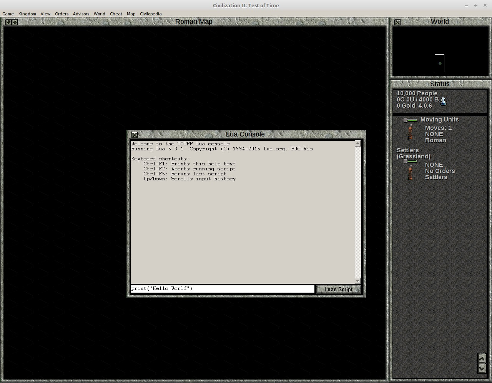
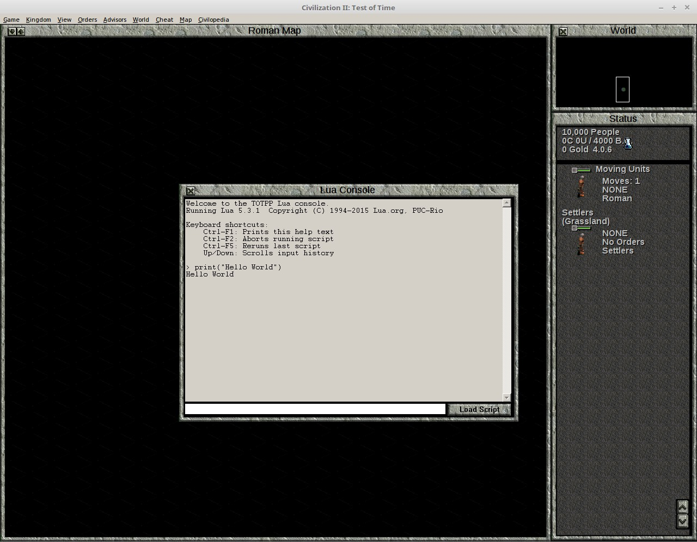
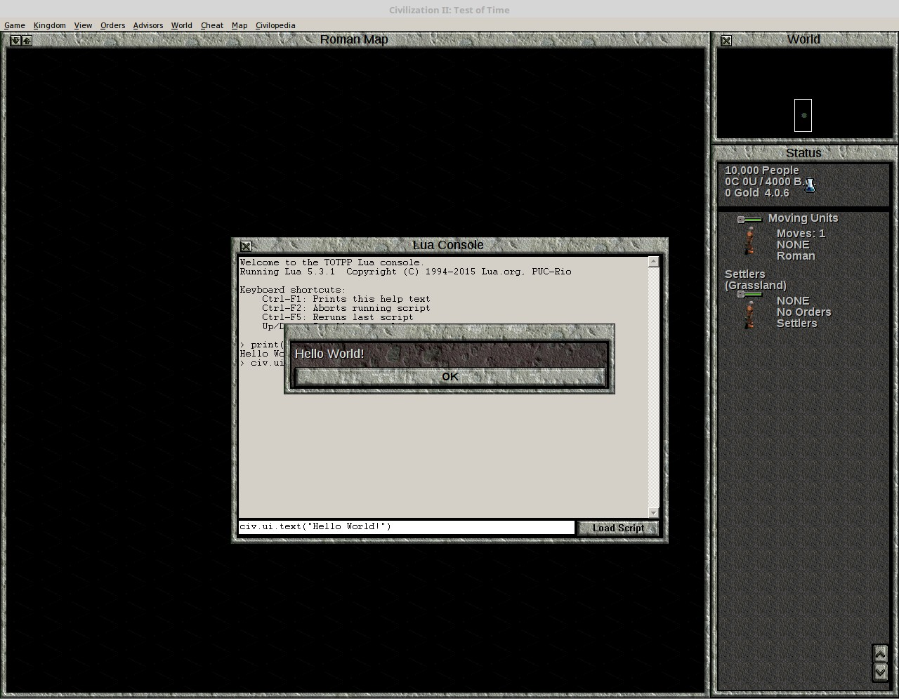
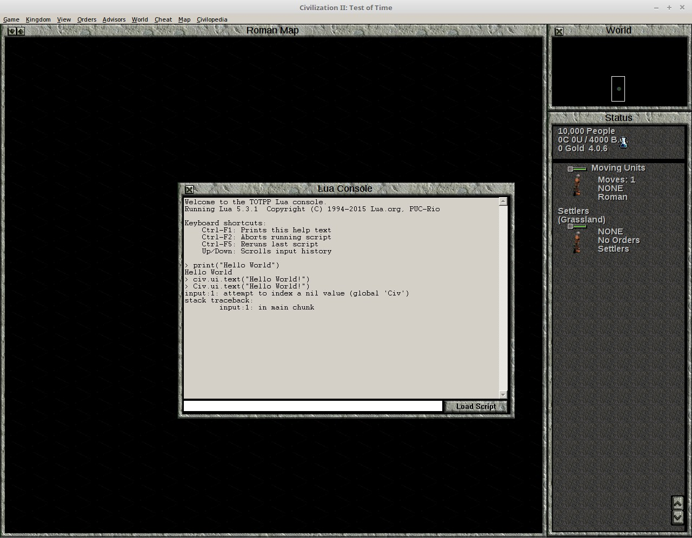
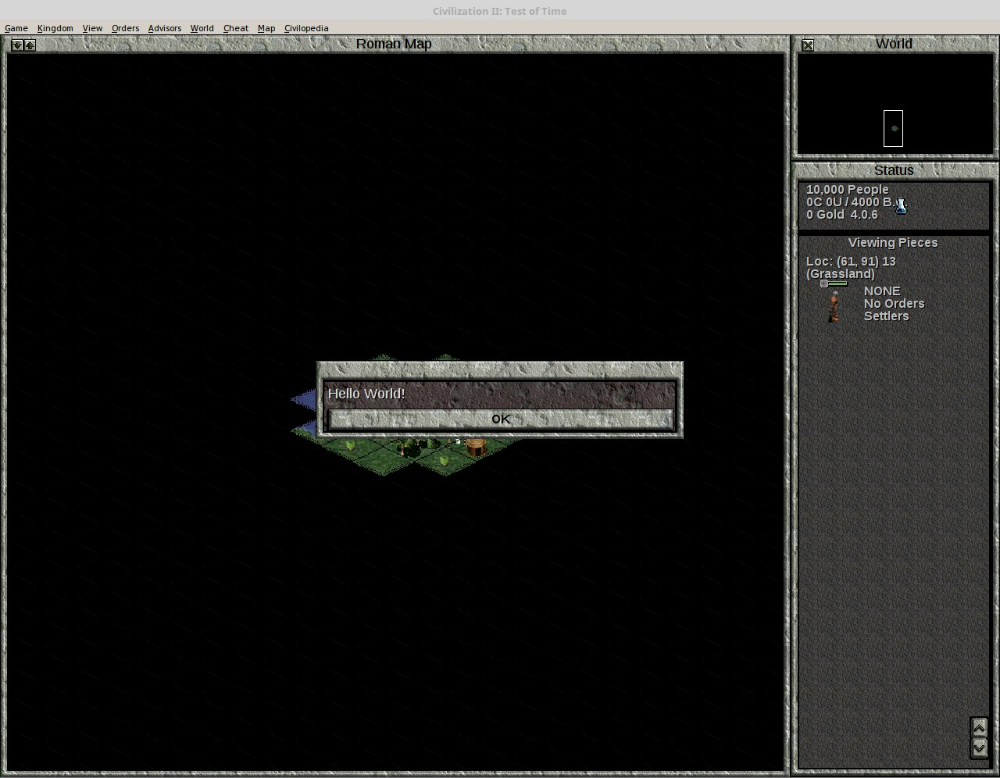
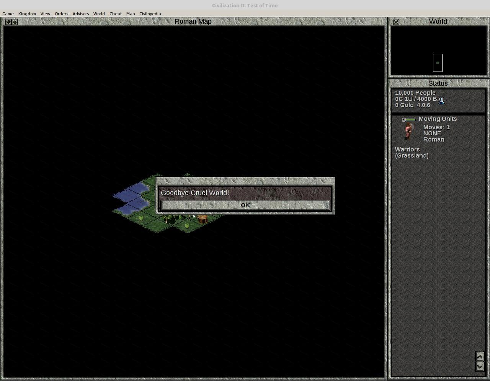

# Hello World

Start a new game of Civilization II Test of Time using the Test of Time Patch Project, [version 0.16](https://forums.civfanatics.com/threads/the-test-of-time-patch-project.517282/page-54#post-16064118) or a later version [if it has been released](https://forums.civfanatics.com/threads/the-test-of-time-patch-project.517282/).  Start (or load) the game as a basic 'original' game.

Activate the Cheat Mode, and press ```Ctrl+Shift+F3``` to open the Lua Console.

In the Input Bar at the bottom of the Lua Console, type:

```Lua
print("Hello World") 
```



And press ```Enter```.

Your console should now look like this:



The command `print()` displays to the console, and this will be useful later for debugging code.  However, our reason for using Lua is to interact with the game itself.  Therefore, enter the code

```Lua
civ.ui.text("Hello World!")
```

A text box should appear in the game like this:



Now, let us make an error typing in a command.  We will type `C` instead of `c`.

```Lua
Civ.ui.text("Hello World!")
```

An error message is printed in the console, which now looks like this:



We can access a previous command and make changes to it by pressing the up arrow in the console command line.  Do this, and make `C` lower case.  Press `Enter`, and the "Hello World" text box should appear.

Thus far, we've only got the game to do something by writing a command in the Lua Console.  Now, we weill write an event.  Don't worry about why the event is written this way.  What you need to know will be explained when you actually start writing events.

```Lua
civ.scen.onActivateUnit(function() civ.ui.text("Hello World!") end)
```

If no error is printed, close the Lua Console (the `X` button in the top left corner).  If there is an error, type in the command again.  Activate a unit (clicking on it will do).  You should get a "Hello World!" text box message.



Next, open the Lua Console again, and enter the following code:

```Lua
civ.scen.onUnitKilled(function() civ.ui.text("Goodbye Cruel World!") end)
```

Now, create 2 warriors, one from a different tribe, and make them fight.  You should get a text box like this:



Congratulations!  You have just completed your first steps into programming Civilization II events with Lua.