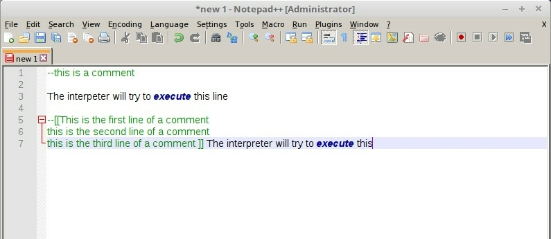
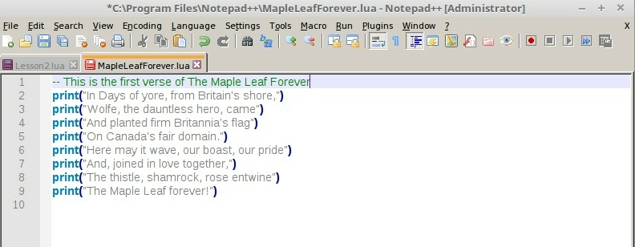
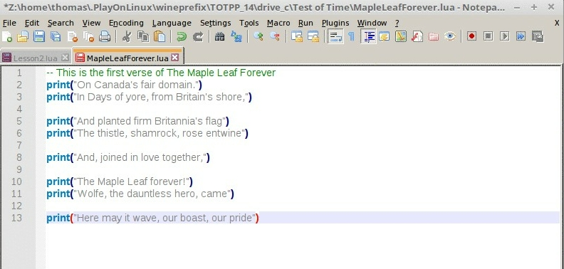
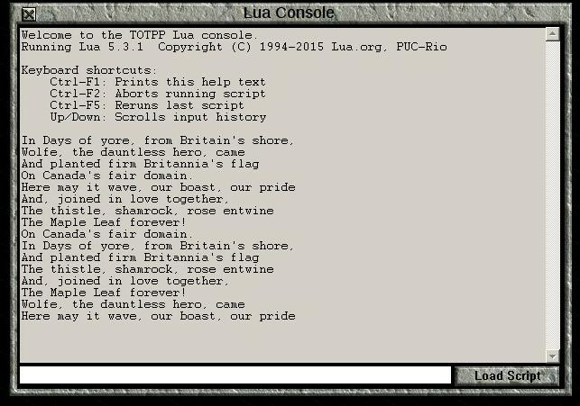
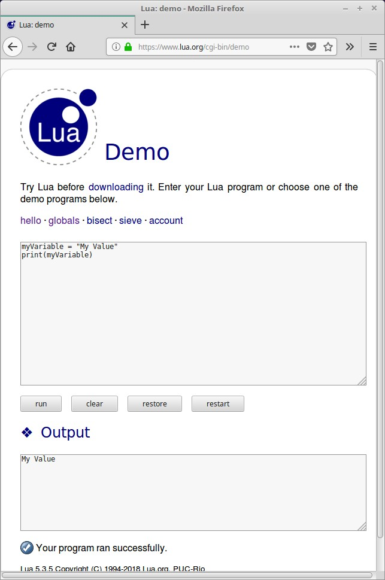

# Lua Basics: Giving Instructions to Your Computer

In order to write events, we must understand some basic programming.  If you feel intimidated, don't be.  You can achieve an awful lot with a small amount of knowledge.  In fact, I could teach you most of the power of the `canBuildSettings.lua` file without calling it "programming," but we wouldn't be able to build on that kind of an explanation.  Instead, we will learn a bit more, and return to that later.  That said, if you want to look at a `canBuildSettings.lua` file from a different scenario, and try to mimic it or make changes, there would be little harm.

## Comments and Printing

Open your text editor and get a new (blank) file.  Make sure to set the language to Lua to get syntax highlighting.  In Notepad++, it is done this way:


We first begin by writing some "comments." Comments are ignored by the Lua interpreter, but they can be helpful to people trying to understand, use, or modify your code. You might one day be one of those people, so at the very least leave the comments you would want to see six months after you wrote the code.

Two dashes (`--`) will make everything to the end of the current line a comment, while `--[[` will comment out everything until a corresponding `]]` is reached.



Commenting can also be useful to stop Lua from executing code that you might still want to include later.

Let us now write some print commands (in an empty file):

```Lua
-- This is the first verse of The Maple Leaf Forever
print("In Days of yore, from Britain's shore,")
print("Wolfe, the dauntless hero, came")
print("And planted firm Britannia's flag")
print("On Canada's fair domain.")
print("Here may it wave, our boast, our pride")
print("And, joined in love together,")
print("The thistle, shamrock, rose entwine")
print("The Maple Leaf forever!")
```

Save this as `MapleLeafForever.lua`.  In Notepad++, it will look something like this:



First, notice how Notepad++ colours the text.

Line 1 is a comment, so it appears in green.

`print` appears in light blue, since it is a command that always comes with a Lua interpreter. The words we want to print appear in grey, since they are `strings`. Exactly what that means will be explained later in this lesson.

Note that colouring will change with different text editors, and even the 'classification' of certain keywords might change. The colouring is only meant as an aid to the programmer (it is not a fundamental part of Lua), and different text editors will have different ideas about what is helpful.

When you run a script, the Lua interpreter will start at line 1 and go line by line executing commands.

Save your copy of MapleLeafForever.lua in your Test of Time directory. (You don't actually have to do this, but the next step will be easier if you do.)

Open Test of Time, start a new game, and open the Lua Console.

Press the '`Load Script`' button, navigate to your Test of Time directory (probably just 'up one level') and select MapleLeafForever.lua

The Maple Leaf Forever Lyrics should appear in your Console.

You may leave Test of Time and the Lua Console open as you do the following. Open MapleLeafForever.lua in your text editor and change the lines around. For example:



Note that the Lua interpreter will simply ignore empty lines when executing instructions. Save MapleLeafForever.lua and use Load Script to load it back into the TOT Lua Console.

Your Lua Console will now look something like this:



The Lua interpreter simply followed each instruction as it was written. It doesn't care that the output makes no sense. It is your job as a programmer to give the computer exact instructions. It isn't going to try to figure out from context what you really want, unless someone else has already written a program trying to mimic human understanding.

Restore MapleLeafForever.lua to print the song lyrics in the correct order, but have it only print the first four lines of the song. Use comments to disable the last four lines, so they can be quickly re-introduced to the program if we decide we want them later. Use the two different methods of commenting described earlier.

Additionally, add two lines of

```Lua
print(" ")
```

to the top of `MapleLeafForever.lua` in order to leave 2 lines between each printing of the lyrics. I will not show a picture of the code, but if you did it correctly, your console will look like this. If you made a mistake, you will have some extra text displayed in the console. Don't worry about that.

# Variables and Arithmetic

Thus far, the only instruction we've given the Lua Console is to print some text. Now, let us learn some more instructions.

The first instruction we need is the ability to create a variable and assign a value to it. For example
```Lua
myVariable = "My Value"
```
assigns `"My Value"` to `myVariable`. Whenever we write `myVariable` later in our code, the Lua interpreter will replace it with `"My Value"` unless we assign something else to `myVariable`.  Think of variables as places in memory that we can put something for later use.

For the next little while we're not going to use any Civilization II related commands, so we're going to use an online Lua interpreter to run our code for a little bit.  This will be more convenient than writing scripts and running them using the Test of Time Lua Console.  Go to the lua demo site https://www.lua.org/demo.html and run the following code:

```Lua
myVariable = "My Value"
print(myVariable)
```

The output will be 

```My Value```



Now, reverse the two commands.

```Lua
print(myVariable)
myVariable = "My Value"
```

You will find that even though `"My Value"` was assigned to `myVariable` in the code, `print(myVariable)` didn't print it. Instead it printed `nil`, which is the special value in Lua that represents an absence of a value. This is because `"My Value"` was assigned to `myVariable` *after* `myVariable` was used in the `print` command.

Look at the code below, and predict what it will do. Be careful, there is a trick that touches on something mentioned in the [Hello World](HelloWorld.md) Lesson. Write down what you think will happen. Once you've done that, cut and paste this code into the Lua Demo and compare your prediction to the actual result.

```Lua
myVariable = "Ten"
print(myVariable)
print(myVariable)
myVariable = "Eleven"
myVariable = "Twelve"
print(myVariable)
myvariable = "Thirteen"
print(myVariable)
```

<details>
    <summary>Answer</summary>
    The "trick" is that Lua commands and variable names are case sensitive. `myvariable` is not the same thing as `myVariable`, as we saw when we deliberately made an error in [Hello World](HelloWorld.md) by using `Civ` instead of `civ`.
</details>
<br>


This page https://www.lua.org/pil/1.3.html tells what is a valid variable name. Basically, "any [sequence] of letters, digits, and underscores, not beginning with a digit." There are some reserved words as well (they all appear as bold dark blue in Notepad++).

Now, let us do a little arithmetic. Per https://www.lua.org/pil/3.1.html:

>Lua supports the usual arithmetic operators: the binary '+' (addition), '-' (subtraction), '*' (multiplication), '/' (division), and the unary '-' (negation). All of them operate on real numbers.
>
>Lua also offers partial support for '^' (exponentiation).

These follow the normal order of operations. You can use parentheses to make sure the behaviour is exactly what you want.

Let us convert kilometers to miles, using the conversion 2.54 cm equals 1 inch.

```Lua
distanceInKM = 12
cmPerKM = 100000
kmPerCM = 1/cmPerKM
cmPerIN = 2.54
inPerCM = 1/cmPerIN
inPerFT = 12
ftPerIN = 1/inPerFT
ftPerMI = 5280
miPerFT = 1/ftPerMI
distanceInMI = distanceInKM *cmPerKM*inPerCM*ftPerIN*miPerFT
print(distanceInMI)
```

Since distanceInKM was set to 12, the output is the mile equivalent.

Specifying all the conversion ratios was a bit of overkill for this one unit conversion, though if we had to do several different kinds, it might have eventually made things easier.

Distance conversions are essentially one line operations. After defining the conversion ratios at the top of the script, all that has to be done is to write the multiplication for the conversion. Let's do something slightly more complicated, converting from Fahrenheit to Celsius

```Lua
tempInF = 68  -- Temperature we want to convert
fFreezeTemp = 32 -- Water freezing point in Fahrenheit
fPerC = 1.8 -- This is the number of Fahrenheit degrees per degree Celsius
fFreezeAt0Temp = tempInF-fFreezeTemp -- This would be the temperature if 0 Fahrenheit were freezing temperature
tempInC = fFreezeAt0Temp/fPerC
print(tempInC)
```

The result of this calculation is 20.0.

Play around with the Lua demo and try doing some simple arithmetic.

## Functions and Local Variables

In the last section, we converted a temperature in Fahrenheit to its Celsius equivalent.  Suppose, however, that we wanted to convert several temperatures.  Using what we know so far, we would have to write code like this:

```Lua
fFreezeTemp = 32 -- Water freezing point in Fahrenheit
fPerC = 1.8 -- This is the number of Fahrenheit degrees per degree Celsius

tempInF = 72
fFreezeAt0Temp = tempInF-fFreezeTemp
tempInC = fFreezeAt0Temp/fPerC
print(tempInC)

tempInF = 100
fFreezeAt0Temp = tempInF-fFreezeTemp
tempInC = fFreezeAt0Temp/fPerC
print(tempInC)

tempInF = 212
fFreezeAt0Temp = tempInF-fFreezeTemp
tempInC = fFreezeAt0Temp/fPerC
print(tempInC)
```

We don't have to copy

```Lua
fFreezeTemp = 32 -- Water freezing point in Fahrenheit
fPerC = 1.8 -- This is the number of Fahrenheit degrees per degree Celsius
```

every time, since these values don't change, but everything else does need to be repeated for each new conversion.  This would get annoying very fast, although we could cut and paste. However, there is a way to specify instructions in advance. We do this by creating a `function`.  We do so with the following code:

```Lua
function myFunction(input1,input2)

end
```

The key word "`function`" tells the Lua Interpreter that we are specifying instructions to be used later, and that we will want those instructions when we write `myFunction`. When we call the function, we replace `input1` and `input2` with the values we wish to evaluate the function with. A function can be defined with as many input values as you would like, or even no input values. Calling `myFunction(10,12)` will set `input1=10` and `input2=12`, and run the commands found after `myFunction` until the word `end` is reached.  The inputs to functions are usually called "arguments."

Later, we'll see `end` used in other places. Think of end as a sort of ')', where there are several things equivalent to '('. The function ends when the '`end`' matching '`function`' is reached.

The code to create a function for our Fahrenheit to Celsius conversion is:

```Lua
function fToC(tempInF)
    local fFreezeTemp = 32 -- Water freezing point in Fahrenheit
    local fPerC = 1.8 -- This is the number of Fahrenheit degrees per degree Celsius
    local fFreezeAt0Temp = tempInF -fFreezeTemp
    local tempInC = fFreezeAt0Temp/fPerC
    return tempInC
end
```

There are a few things to address now. First, the command '`return`' immediately ends the function execution, regardless of what other commands might still be available, and turns `myFunction(inputA,inputB)` into the value to the right of '`return`'.  A function doesn't have to return anything.  This can be achieved either by having a line 

```Lua
    return
```
with no value to return, or simply by reaching the `end` of the function.

The second is that the code within the `fToC` function is indented.  Indentation is not necessary for the Lua Interpreter to work, but it makes code *much* easier to read.

The last item to address is the use of `local` when defining a variable. `local` restricts what parts of your program can access the variable you just created. `Global` variables can be accessed and changed by any part of the program.

For now, remember that `local` inside a file means that only other code in that file can access and make changes to the variable. They will not be accessible by command in the Lua Console! A local variable inside a function will only be accessible to that function, and variables specified in a function declaration are also local. It is strongly recommended to initialize all your variables as local variables, in order to avoid strange bugs. If your variables are initialized as local, you don't have to worry about whether somewhere else in the code there is a variable with the same name (unless they were both initialized at the same 'level').

Consider the following code:

```Lua
function buggy(input)
    j = 3
    print(input)
end
print(j)
j = 7
buggy(8)
print(j)
```
The output is
```
nil
8
3
```
Why?
```Lua
function buggy(input)
    j = 3
    print(input)
end
```
This set of code creates the function `buggy`, which has a single input.  On the second line, the `global` variable `j` is set to `3`.  (Since there is no `local` variable `j`.)  On the third line, the input is printed.  Since the function has only been *defined* and not run, `j` is not changed and nothing is printed.

```Lua
print(j)
```
"nil" is printed since `j` has not been assigned a value yet, and `nil` is the default value for a `global` variable.
```Lua
j = 7
```
The global variable `j` is set to `7`, nothing is printed.
```Lua
buggy(8)
```
`j` is set to `3`, and "8" is printed.
```Lua
print(j)
```
Since `j` has a value of `3`, "3" is printed.  The issue here is that if we didn't know what `buggy` did, we would expect `j` to still have a value of `7`.  Sometimes, this sort of thing is desirable, but we certainly don't want to do it by accident, since it will create strange bugs that are hard to find.

Our code will do what we expect, if we write it like this:

```Lua
function buggy(input)
    local j = 3 -- notice the local here
    print(input) 
end
print(j)
j = 7
buggy(8)
print(j)
```
This prints
```
nil
8
7
```

Why does this code work differently?
```Lua
function buggy(input)
    local j = 3 -- notice the local here
    print(input) 
end
```
This function now creates a new `local` variable `j`  (accessible within the current instance of the `buggy` function) and sets it equal to 3.  Then, the input is printed.

```Lua
print(j)
```
There is no local variable `j` (even if `buggy` were run and it were created, that local variable wouldn't be accessible outside of `buggy`), so Lua assumes this means the global variable `j`, which has a value of `nil`, so "nil" is printed.

```Lua
j = 7
buggy(8)
```
The global variable `j` is now set to 7.  A local variable in `buggy` is set to `3`, and "8" is printed.

```Lua
print(j)
```
The global `j` was not changed by `buggy`, so 7 is printed.

Let us re-arrange the code a bit, and see what happens when 2 local variables have the same name.

```Lua
local j = 7 -- notice local here
function buggy(input)
    local j = 3 -- notice the local here
    print(input,3) 
end
print(j)
buggy(8)
print(j)
j=10
print(j)
```
```
7
8	3
7
10
```
First, a `local` variable `j` is created, and initialized with a value of 7.  Next, the `buggy` function is created, which includes instructions to create a `local` variable called `j` and initialize it to 3.  This is a different `local` variable than was created on the first line.  `buggy` will print this `j` as well as the input.

Next, `j` is printed, and that selects the `j` that was created on line 1 to print "7".  `buggy` is run, and "8" is printed along with "3", since the `j` in `print` refers to the local variable within `buggy`.  After that, the line prints `7`, since `buggy` didn't change the `j` defined on line 1.  The line `j=10` *does* change the line 1 variable, so the last line prints "10".  Note that we don't write `local` when changing the value of an already existing local variable.

Don't worry *too* much about this stuff now.  If you make a habit of initializing new variables with `local`, you will probably be fine.  In fact, the Lua Scenario Template disables the use of global variables, so you will typically get errors if you fail to use `local`.  We need a bit more knowledge of Lua to fully explain why the Template disables global variables by default. 

## Types of Values

Now that we're starting to use commands and functions, we need to know about the different types of values. It is important to understand types of variables since most functions can only accept a particular type of value as input.

[Run](https://www.lua.org/cgi-bin/demo) the following code:

```Lua
print("Maple"+"Leaf"+"Forever")
```
You will get an error:
```
input:1: attempt to add a 'string' with a 'string'
```
This is because the `+` operator is supposed to add `numbers`, not `strings`.

Per https://www.lua.org/pil/2.html,
>There are eight basic types in Lua: nil, boolean, number, string, userdata, function, thread, and table. 

This tutorial will not cover the types `userdata` and `thread`. `Tables` are very important, and will be discusses a little later.  These are the other data types:

1. `nil`, as mentioned earlier, is the type representing 'nothing' in lua. Notepad++ colours this in bold dark blue.
2. `boolean` is a type with exactly two values, `true` and `false`. They're mostly used in logical statements, but can be used for anything which naturally has two values (such as flags). Notepad++ colours `booleans` in bold dark blue.
3. `number` is pretty straightforward, it is a [real number](https://en.wikipedia.org/wiki/Real_number). Lua doesn't distinguish between integers and decimal numbers, but if you want to be extra sure you have an integer, you can use the functions `math.floor(number)` and `math.ceil(number)` to round down and up respectively. Notepad++ colours `numbers` in orange.
4. `string` is text. Enclose it in '' or in "" or in [[]]. Certain characters, (e.g. newline '`\n`') are written with a backslash, so the backslash character is '`\\`' Notepad++ colours `strings` in grey.
5. `function` is as we've defined it earlier. But, as a type, functions can be stored in variables, passed as arguments to other functions, or returned as results.

In addition to these types native to Lua, there are several types that the Test of Time Patch Project provides so that we can interact with the game. These are described in the thread [\[TOTPP\] Lua function reference]( https://forums.civfanatics.com/threads/totpp-lua-function-reference.557527/).  You will most often use the '`unit object`', '`unittype object`' and '`tile object`', but all of these 'objects' provide a means of interacting with some 'piece' of the game.  Strictly speaking, these are the `userdata` type that was mentioned above, but we won't use them like that.

Some functions, like `print` can take many different data types as arguments, other functions can only accept one or a couple data types as arguments.

## Tables

Thus far, we've stored one value at a time in a variable. However, we often want to deal with multiple values of data at once, either because they go together naturally, or because we want to keep them in a list (and often times, both reasons together).

A `table` contains pairs of '`keys`' and '`values`'. A '`key`' in a `table` can be a `number` or a `string` (The key can also be other values, but we'll ignore that in these lessons. Strings and numbers are powerful enough.). The value can be anything, including Test of Time Patch Project specific objects and other `tables`.

We can declare an empty table as 

```Lua
local myTable = {}
```

We can assign a value to a specific key with the following assignment syntax:

```Lua
myTable[keyOne] = myValue
```

We can then access `myValue` by using

```Lua
myTable[keyOne]
```

Let us [run some code](https://www.lua.org/cgi-bin/demo):
```Lua
local myTable = {}
myTable[1] = 2
print(myTable[1])
```
```
2
```
Now, let us add another value to the table:
```Lua
myTable["tree"] = "leaf"
print(myTable["tree"])
```
Adding this to the previous code, and running the whole thing yields:
```
2
leaf
```
We can create a table with initialized data as follows:
```Lua
local myOtherTable = {[keyOne] = valueOne,[keyTwo] = valueTwo, [keyThree] = valueThree,}
```
The ',' after valueThree isn't necessary, but it doesn't hurt anything either.  Let us run another example:
```Lua
local populationTable = {["China"]=1.411e9, ["India"]=1.377e9, ["United States"]=0.331e9,}
print(populationTable["China"])
print(populationTable["United States"])
print(populationTable["India"])
```
```
1411000000.0
331000000.0
1377000000.0
```
We can also write:
```Lua
local myThirdTable = {valueOne,valueTwo,valueThree}
```
which is equivalent to
```Lua
local myThirdTable = {[1]=valueOne,[2]=valueTwo,[3]=valueThree}
```
What's more, we can define tables inside of tables, e.g.
```Lua
local coordinates = {{110,44,0},{111,45,0},{109,43,0}}
```
If we wanted to print the numbers in the second coordinate, we would write:
```Lua
print(coordinates[2][1],coordinates[2][2],coordinates[2][3])
```
and get
```
111	45	0
```
When dealing with nested tables, the leftmost key is is for the outermost table.

There is an alternate syntax that can be used when `table` `keys` are `strings` that can qualify as a variable name (that is, the string has no spaces and doesn't start with a number).

To add an entry in a table, use a `.` between the table name, and the `key`, and don't wrap the key in quotes.
```lua
local newExampleTable = {}
newExampleTable.firstEntry = "First String"
```
You can access the value in a similar manner:
```lua
print(newExampleTable.firstEntry)
```
You can do something similar when creating a table for the first time:
```lua
local anotherExampleTable ={firstEntry = "MyFirstString",secondEntry="MySecondString",["thirdEntry"] = "Three"}
print(anotherExampleTable.firstEntry, anotherExampleTable["firstEntry"])
print(anotherExampleTable.secondEntry, anotherExampleTable["secondEntry"])
print(anotherExampleTable.thirdEntry, anotherExampleTable["thirdEntry"])
```
```
MyFirstString	MyFirstString
MySecondString	MySecondString
Three	Three
```
Notice that defining a `key` `value` pair using the `.` method doesn't preclude the use of `[""]` method for accessing the value, or vice versa.  Of course, the key must qualify.  For example,
```Lua
local populationTable = {["China"]=1.411e9, ["India"]=1.377e9, ["United States"]=0.331e9,}
print(populationTable.United States)
```
results in a syntax error, since the `"United States"` string has a space.
```
input:2: ')' expected near 'States'
```
However, 
```Lua
print(populationTable.China)
```
works just fine.

Now, what happens if we try to access the value associated with a key that is not in a table?  For example, what happens here:
```Lua
local populationTable = {["China"]=1.411e9, ["India"]=1.377e9, ["United States"]=0.331e9,}
print(populationTable["Indonesia"])
```
```
nil
```
The result for trying to access any key not in the table is that the key is defined to have the value `nil` associated with it.  In fact, if we want to remove a value from a table, we change the value of its associated key to `nil`.
```Lua
local populationTable = {["China"]=1.411e9, ["India"]=1.377e9, ["United States"]=0.331e9,}
populationTable["China"]=nil
```
This will become more important later, when we discuss loops and the `pairs` function.

As a final note, this feature of tables where any missing key is defined to have a value of `nil` is a huge reason why global variables are disabled in the Lua Scenario Template.  Global variables are implemented as keys of a special "Global" table.  If there is no local variable with a particular name, the Lua Interpreter instead checks the Global table for a value associated with that key, and a value will always be found, even if it is nil.  This means that typos don't raise errors directly, but instead wait until later in the code to cause problems.

A simple example will clarify this:
```Lua
local mynumber = 10
print(myNumber*2)
```
```
input:2: attempt to perform arithmetic on a nil value (global 'myNumber')
```
The error that is raised makes us try to figure out why `myNumber` has a value of `nil` instead of a `number`, but doesn't point us to the possibility of a typo somewhere, which is the actual cause of the problem.  If your code is complicated, it can take some detective work to figure out why the problem exists, and if `nil` is a reasonable value for `myNumber` to take, then my code will run, just not work properly.

There is a final note to make for tables.  When you store a table in a variable, what is stored is the *name* of the table, not the table itself.  That is, if you "copy" a table into another variable, changes to the "copy" are also made in the original.  Here's an example:
```Lua
local myTable = {1,2,3}
local myOtherTable = myTable
myTable[2] = "Not Two"
print(myTable[2])
print(myOtherTable[2])
```
```
Not Two
Not Two
```
Notice how `myOtherTable` was also changed.  This is different than copying things like strings or integers:
```Lua
local myString = "A nice string"
local myOtherString = myString
myString = "A bad string"
print(myString)
print(myOtherString)
```
```
A bad string
A nice string
```
## Civilization Objects

Lua is useful for making Test of Time Events because of Civilization II specific functionality that interacts with the game.  Some of these are functions, while others are "objects".  We interact with these objects in the same way we interact with tables, except that setting a value for a particular key changes the rules of the game (or, sometimes, the "pieces" on the "board").  We can find this information in the [\[TOTPP\] Lua function reference]( https://forums.civfanatics.com/threads/totpp-lua-function-reference.557527/).  Let us take a closer look at some of the `unittype object` [properties](https://forums.civfanatics.com/threads/totpp-lua-function-reference.557527/#unittype), as an example.

>Properties
>
>advancedFlags (get/set - ephemeral) (since 0.16)
>
>unittype.advancedFlags -> integer
>
>Returns the 'advanced flags' settings of the unit type (bitmask).


>advancedFlags (get/set - ephemeral) (since 0.16)

This is the 'name' of the key.  This line also tells us that we can both "get" the information from this key (in this case, find out what the advanced flags are for this unit type, so we can write code that is dependent on that information) and "set" or change the information as well (in this case, change which of the advanced flags are active for this unit type).  "ephemeral" means this information won't be preserved in the saved game file.  If we want any changes to last after a save and load, our events must take care of that (probably using the `onScenarioLoaded` event).

>unittype.advancedFlags -> integer

`unittype.advancedFlags` tells us how to access the functionality, that is that the key for this functionality is `"advancedFlags"`, which we would use in the same way as a table key.  The `-> integer` tells us that the value of this key is an integer, and that if we want to change the value associated with this key, we must change it to another integer.

>Returns the 'advanced flags' settings of the unit type (bitmask).

This tells us what the advancedFlags key does.  In this case, it provides the 'advanced flags' from the `rules.txt`, with "bitmask" telling us that the 0's and 1's of the flags are treated as the binary representation of the number that is returned.  We'll learn how to cope with bitmasks in a later lesson. 


>id (get)
>
>unittype.id -> integer
>
>
>Returns the id of the unit type.

Most objects have an `id` key.  This is an integer that tells the `place` of the object somewhere.  For a `unitType` object, it is the place in the list of unit types in the `rules.txt`.  For actual `unit` objects (the way to access units), it is the number that the game uses to refer to the unit. 

Since `id` is only a "get" key, you can't change the `id` of a unit type using Lua.

>name (get)
>
>unittype.name -> string
>
>Returns the name of the unit type.

Many objects have a `name`.  If you want the name of something (usually to display in a text box), you use the `name` key.  `unit` objects don't have names.  You must use `unit.type.name` if you want to display the name, since `unit.type` accesses the `unitType` object for the `unit`.  `city` objects have a `name` as well.


>useTransport (get/set)
>
>unittype.useTransport -> integer
>
>Returns the 'use transport site' settings of the unit type (bitmask).

This is one of the rare "set" keys that is *not* ephemeral, presumably because this functionality was part of an available macro event, and so the details are stored within the saved game file.

