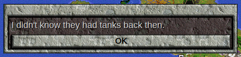
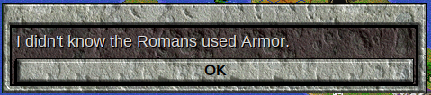
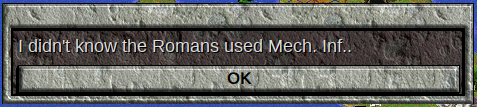
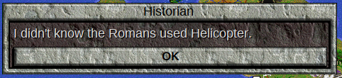
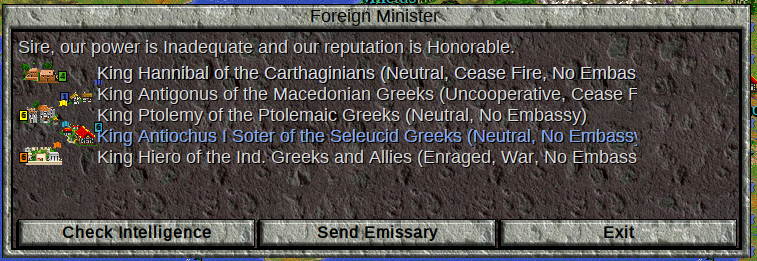
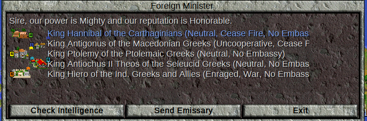
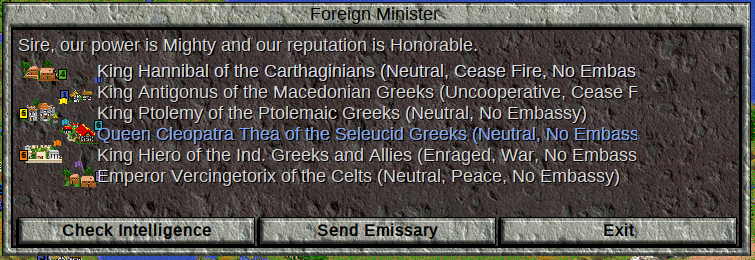

<style>
  code {
    white-space : pre-wrap !important;
    word-break: break-word;
  }
</style>

[&larr;Loops](Loops.md) | [Home](index.md) | 

# More Logic

In the [Conditional Code](ConditionalCode.md) lesson, we used 'if' statements along with 'and' and 'or' to specify code that should only be executed if certain conditions are met. Let us look at logic a bit more closely.

## "else" Statements

Thus far, we've used if statements without `else`. The structure of else in an if statement is as follows:

```Lua
if condition then
-- execute code here only if condition is true
else
-- execute code here only if condition is false
end
```
An `if`-`else` statement will only execute one body of code, never both. It is useful when we want to choose between two options, and it may be clearer what we are doing than if we write two separate if statements. To use our alternating Roman rulers example [from before](ConditionalCode.md#if-statements), we can write our event as:
```Lua
    if turn % 2 == 0 then
        -- We only get here if the turn is even
        object.pRomans.leader.name = evenTurnLeader
    else
        -- We only get here if the turn is odd
        object.pRomans.leader.name = oddTurnLeader
    end
```
With separate if statements, it is not immediately clear whether the two events can both happen at the same time, or if it is possible that neither event will happen.  Using the if-else structure, it is clear that exactly one of these code bodies will happen.

Change your code in `onTurn.lua` to use else, and test this event again.

## "elseif" Statements

Next, we consider `elseif`. `elseif` is a combination of else and if, as the name implies. If the original if statement is false, the Lua Interpreter will check the condition on the first elseif statement. If that is true, the code is executed and then all other elseif (and else) bodies are ignored, even if another condition would be met.  `elseif` is used as follows:

```lua
if condition1 then
--Run this code if condition1 is true
elseif condition2 then
--Run this code if condition1 is false, and condition2 is true
elseif condition3 then
--Run this code if condition1, condition2 are false, and condition3 is true
else
--Run this code if all conditions are false
end
```
In the above if statement, exactly one section of code would be run, depending on which condition was true first. If there is no 'else' before the end, then it is possible that no section of code will execute, if all the conditions are false.

Let us revisit the [Campaign Cost](BuildingFirstEvent.md#campaing-cost-example-event) event that we wrote in `onUnitKilled.lua`.  At the moment, our event looks like this:
```lua
    loser.owner.money = math.max(loser.owner.money -campaignCost,0)
    winner.owner.money = math.max(winner.owner.money-campaignCost,0)
```
The first thing to note is that we're doing the same thing twice, and the only thing different is that we change from `winner` to `loser`.  This isn't a big deal at the moment, but our event is going to get more complicated.  Let us practice making a loop:

```lua
for __,unit in pairs({loser,winner}) do
    unit.owner.money = math.max(unit.owner.money -campaignCost,0)
end
```
Here, we create a table with `loser` and `winner` as values, and then loop over that table to perform our campaign cost event.  Now, let us make this event more complicated.

Elephants are expensive to move and supply, so they'll cost 5 gold per combat. Catapults will cost 4 gold to battle. All other units with 2 movement points will have a combat cost of 3, and all other units will have a combat cost of 1.

We will need parameters for the Elephant and Catapult costs:
```lua
local elephantCampaignCost = 5
local catapultCampaignCost = 4
local twoMoveCampaignCost = 3
local defaultCampaignCost = 1
```
Next, we use `if` and `elseif` to build the details of the event
```lua
for __,unit in pairs({winner,loser}) do
    if unit.type == object.uElephant then
        unit.owner.money = math.max(unit.owner.money-elephantCampaignCost,0)
    elseif unit.type == object.uCatapult then
        unit.owner.money = math.max(unit.owner.money-catapultCampaignCost,0)
    elseif unit.type.move == 2*totpp.movementMultipliers.aggregate then
        unit.owner.money = math.max(unit.owner.money-twoMoveCampaignCost,0)
    else
        unit.owner.money = math.max(unit.owner.money-defaultCampaignCost,0)
    end
end
```
We first note that we get the unit's type by using the `type` key, as in `unit.type`.  Other than that, the most interesting line is this one, the one that checks if the unit has a movement allowance of 2:
```lua
    elseif unit.type.move == 2*totpp.movementMultipliers.aggregate then
        unit.owner.money = math.max(unit.owner.money-twoMoveCampaignCost,0)
```
The first thing to note is that we do not have to exclude Elephants from this statement, since we can only reach this elseif line if the unit is not an elephant.  That is part of the point of elseif.  Next, we have to take notice of the weird way that we are checking if the unit type has 2 movement points.

In Civilization II, a unit can move a fraction of a movement point.  For example, in a standard game, a unit requires 1/3 of a movement point to move along a road.  However, the game's data for movement points does not use fractional values.  Instead, it multiplies all movement cost figures we see in game by a special value (`totpp.movementMultipliers.aggregate`), and keeps track of these values.  One of these movement points is an "Atomic Movement Point."  Atomic movement points are returned by `unitType.move` and `unit.moveSpent`.  You can find examples [here](Jargon.md#atomic-movement-points).

Since `unit.moveSpent` doesn't return the movement cost we see in the rules or Civlopedia, we must figure out how many "atomic" movement points correspond to 2 "regular" movement points.  We can get the number of "atomic" movement points in one "regular" movement point by calling `totpp.movementMultipliers.aggregate`, and then we simply multiply that by 2 in order to get the number with which to compare `unit.moveSpent`.

Now, copy this code into `onUnitKilled.lua` and test it.  The relevant part of your file should look something like this:
```lua
local elephantCampaignCost = 5
local catapultCampaignCost = 4
local twoMoveCampaignCost = 3
local defaultCampaignCost = 1
--local campaignCost = 1
function unitKilledEvents.unitKilledInCombat(loser ,winner ,aggressor,victim,loserLocation,winnerVetStatus,loserVetStatus)
    --loser.owner.money = math.max(loser.owner.money -campaignCost,0)
    --winner.owner.money = math.max(winner.owner.money-campaignCost,0)
    for __,unit in pairs({winner,loser}) do
        if unit.type == object.uElephant then
            unit.owner.money = math.max(unit.owner.money-elephantCampaignCost,0)
        elseif unit.type == object.uCatapult then
            unit.owner.money = math.max(unit.owner.money-catapultCampaignCost,0)
        elseif unit.type.move == 2*totpp.movementMultipliers.aggregate then
            unit.owner.money = math.max(unit.owner.money-twoMoveCampaignCost,0)
        else
            unit.owner.money = math.max(unit.owner.money-defaultCampaignCost,0)
        end
    end
end
```
Note that I commented out the lines that were replaced.  Test this code.  You will run into the following error:

```
...of Time\Scenarios\ClassicRome\LuaCore\generalLibrary.lua:2791: 
The variable name 'object' doesn't match any available local variables.
Consider the following possibilities:
Is 'object' misspelled?
Was 'object' misspelled on the line where it was defined?
(That is, was 'local object' misspelled?)
Was 'local object' defined inside a lower level code block?
For example:
if x > 3 then
    local object = 3
else
    local object = x
end
print(object)
If so, define 'object' before the code block:
local object = nil -- add this line
if x > 3 then
    object = 3 -- remove local from this line
else
    object = x -- remove local from this line
end
print(object)
If you really did mean to access a global variable, write:
_global.object
If you are trying to work in the console, use the command:
console.restoreGlobal()
to restore access to global variables (locals don't work well in the console)
stack traceback:
	[C]: in function 'error'
	...of Time\Scenarios\ClassicRome\LuaCore\generalLibrary.lua:2791: in metamethod '__index'
	...LuaTriggerEvents\UniversalTriggerEvents\onUnitKilled.lua:16: in function 'UniversalTriggerEvents\onUnitKilled.unitKilledInCombat'
	...Scenarios\ClassicRome\LuaTriggerEvents\triggerEvents.lua:115: in function 'triggerEvents.unitKilledInCombat'
	...op\drive_c\Test of Time\Scenarios\ClassicRome\events.lua:231: in upvalue 'doOnUnitDefeatedInCombat'
	...op\drive_c\Test of Time\Scenarios\ClassicRome\events.lua:299: in function <...op\drive_c\Test of Time\Scenarios\ClassicRome\events.lua:282>
```

The first couple lines tell us what we need to know:
```
...of Time\Scenarios\ClassicRome\LuaCore\generalLibrary.lua:2791: 
The variable name 'object' doesn't match any available local variables.
```
We haven't declared an `object` variable, and that is because we forgot to add this line to the file:

```lua
local object = require("object")
```
Without this, we can't access the information in `object.lua`.  Add this line, and test the code again.  It should work now.  Make sure to test what happens when you kill a unit stack.

When we make a stack kill, the campaign cost is deducted for each unit killed.  That is because the unit killed event runs for *every* unit killed, not just the unit that fought.  It isn't necessarily "wrong" to have the event work like this, but it may not be what we want.  It turns out there is a way to deal with this.

When the unit killed event is run, the winner and loser hitpoints are not changed from the end of combat.  The `loser` that fought and lost will have 0 hitpoints, while all the other losers have more than 0 hitpoints.  We can use this to distinguish units killed in a stack from units that actually fought.

We will modify our `unitKilledInCombat` code so that the campaign cost code only happens when the loser has 0 or less hitpoints.

```lua
function unitKilledEvents.unitKilledInCombat(loser ,winner ,aggressor,victim,loserLocation,winnerVetStatus,loserVetStatus)
    --loser.owner.money = math.max(loser.owner.money -campaignCost,0)
    --winner.owner.money = math.max(winner.owner.money-campaignCost,0)
    if loser.hitpoints <= 0 then
        for __,unit in pairs({winner,loser}) do
            if unit.type == object.uElephant then
                unit.owner.money = math.max(unit.owner.money-elephantCampaignCost,0)
            elseif unit.type == object.uCatapult then
                unit.owner.money = math.max(unit.owner.money-catapultCampaignCost,0)
            elseif unit.type.move == 2*totpp.movementMultipliers.aggregate then
                unit.owner.money = math.max(unit.owner.money-twoMoveCampaignCost,0)
            else
                unit.owner.money = math.max(unit.owner.money-defaultCampaignCost,0)
            end
        end
    end
end
```

Try killing a stack again, and see the change.

## "not" Operator

The logical operator 'not' is quite straightforward. It returns true if it operates on false or nil, and false otherwise. That is, false becomes true and true becomes false.

```lua
print(not 7)  -- false
print(not false) -- true
print(not true) -- false
print(not nil) -- true
print(not {}) -- false
print(not 0) -- false
```
Run this code in the [Lua Demo](https://www.lua.org/cgi-bin/demo) to verify these results.

Let us revisit the bonus chariot event for the Celts in `onTurn.lua`.
```lua
    if (object.lMilan.city and object.lMilan.city.owner == object.pCelts) and
        (chariotSquare.defender == nil or chariotSquare.defender == object.pCelts) then
        local newChariot = civ.createUnit(object.uChariot, object.pCelts, chariotSquare)
        newChariot.veteran = false
        newChariot.homeCity = nil
    end
```
Suppose we wish to only give this bonus to the AI.  We can check if a tribe is played by a human player by the method `tribe.isHuman` method, which returns true if the tribe is being controlled by a human.  Try making this change yourself, and then test the code.

<details><summary>Solution</summary>
<code>
    if (object.lMilan.city and object.lMilan.city.owner == object.pCelts) and
        (chariotSquare.defender == nil or chariotSquare.defender == object.pCelts) and
        not object.pCelts.isHuman then
        local newChariot = civ.createUnit(object.uChariot, object.pCelts, chariotSquare)
        newChariot.veteran = false
        newChariot.homeCity = nil
    end
</code>
</details>

## More About "and" and "or"

When [discussing](ConditionalCode.md#guarding-against-Errors-with-and) how to "guard" against certain errors using the `and` operator, I mentioned that 
```lua
nil and anything
```
actually evaluates to `nil` and not `false`.  This is because the "and" and "or" operators don't return only booleans, but instead they return one of the two arguments they were given.  That is,
```lua
A and B --> A if A is false or nil
A and B --> B otherwise (even if B is false or nil)
```
Similarly, 
```lua
A or B --> B if A is false or nil
A or B --> A if A is anything else
```
This makes no difference when determining whether to execute the body of an if statement, but it is quite useful when using `and` or `or` in other contexts.  Or, rather, it is useful to use `or` in other contexts, as we will see.  I don't think I've used `and` outside an if statement, but [this page](https://www.lua.org/pil/3.3.html) has an example if you want it.

On the other hand, I use `or` quite frequently outside of if statements, because it is quite useful for setting up default values.  Run this code in the [Lua Demo](https://www.lua.org/cgi-bin/demo):
```lua
local animals = {cats = 4, dogs = 3, pigs = 2}
animals.horses = animals.horses + 4
print(animals.horses)
```
You will get the following error:
```
input:2: attempt to perform arithmetic on a nil value (field 'horses')
```
This is because there is no key in the `animals` table called `horses`, so `animals.horses` returns `nil`.  One thing we can do is use an `if` statement to check if `animals.horses` already exists.  If it doesn't, we can initialize to a value of 0.
```lua
local animals = {cats = 4, dogs = 3, pigs = 2}
if animals.horses == nil then
    animals.horses = 0
end
animals.horses = animals.horses + 4
print(animals.horses)
```
This code works as we would like, but we can make it more compact by using `or`.

```lua
animals = {cats = 4, dogs = 3, pigs = 2}
animals.horses = animals.horses or 0
animals.horses = animals.horses + 4
print(animals.horses)
```
The relevant line is 
```lua
animals.horses = animals.horses or 0
```
On the Left Hand Side, we are setting the value of animals.horses.  On the Right Hand Side, if animals.horses already has a value (unless that value is false), `animals.horses or 0` will return `animals.horses`, because `or` returns the left value if that value is "truthy."  `nil` is "falsy," so if animals.horses hasn't been assigned a value, `animals.horses or 0` will return the value to the right of `or`, which is 0. Hence, 0 will be assigned to animals.horses.  If we wanted, we could even combine those two lines:
```lua
animals = {cats = 4, dogs = 3, pigs = 2}
animals.horses = (animals.horses or 0) + 4
print(animals.horses)
animals.horses = (animals.horses or 0) + 3
print(animals.horses)
```
I have added another addition line, so we can see that once `animals.horses` has a value, teh value will be maintained.  It is important to remember that you can't use this "Lua Idiom" if your table will have false values, but that is actually rather uncommon.

## Tables and Logic


Let's build an event that will chide the player if they win a battle with a "modern" unit.  We'll begin by checking if the unit is an Armor unit.  This event will be another `unitKilledInCombat` event.
```lua
if winner.type == object.uArmor and winner.owner.isHuman then
    civ.ui.text("I didn't know they had tanks back then.")
end
```
The `civ.ui.text` function is the basic way to show a text box.  Add this code to the game, and test the event.  You should get this text box message:



Now, let's add Mech. Inf. to the unit types that will trigger this event.  We will also customize the message based on the unit type and owner of the unit.
```lua
if (winner.type == object.uArmor or winner.type == object.uMechInf) and winner.owner.isHuman then
    civ.ui.text("I didn't know the "..winner.owner.name.." used "..winner.type.name..".")
end
```



The `..` operator concatenates strings, and `tribe.name` and `unitType.name` both return strings as well.  With string concatenation, we build the custom message.

Now, let us add Helicopter units to the list of unit types that trigger this event.  Also, let us give a "title" to the text box.  One way to do that is to use the [dialog object](https://forums.civfanatics.com/threads/totpp-lua-function-reference.557527/#dialog), but we're going to import the [`text` module](TextModule.md) and use `text.simple` instead.

```lua
local text = require("text")
```
```lua
if (winner.type == object.uArmor or winner.type == object.uMechInf
    or winner.type == object.uHelicopter) and winner.owner.isHuman then
    text.simple("I didn't know the "..winner.owner.name.." used "..winner.type.name..".","Historian")
end
```
The second (and optional) argument of `text.simple` provides the title ("Historian") of the text box, as we see when testing this code:



By now, you've probably noticed that checking if the winner's unit type triggers this event is using a lot of code in the if statement.  We can use a table to make this check:

```lua
local modernUnits={
    [object.uArmor.id]=true,
    [object.uMechInf.id]=true,
    [object.uHelicopter.id]=true,
    [object.uParatroopers.id]=true,
}
```
(The above table can go before `unitKilledEvents.unitKilledInCombat`, along with the other parameters.)
```lua
if modernUnits[winner.type.id] and winner.owner.isHuman then
    text.simple("I didn't know the "..winner.owner.name.." used "..winner.type.name..".","Historian")
end
```
If a `unitType` `id` is a key in `modernUnits`, then `modernUnits[winner.type.id]` will be `true` if the winner is one of those types and `nil` (hence, false) if it is not.  Try this code out with the four unit types, and a couple that are not "modern." 

In this next example, we will use a table where the values actually have relevant information for our function.  In `onTurn.lua`, we already change the name of the Roman leader based on whether the turn is even or odd.  Now, we will change the name of the ruler of the Seleucids, based on the game year.  Here is an incomplete list of the [Seleucid rulers](https://en.wikipedia.org/wiki/List_of_Seleucid_rulers) from the time period of the scenario.  The key is the year in which they gained power.
```lua
local seleucidRulers = {
[-281] = {name = "Antiochus I Soter", female = false},
[-278] = {name = "Antiochus I Soter", female = false}, -- this is the year the game starts
[-261] = {name = "Antiochus II Theos", female = false},
[-246] = {name = "Seleucus II Callinicus", female = false},
[-225] = {name = "Seleucus III Ceraunus", female = false},
-- this makes the point
[-126] = {name = "Cleopatra Thea", female = true},
-- have a female ruler to test, though
}--close seleucidRulers
```
Antiochus I Soter is included twice, with one time being the year this scenario begins, so that the Seleucid Ruler will be renamed on the first turn.  We note that years here are not turns, so we use `civ.getGameYear()` to get the year (which is negative for B.C. years).

The code to change the name (and gender) of the Seleucid Greeks is:

```lua
if seleucidRulers[civ.getGameYear()] then
    -- if there is no entry for this index, it returns nil, which the if statement counts as false.
    object.pSeleucidGreeks.leader.name = seleucidRulers[civ.getGameYear()].name
    object.pSeleucidGreeks.leader.female = seleucidRulers[civ.getGameYear()].female
end --if seleucidRulers[civ.getGameYear()]
```

If the year is a year for which the Seleucid ruler must change, this code is run.


Copy this data and code into `onTurn.lua`, and start a new game to make sure that the Seleucid Greeks have the correct name.



Now, change the game year to 262 B.C. (Turn 16), and end the turn.  Between turns, the name of the ruler will change.



To check that the female ruler part works, change the year to 127 B.C. (Turn 151), and end your turn again.




[&larr;Loops](Loops.md) | [Home](index.md) | 