<style>
  code {
    white-space : pre-wrap !important;
    word-break: break-word;
  }
</style>


[&larr;Hello World](HelloWorld.md) | [Home](index.md) | [Lua Basics&rarr;](LuaBasics.md)

# The Lua Scenario Template

For this guide, we will be learning to build our Lua Events with the Lua Scenario Template.  The template is larger than what we strictly need to make events in Lua, but it means we can take advantage of many pre built features without having to learn how to join them together.

To begin, there should be a zip file included with this guide called [ClassicRome.zip](GameFiles/ClassicRome.zip), which contains a Test of Time conversion of the "Rome" scenario that shipped with the original game.  The scenario has been altered to have two 'macro' style events, in order to show how the Lua Scenario Template integrates these 'legacy' events.  These two events display text when the Romans capture Taras or Syracuse.

## Installing the Lua Scenario Template

Extract the ClassicRome scenario into your Scenario directory, just as you would install any other scenario.  This will serve as our 'base' scenario for this guide.  It is not necessary to have everything else completed in your scenario before you start building the Lua Events.

Next, download a copy of the Lua Scenario Template, preferably from this [Github Repository](https://github.com/ProfGarfield/LuaTemplate).  At the time of writing, there is still more work to be done on the template, so downloading from this Github Repository will ensure you get the most up to date version of the template.

You will want to download a ```.zip``` file of the code.  At the time of writing, you click on the green `code` button and select `download zip`.

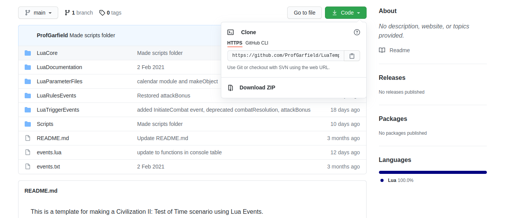

Follow these installation instructions (If the README.md displayed in the repository has different instructions follow them, since they will be more current.).

1.  **Make a backup of the scenario folder, just in case.**  (We already have a backup for ClassicRome, so don't worry about it for this tutorial.)
2.  **If you have an events.txt file for the old style "macro" or "legacy" events in your scenario folder, rename it to legacyEvents.txt.**  (We do, indeed, have an events.txt file, so rename it to legacyEvents.txt now.)  This step is important, since without it, the events that already been written will be overwritten by an empty events.txt file.  (The empty file is necessary to make the Lua Events work.)
3. **Download the LuaTemplate code.**
4. **Copy the contents of this template into your scenario folder. Do not include the LuaTemplate-main folder. That is, you should be copying 6 folders and a couple other files into your scenario folder.**

At this point, your ClassicRome folder should look like this:
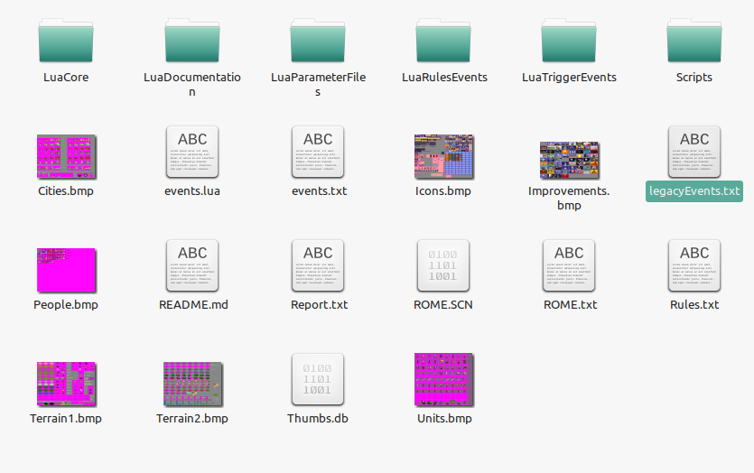

5. **If you have legacy events, move legacyEvents.txt from the main scenario folder into the LuaTriggerEvents folder, replacing the existing file.**  (Since we do have that file, make sure to move it.)

Now, begin a new scenario for ClassicRome.  Choose to allow Lua Events when prompted.

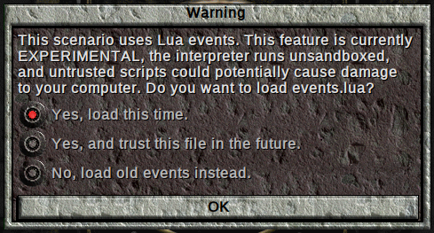

Also, clear the saved data for the Legacy Event Engine.

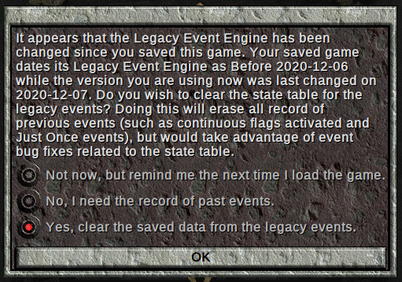

This prompt will occur after upgrades to the Legacy Event Engine (this is the name of the code that has implemented the old 'macro' or 'legacy' events in Lua), or after you make changes to legacyEvents.txt.  You receive this prompt now, since the game has never been saved with a version of the Legacy Events Engine.  Deleting the existing data prevents certain bugs (especially if you change the order of events in the legacyEvents.txt file).

Choose the Romans as you tribe, open the cheat menu, and save the game.  Having a saved game with the cheat menu open will make checking our events just a little bit quicker.

For now, open the Lua Console.  The following information will have been printed to the console.  (There might be other information from future changes to the template.)

```
Global variables are disabled
WARNING: setGuaranteeUnitActivationType was set to nil.  The functionality to guarantee that a tribe will have an active unit is disabled.  Some events may not work properly until a unit type is specified.
File number 1 event ending at line 12 successfully parsed.  Event number is 1.
File number 1 event ending at line 24 successfully parsed.  Event number is 2.
```

For now, let us focus on these lines:

```
File number 1 event ending at line 12 successfully parsed.  Event number is 1.
File number 1 event ending at line 24 successfully parsed.  Event number is 2.
```
When the Legacy Event Engine successfully processes an event, a line is printed to the console.  If there is an error parsing an event, we can use this information to figure out where to look, since the first event with an error will occur just after the line that was successfully parsed.

Open `legacyEvents.txt` in the `LuaTriggerEvents` directory, and change the second event.  Replace the `TEXT` action with `TXT` instead:
```
@IF
CityTaken
city=Syracuse
attacker=Romans
defender=Anybody
@THEN
TXT
Syracuse has been captured by the Romans!
EndText
@ENDIF
```
Save the file, and load your saved game.  You will get an error:

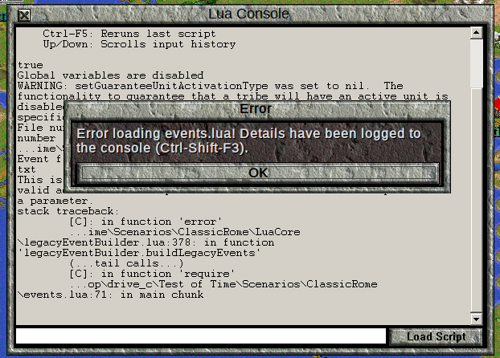

Open the console, if it isn't already open, to see the error:

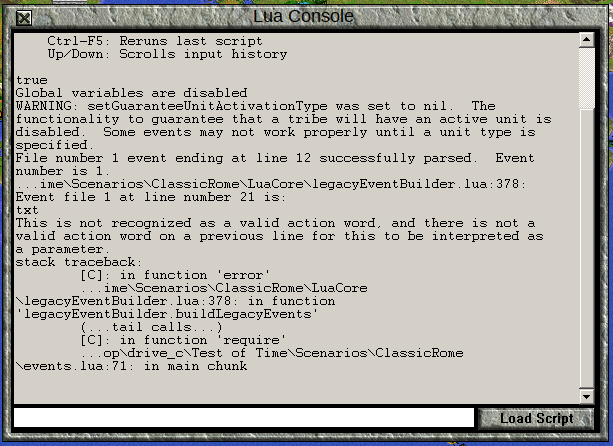


There are several pieces of information that we need:
```
File number 1 event ending at line 12 successfully parsed.  Event number is 1.
```
This tells us that up to line 12 was processed properly, so we should go to line 12 in our `legacyEvents.txt` file, and look at the event after that one.

```
...ime\Scenarios\ClassicRome\LuaCore\legacyEventBuilder.lua:378: Event file 1 at line number 21 is:
txt
This is not recognized as a valid action word, and there is not a valid action word on a previous line for this to be interpreted as a parameter.
```
This is telling us that the legacy event engine realized that there was a problem at line 21.  It doesn't necessarily mean that line 21 is where the error is (though in this case it is), but that was where the parser realized there was a problem.  In this case, the problem is that `txt` is not a valid action word in the legacy events system, and it is not a parameter for an action initiated on a previous line.

Of course, since it is supposed to be `text`, we can go and fix this particular problem.
```
stack traceback:
	[C]: in function 'error'
	...ime\Scenarios\ClassicRome\LuaCore\legacyEventBuilder.lua:378: in function 'legacyEventBuilder.buildLegacyEvents'
	(...tail calls...)
	[C]: in function 'require'
	...op\drive_c\Test of Time\Scenarios\ClassicRome\events.lua:71: in main chunk

```
This information tells us where the code was being executed in the Lua files when the error happened.  It is not useful to us now, but this information will help us when we are debugging actual Lua code.

The Legacy Event Engine isn't a rigorous event checker, so it is still possible that there are mistakes in the events.  It will catch certain things that the macro debugger won't (meaning that if you are enhancing an old scenario with Lua, you might find mistakes in the events that you must fix), and the old macro debugger might catch things in advance that the Legacy Event Engine won't know are wrong until the event happens.  If you are intending to combine legacy and lua events in the same scenario, you must still write and test your legacy events carefully.

Once you have fixed `legacyEvents.txt`, load your saved game again to get the correct events loaded.  You do not have to start an entire new scenario when you change either Lua or Legacy events.

## Choose a Text Editor

In order to to write Lua events, you are going to need a program called a "Text Editor."  This is not the same thing as a "Word Processor," so Libre Office Writer or Microsoft Word won't suffice for our purposes.  Text editors are used to write and edit text files for programming and other similar purposes.  They provide features like line numbering (and being able to jump to specific lines) and syntax highlighting.  Syntax highlighting changes the colour (and sometimes font) of certain words in your code based on their use in the programming language.

Here is a snippet of code from the Boudicca Scenario:

```lua
	if loser.type == object.uLegionStandard and loserLocation == object.lXXvictrixEvocati and loser.owner == object.tTheGods and winner.owner == object.tRomans then 
		if aggressor.type == object.uDispatchRider then 
		    civ.ui.text("Recent retirees of the XX Valeria Victrix answer the call and rally behind their Evocati standard! They are a bit rusty, but battle will cure that!") -- Note you can have text this way as well if you don't want to store it in the object file
		    civlua.createUnit(object.uEvocatiFresh, object.tRomans, {{winner.location.x,winner.location.y,winner.location.z}}, {count=2,randomize=false, veteran=false})  	
	        -- I create unit - but note that by using loserLocation.x and so on, it will create exactly where the legion standard was killed.  This doesn't really matter for this unit (as the legion standard is immobile) but if you wanted to use this to 
	        -- capture "slaves" or something and have the unit show up in the same place as the victorious unit, this is how you achieve it.
		else
		    civ.ui.text("Only dispatch riders can summon more troops.  Send them at once!")
		    civlua.createUnit(object.uLegionStandard, object.tTheGods, {{loserLocation.x,loserLocation.y,loserLocation.z}}, {count=1, randomize=false, veteran=false})
		end 
	end 
```
In this syntax highlighting, the special words `if`, `and`, `then`, `else`, and `end` are in dark blue.  Comments (notes to program readers that are ignored by the computer) are in green, while the special values `true` and `false` are in red, along with "string" (sequences of characters) values.

The exact highlighting will be different for each text editor.  Some programming environments are more advanced than text editors, called Integrated Development Environments (IDEs), and will come with even more features.  It doesn't really matter which one you use.  If you don't already have a preference, [Notepad++](https://notepad-plus-plus.org/) is a decent choice, and is Licensed under the GNU General Public License, so you should always be able to get a copy, since it is free to redistribute.

If you open a file that has already been saved as a `.lua` file, your text editor will probably already recognize it as a Lua file and highlight the syntax appropriately.  Use this menu to change the syntax highlighting in Notepad++:

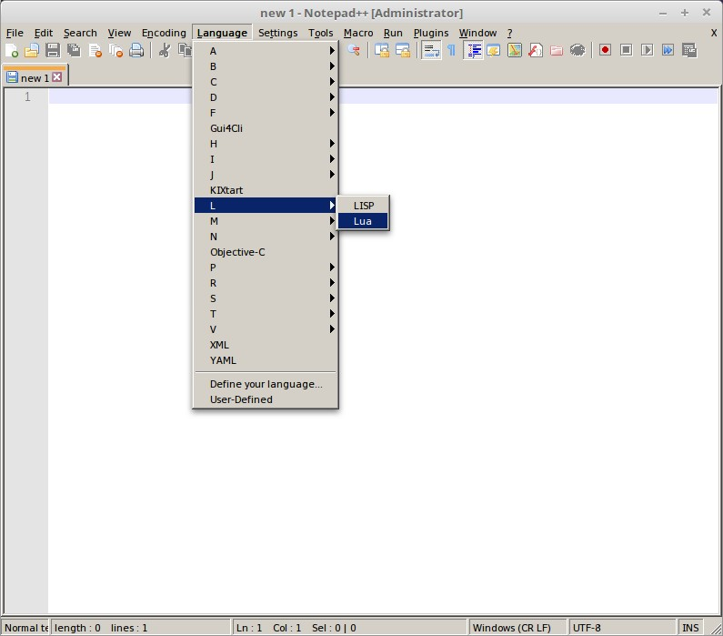

## Building the object.lua File

The Lua programming language has a number of different data types.  Some of these, like "numbers" and "strings" (sequences of characters) are standard for all Lua programming instances (and, for that matter, most other programming languages).  There are other data types, such as `unit type` objects and `technology` objects which are distinct to the Civilization II Lua environment.  It turns out to be very useful to give these kinds of objects "Lua Names," rather than to refer to them by their location in the `Rules.txt` file.

One reason to give names to things is to make our code more readable.  Reading `object.uWarrior` is a lot more informative than `civ.getUnitType(2)` or simply `2`.  Another reason is that if we change the `rules.txt` file, we need only change one or two places in our code, not necessarily everywhere.  For example, we might originally want to have a "fortifications" technology use the construction technology slot, but later decide that we don't want fortresses in our scenario (but still want the fortifications tech).  We can then simply change what `object.aFortifications` refers to instead of searching all our code for instances of `18` and determine if they refer to the Construction technology or something else, and then manually change the number.

In the Lua Scenario Template, we define the names of our Civilization II Objects in the file `object.lua`, found in the `Lua ParameterFiles` directory.  We could fill this whole file manually, but we don't have to.  Instead, we can use a script to produce a basic `object.lua` file, and then make adjustments if we have a specific need.

To do this, open the Lua Console, and click the `Load Script` button  

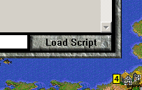

Navigate to the ClassicRome scenario directory, then to the `Scripts` folder and load `makeObject.lua`.

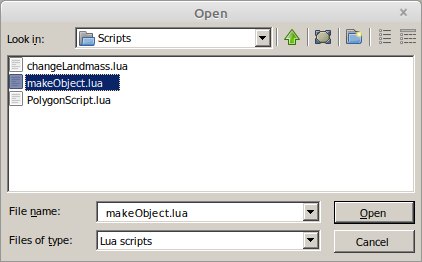

When you run this script, you will be asked how many terrain types each map has.  In this case, there is only one map (map 0), and this is a pre Test of Time Patch Project scenario, so there are 11 terrain types.

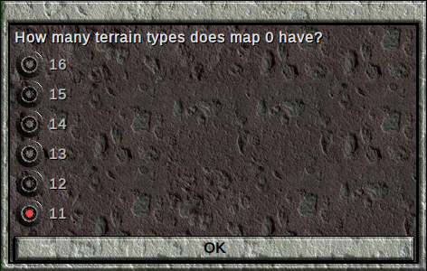

Once completed, a message like this will be printed to the console:

```
Basic object file written to <path\to\TOTDir>\Test of Time\XXXXXXXXXXobject.lua
```
This will tell you the location and name of the new object file that was just created.  It is made in your base Test of Time directory, and the file name is prefixed with a number derived from the current date and time.  This is all to ensure that no file is accidentally overwritten in this process.

Rename this file as `object.lua`, and replace the existing `object.lua` file in the `LuaParameterFiles` folder.  Load your game again to make sure this works.

We will learn more about `object.lua` and its contents in later lessons.  For now, let us conclude this lesson by using the Template to introduce a restriction on where Legion units can be built.  With your text editor, open the file `canBuildSettings.lua`, which is found in the `LuaRulesEvents` folder.

The top of this file has some `require` lines, which we will learn about in due course.  It also has a lot of comments documenting the various restrictions available.  For now, scroll down past the comments until you find the line

```lua
local unitTypeBuild = {}
```

Directly below this line, type in this line to make it so that legions can only be built in cities with the Barracks improvement.  We'll cover why this is what you must write in due course.

```lua
unitTypeBuild[object.uLegion.id]={allImprovements={object.iBarracks}}
```

The nearby lines should look something like this:

```lua
local unitTypeBuild = {}
unitTypeBuild[object.uLegion.id]={allImprovements={object.iBarracks}}

local improvementBuild = {}
local wonderBuild = {}
```

Save your changes to `canBuildSettings.lua`, and load the game again.  In Rome, you will have the option to build Legions:

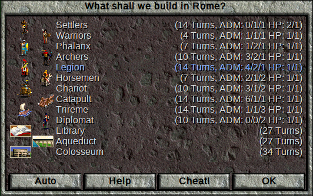

But in Neapolis, you will not:

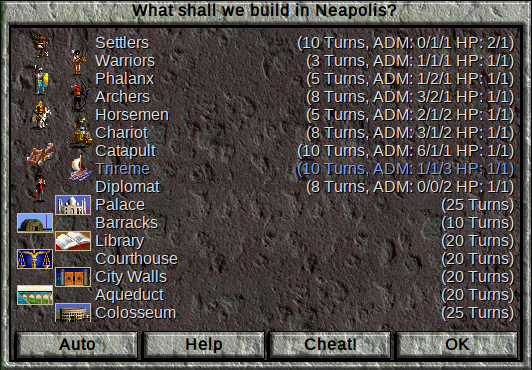

## Next Lesson: [Lua Basics](LuaBasics.md)

[&larr;Hello World](HelloWorld.md) | [Home](index.md) | [Lua Basics&rarr;](LuaBasics.md)