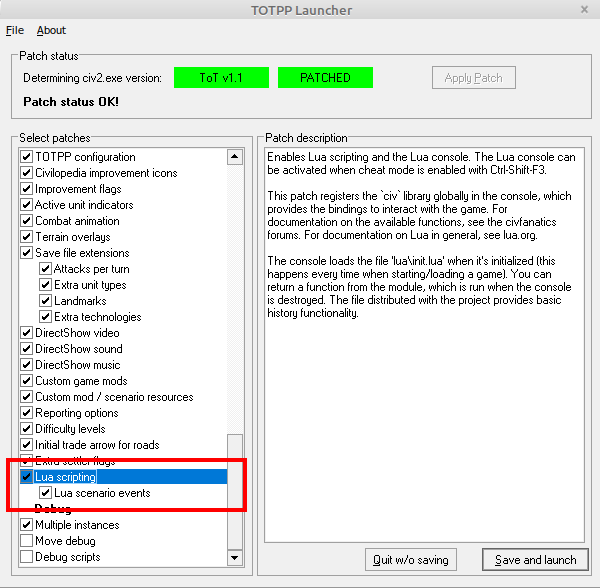
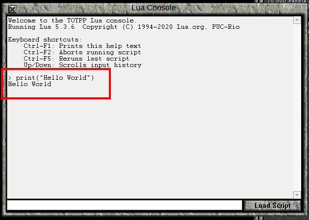

| Next: [Writing Programs](02_writingScripts.html)

# Hello World

## Introduction

Welcome.  This is the first in a series of lessons designed to teach you how to use the Lua Programming Language in order to write scenario events for Civilization II: Test of Time.  If you've never programmed before, don't worry.  I'll teach you the basics as we go along.  But before you seek the power of The Moon, I must give you this warning: Since Lua will give you the power to do almost anything in your scenario, you will be tempted to do almost everything.

I must emphasize that you should actually perform the instructions that I give in these lessons.  Type out the code and run the scripts as instructed. Don't just read the "story."  You will pick up a lot more by doing the work, and it will start to get you comfortable with programming.  However, if for some reason you have a typo that you can't find that is causing the code to fail, then, by all means, copy and paste from the code I give you.

If you have questions (or feedback) about these lessons, you can ask them [here](https://forums.civfanatics.com/threads/feedback-thread-for-totpp-get-started-with-lua-events.636239/).  Note that this thread originally served an [older set of lessons](https://forums.civfanatics.com/threads/totpp-get-started-with-lua-events.636192/) so the first couple pages of posts are not directly applicable to these lessons.

When teaching programming, it is traditional to start with a "Hello World" example.  In that spirit, this lesson will show you how to open the "Lua Console" and how to paste some code into it.  Do not worry about *understanding* the code at this stage.  In fact, the more interesting commands you use here are actually hidden from you when you use my Lua Scenario Template.

## Getting Started

The Lua Programming Language was not integrated with the original Test of Time game.  Rather, it was introduced as part of the [Test of Time Patch Project](https://forums.civfanatics.com/threads/the-test-of-time-patch-project.517282/), so you must install that.  At the time or writing, the most recent version is [0.18.4](https://forums.civfanatics.com/threads/the-test-of-time-patch-project.517282/page-66#post-16214239), but a more recent version should be fine.  Also, make sure that you have enabled **Lua scripting** and **Lua scenario events** in the TOTPP launcher.



Now, start a new Original game.  (If you've replaced the Original folder with a mod that uses Lua, restore the original version of the folder.  The reason will be explained in a later lesson.)  For convenience, start as the Romans.  None of the other selections matter.

Once the game has begun, activate Cheat Mode.

## Printing Hello World in the Lua Console

Press Ctrl+Shift+F3 to open the Lua Console.  This window can be used to type in instructions line by line to be executed immediately.


For your first command, type the following into the command line at the bottom of the console.

```lua
print("Hello World")
```


Once you've finished typing, press Enter, and your console should look like this:



Notice how the command you typed in was printed, then, on the next line, 'Hello World' was printed.

Perhaps you made a typo.  Depending on where you put it, either 'Hello World' was different, or something else happened.

Let's show an example, where the '(' was forgotten.  Type the following into the console command line:

```lua
print"Hello World")
```
You will get the following error:
```
> print"Hello World")
input:1: unexpected symbol near ')'
```
We will learn to interpret errors soon enough.  For now, let's try this mistake:
```lua
Print("Hello World")
```
In this case, we get a slightly different error:
```
> Print("Hello World")
input:1: attempt to call a nil value (global 'Print')
stack traceback:
	input:1: in main chunk
```
Commands in Lua are case sensitive, so `print` is not the same as `Print`.  Again, we'll discuss how to interpret error messages in later lessons.

For a final "mistake," try the following line:
```
print("Hello World"
``` 
In this case, we don't get an error message, we just get the line we put in:
```
> print("Hello World"
```
This is because the Lua Console recognizes this as an *incomplete* command, rather than a *bad* command.  Type in the closing `)` to get Hello World printed again.  If you've typed in everything the way I have, your console will look like this:


If it looks slightly different, don't worry about it.  As long as you've successfully printed Hello World to the console, move on to the next section.

## Creating a Text Box

The command `print()` displays to the console, and this will be useful for debugging code when the time comes. However, the point of Lua is to interact with the game itself. Therefore, we will now create a text box.

Enter the following command into the Lua Console:
```
civ.ui.text("Hello World!")
```

If typed correctly, a text box should appear:


In the above command, the characters within the quote marks `"` are displayed to the player.  Try changing the command to show a text box containing _Hello Moon!_ instead. Note that you can use the up and down arrow keys to bring up previous console commands. 

## Registering an Event

Thus far, we've only been able to make the game do something by writing a command in the Lua Console.  Now we will write code to register an event.  Don't worry about _why_ the code is written this way.  That will be explained later.  (In fact, the Lua Scenario Template will have you use slightly different code to register an event.)

Enter the following code into the Lua Console:
```
civ.scen.onActivateUnit(function() civ.ui.text("Hello World!") end)
```
If no error is printed, close the Lua Console (the X in the top left corner). Activate a unit (clicking on it will do). You should get a "Hello World!" text box message.


## A Unit Killed Event

Now that we have an event when units are activated, let's write an event for when units are killed.

Open the Lua Console again, and enter this command:

```
civ.scen.onUnitKilled(function() civ.ui.text("Goodbye Cruel World!") end)
```

Now, create 2 warriors, one from a different tribe, and make them fight.

You should get a text box like this:


## Conclusion

In this short lesson, we've given commands to the game and seen the game react.  We've also seen some errors in the Lua Console.  As we progress, we'll come to understand the commands we give and the errors we will sometimes receive.  For now, I hope you are just a little bit less intimidated by the idea of programming.  You've given the computer instructions, and it has followed them.  You have started programming.


| Next: [Writing Programs](02_writingScripts.html)