| Previous: [Hello World](01_helloWorld.html) | Next: [Values and Variables](03_valuesAndVariables.html) |

# Writing Programs

## Introduction

In [Lesson 1](01_helloWorld.html), we wrote code directly into the Lua Console, and it executed those commands immediately.  Usually, however, we will want to write our code ahead of time and run it all at once.  In this lesson, we will download the software to create and change Lua files, write some programs, and run them in the Lua Console.

## Setting Up Our Programming Environment

In order to write programs in Lua (or any programming language) you will need to use a special kind of program called a "text editor."  This is NOT the same thing as a "word processor."  A program like Libre Office Writer or Microsoft Word will not work for our purposes.  Lua programs are written in "plain text" format, which is to say that the file is just a sequence of letters, numbers, special characters, spaces, etc.  There is no extra data for stuff like formatting or fonts.  

In plain text, an A is an A is an A.  But in a Word document, you could have an A or an _A_ or an **A** or an <span style="font-size:30px">A</span>.  That extra information doesn't exist in a plain text file.  The rules.txt, game.txt, and events.txt files are all examples of text files.  A text editor is a program designed for writing and changing text files, and provides features useful for programming such as different colors for different programming elements.   

Some text editors have a lot of features useful for programmers, and are called "Integrated Development Environments," or IDEs.  For these lessons, I will be using [Visual Studio Code](https://code.visualstudio.com/), which is an IDE, but I would recommend also installing [notepad++](https://notepad-plus-plus.org/) or some other more "lightweight" text editor for when you just want to take a look at an individual file.

Download and install Visual Studio Code (VS Code).  Default installation choices are probably fine, except that during Select Additional Tasks, you should probably enable all the "other" options:

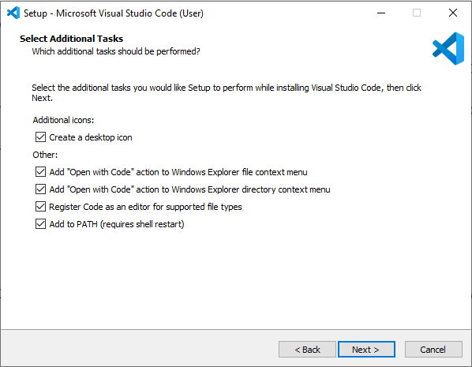

The first time you open Visual Studio Code, it will probably look something like this:


You should choose a theme here.  I will be using Dark Modern for these lessons, so, you should do the same if you want syntax colours to match what I'm using.  Note that VS Code prints unused code in a slightly lighter shade.  This is a fine feature (it alerts you to code you might want to delete), but it often applies to the code you are currently writing, and you might find that a light theme doesn't contrast enough with the code.  That is why I chose a dark theme.

You can always change your theme, by selecting this menu sequence:

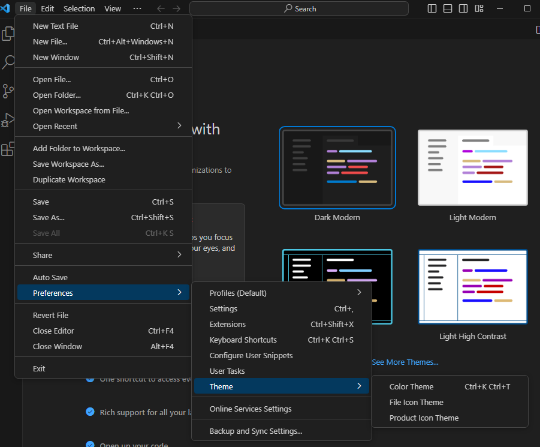

We don't have to worry about any of the other stuff in the welcome window for now.  Instead, we will install the [Lua Language Server](https://github.com/LuaLS/lua-language-server#lua-language-server) Extension, by sumneko.

Click on the extensions icon 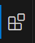 and search for Lua Language Server.  Make sure that sumneko is the author, so you get the correct one.

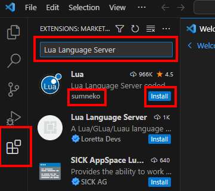

## Writing a Script

Now, we will write a "script," which is just another way of saying program.  In VS Code, select Open Folder from the drop down File menu

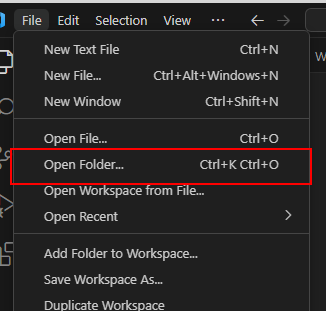

And navigate to and select the **lua** folder within your **Test of Time** directory.  (You may not see any files within the directory in the navigation window.)  You may be asked if you trust the files in the folder.  Say that you do.

This folder will already contain a few files.  We won't be using any of them.  Instead, create a new text file.  You can right click within the file explorer, (which you can open with the  button), or use the new file button (you will have to hover your mouse there for the icons to appear):

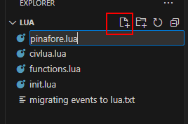

Name the file **pinafore.lua**.  Your VS Code window will now look something like this:

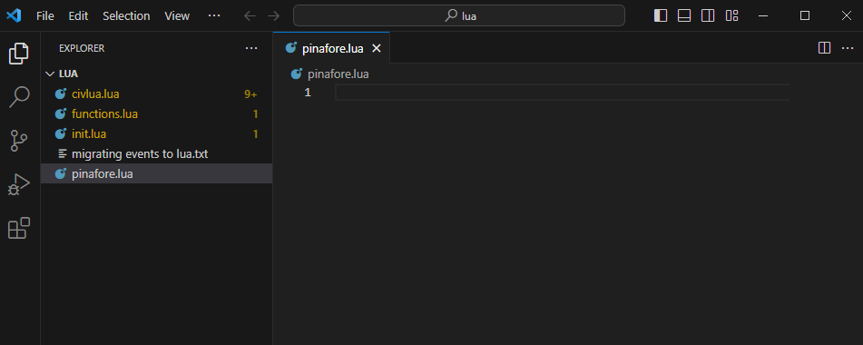

You might have noticed that the other .lua files are now highlighted in yellow.  This is because the Lua Language Server has detected potential mistakes in those files.  If a file is known _for sure_ to have an error, it will be highlighted in red.  Don't worry about the other files.

Copy the following code into **pinafore.lua** (although I suggest you usually type the code in yourself, in this case you might as well copy and paste most of it):

```lua
print("I am the Captain of the Pinafore;")
print("And a right good captain, too!")
print("You're very, very good,")
print("And be it understood,")
print("I command a right good crew.")
print("We're very, very good,")
print("And be it understood,")
print("He commands a right good crew.")
print("Though related to a peer,")
print("I can hand, reef, and steer,")
print("And ship a selvagee;")
print("I am never known to quail")
print("At the fury of a gale,")
print("And I'm never, never sick at sea!")
print("What, never?")
print("No, never!")
print("What, never?")
print("Hardly ever!")
print("He's hardly ever sick at sea!")
print("Then give three cheers, and one cheer more,")
print("For the hardy Captain of the Pinafore!")
```
([This song](https://www.youtube.com/watch?v=c548RjB8jzQ) is from the Gilbert and Sullivan play H.M.S. Pinafore)

If you start to type out the above code, Visual Studio Code will start offering suggestions in a suggestion box, like this:


Ignore the suggestions and information in these boxes for now.  Eventually, they will be helpful.

Once you've copied the code, you should notice a few things about VS Code.

1. The file explorer icon has a circle with a 1 in it.  This means there is one unsaved file.
2. The tab for **pinafore.lua** also has a circle, instead of an x. This means that **pinafore.lua** is unsaved.
3. Each line in the editor has a number beside it, to tell you what line of the file it is.

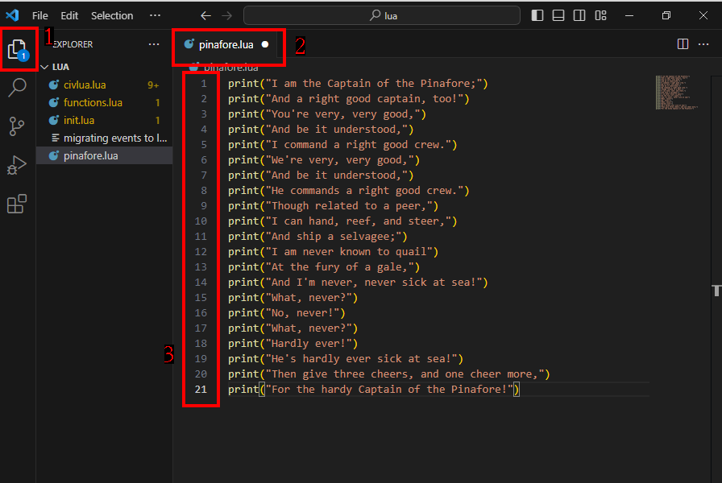

Under the File menu, choose Save All.

Now, start a new Original game and open the Lua Console (just as we did in Lesson 1).  Press the Load Script button in the bottom right, navigate to the **Test of Time\lua** folder, and choose **pinafore.lua**.  Note: Depending on your settings, Windows might hide the .lua extension, but the "Type" will be "Lua Source File."


All the print commands are immediately executed, in order, and the song is printed to the console:


Note that Lua (or any programming language) will blindly follow your instructions, regardless of what makes sense.  For example, if we swap lines 1 and 3 in **pinafore.lua**, save, and run the script again with Load Script, the Lua Console will happily print our song, even though it makes no sense to us:


In addition to printing a nonsensical start to the song, the Lua Console didn't even split the last line of the first rendition from the first line of the second rendition.  Why not?  We didn't tell it to, so it had no way of knowing that it would be a good idea to do that.

It probably makes sense to have an empty line at the start and end of this script.  We will do this in two different ways.  Change the print statements back to their original order, then insert this line as a new first line:
```lua
print("")
```
This will print an empty line before the song starts.  At the end, we'll do something a bit different.  Change the last line (formerly line 21, now line 22) to
```lua
print("For the hardy Captain of the Pinafore!\n")
```
Up to this point, the `print` command has printed every character between `"` marks to the console, just as we wrote it.  However, the `\` indicates that it and the next character should be interpreted as a single character.  In this case, `\n` represents the "newline" character, which tells the Lua Console to move to the next line.

**pinafore.lua** will now look like this:

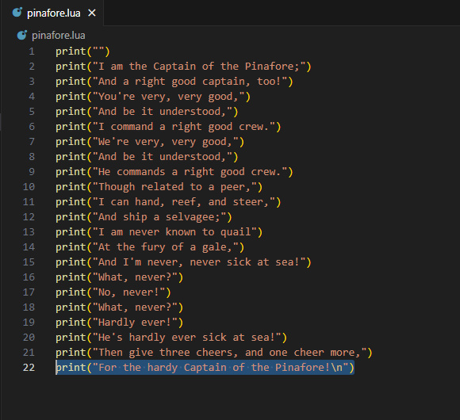

Save and load the **pinafore.lua** script a couple more times.  The first time, you will see 1 empty line between the end of the previous rendition, and the start of the next one.  The second time, you will see two empty lines, one of which was created at the end of a rendition, and the next created at the start of one.

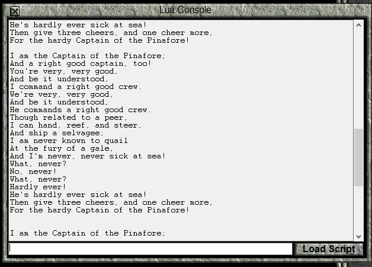

## Adding Comments in Code

So far, the Lua Console has done something with every character written in **pinafore.lua**.  The command `print` along with `("` and `")` has told Lua that we want stuff printed to the console window, and the characters between the `"` marks were actually printed.  In this section, we will write "comments" in our code, which Lua will ignore.

Save your game, and then load it again.  This will clear the console.

First, we're going to separate the lines of the song based on whether it is being sung by the Captain or by the Sailors' Chorus.  Press Enter at appropriate locations to separate lines when the singer changes.  The result should look like this:


Save and run this in the console.  The console will look like this:

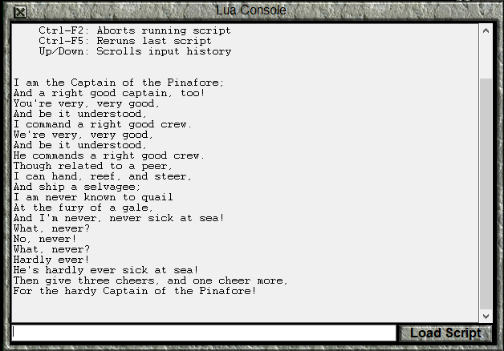

Note that despite having added empty lines in our code, the song is printed the same way that it was before.  When interpreting code, Lua ignores "whitespace," which is to say stuff like extra spaces (you often still need one space), tabs, or empty lines.

What we're actually interested in at the moment is leaving ourselves a note about who is singing the next line of the song.  We don't want this information to be printed to the Console, so we'll just try writing some notes on the empty lines:

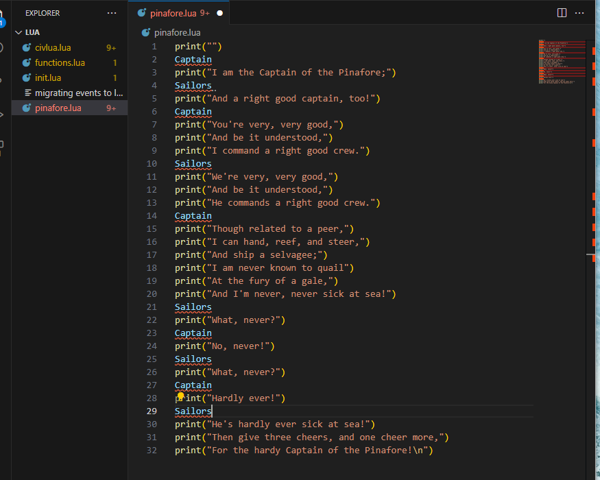

Notice that the **pinafore.lua** file name is now coloured red.  This means that if we try to run the file, we'll get an error.  The red underlining in the code (which would indicate misspelling in a word processor) tells us the part of code that will cause the error, and the red in the file overview and scroll bar on the right give that information in relation to the entire file.

For now, let's save **pinafore.lua** anyway, and try to load the script in the console.

None of the song will be printed (although the last song will still be visible).  Instead, you will get the following message:

```
C:\Games\Test of Time\lua\pinafore.lua:3: syntax error near 'print'
```

A "syntax error" means that the file has "instructions" that haven't been written properly.  That is, the Lua interpreter can't transform what we've written into instructions for the computer.

The `C:\Games\Test of Time\lua\pinafore.lua:3:` part of the error message tells us that the error was detected on line 3 of **pinafore.lua**, and the `near 'print'` gives a bit of extra information.  So, the Lua Console "realized" there was something wrong with the file just before the `print` command on line 3.  VS code identifies the problem as the `Captain` "code" on line 2.

Now, we weren't trying to give the Lua Console an instruction called "Captain," but rather trying to write a note for ourselves.  Lua has ways of indicating that part of the file are "comments" and should be ignored by the interpreter. The most basic way to do so is to add a double dash `--` to a line.  This tells the Lua interpreter to ignore everything on the line _after_ that point.

Add `--` at the start of the lines with Captain and Sailors, and save.

Your file will look like this:

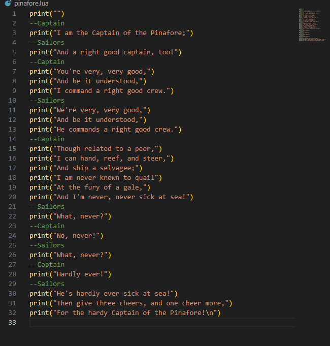

Notice how the `--Captain` and `--Sailors` lines are now coloured green.  This is the way that VS Code indicates that a portion of code is a comment.  Of course, the colour might be different if you use a different highlighting scheme.

Load the script again, and the song will once more be printed, the comments totally ignored.

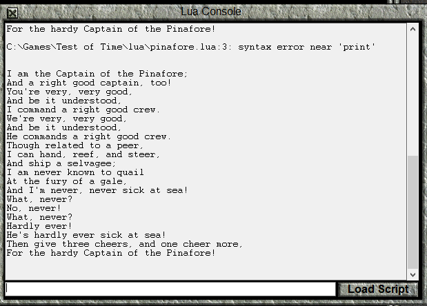

Comments do not have to literally be "comments" about our code.  If we want to stop part of our code from executing, we can "comment it out" by putting `--` before it.

Comment out line 5.  While you're at it, add a comment to line 7, saying "maybe this line should go", but make sure the script will still print "You're very, very good,".

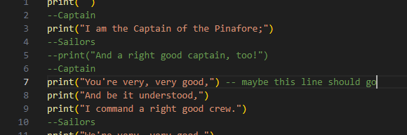

Since `--` only comments out stuff _after_ it, "You're very, very good," is still printed.

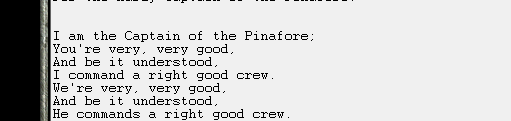

If you want to comment out multiple lines at once, or comment out only part of a line, you can start the comment with `--[[` and end it with `]]`.

So, for example, we can comment out several lines, or put a note before a `print` command:

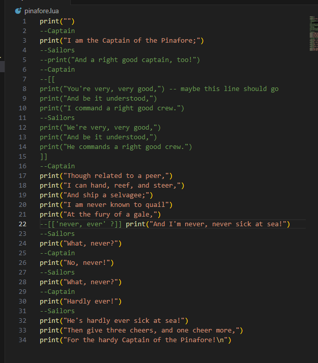

Comment out lines 7-13 as shown in the above image (lines 8-14 after the line is inserted to start a comment).  Also, add the comment `--[['never, ever' ?]]` as shown.  You will probably notice that when you type `--[[`, the `]]` is filled in automatically.  If you like, you can change this behaviour through the menu File>Preferences>Settings, which will open the Settings tab.

In the Settings tab, scroll down to the **Text Editor** section (the section right after **Commonly Used**) and change the **Auto Closing Brackets** setting.

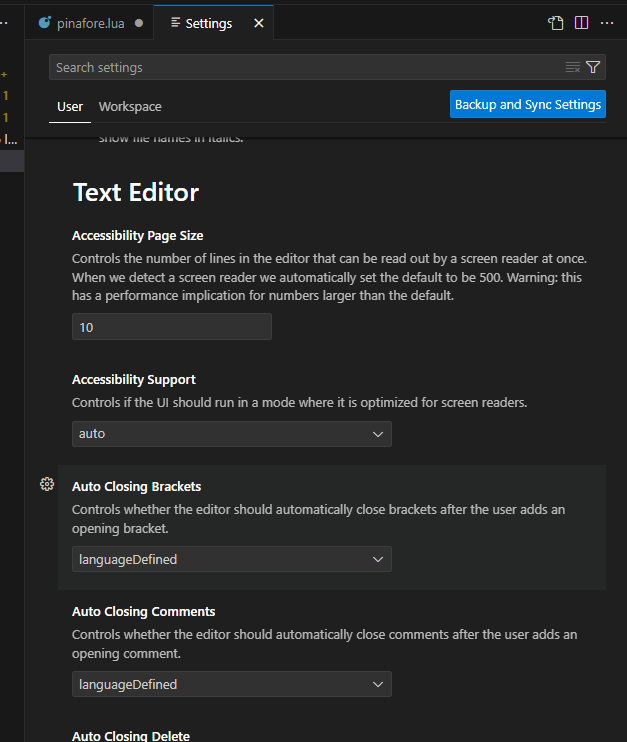

Once you've added the comments, run the script again.  Notice that many lines were skipped, but the line "And I'm never, never sick at sea!" is unchanged, despite the comment on that line.


## Conclusion

In this lesson, we've installed a convenient program to write code in, seen how to write scripts, and also how to run them.  We've also learned how to add comments to our code, either as documentation or to prevent some code from running even if we don't want to delete it outright.  In the next lesson, we'll start performing calculations, rather than just printing a song to the console.


| Previous: [Hello World](01_helloWorld.html) | Next: [Values and Variables](03_valuesAndVariables.html) |