Previous: [Writing Programs](02_writingScripts.html) | Next: [Civilization II Objects and If Statements](04_civObjectsAndIfStatements.html)

# Variables, Values, and Functions

## Introduction

In this lesson, we'll see how to store data in "variables" so that they can be used later in the code.  We will also define "functions," which are a series of commands to be executed together.  As part of this discussion, we'll learn about some of the _kinds_ of data that a Lua program can have.

## Assigning a Value to a Variable

Thus far, when we've wanted to show text in the Lua Console, we have specified the text that we want to show in the same line as the `print` command.  However, we can, if we want to, specify some of the text early in the code, and then get it later when it is needed.

At the end of the last lesson, the file pinafore.lua looks like this:

```lua
print("")
--Captain
print("I am the Captain of the Pinafore;")
--Sailors 
--print("And a right good captain, too!")
--Captain
--[[
print("You're very, very good,") -- maybe this line should go
print("And be it understood,")
print("I command a right good crew.")
--Sailors
print("We're very, very good,")
print("And be it understood,")
print("He commands a right good crew.")
]]
--Captain
print("Though related to a peer,")
print("I can hand, reef, and steer,")
print("And ship a selvagee;")
print("I am never known to quail")
print("At the fury of a gale,")
--[['never, ever' ?]] print("And I'm never, never sick at sea!")
--Sailors
print("What, never?")
--Captain
print("No, never!")
--Sailors
print("What, never?")
--Captain
print("Hardly ever!")
--Sailors
print("He's hardly ever sick at sea!")
print("Then give three cheers, and one cheer more,")
print("For the hardy Captain of the Pinafore!\n")
```

Now, suppose that we're not sure that "Pinafore" is a good name for our ship.  At the moment, if we want to change the name, we must search for every instance of "Pinafore" in our code and manually change it.  This could be tedious, and we might accidentally change an instance of "pinafore" that was used in a different context.
Instead, what we can do is store the text "Pinafore" in a _variable_, and reference it later in the code, instead of writing "Pinafore" explicitly.

Here is the code to assign a variable:
```lua
local shipName = "Pinafore"
```
Let's break this down.  On the right, we have our _value_ `"Pinafore"`.  This kind of value is known as a _string_.  A string is a sequence of characters in a particular order.  Personally, I think of letters hanging from a string like this:


([Wikipedia](https://en.wikipedia.org/wiki/String_(computer_science)#History) has a different explanation for the term, if you're curious.)

The first `"` mark tells the Lua Interpreter that a new string is being created, and that all the subsequent characters should be in the string until the next `"`.  If you need a `"` character in your string, you can write `\"`.  Alternatively, you can choose to start and end your string using the `'` character instead.

Strings defined using `"` or `'` must be complete on the same line that they start.  If you want to define a string over multiple lines, the characters `[[` and `]]` can start and end a string.  This kind of string definition is a bit different.  The sequence `\n` will be interpreted as a `\` character followed by an `n` character, instead of a newline, for example.  You would get a newline by actually pressing enter to get a new line in your text file.

This is enough about strings for now, let's return to our variable assignment.

```lua
local shipName = "Pinafore"
```
The `=` sign means that we're assigning the value on the right hand side ("Pinafore") to the variable specified on the left hand side, called `shipName` in this example.

In Lua, a variable name can be any sequence of (English) letters (`A`-`Z`, `a`-`z`), digits (`0`-`9`) or underscores (`_`), as long as it doesn't start with a digit, and isn't one of these special reserved words:

    and     break   do      else    elseif  end     false   for     function        if
    in      local   nil     not     or      repeat  return  then    true    until   while

Of course, you probably shouldn't redefine other built in commands, like `print`, to be variable names, but the language doesn't stop you.

Finally, we have the special keyword `local`, which, you may notice, is one of the reserved words in the list above.  `local` tells the Lua Interpreter that the variable `shipName` is only valid within pinafore.lua.  Another file can still have a variable called `shipName`, but they will be completely separate.

If we didn't include the `local` keyword, `shipName` would be a "global" variable, which could be accessed and modified in the Lua Console, or even other scripts.  There is a future lesson on [variable "scope"](06_variableScopeAndSharingData.html) where we will go into more detail.  For now, use this rule: if you are defining a variable in the Lua Console (local variables last one line in the Console), or want to be able to access your variable from the Lua Console, use a global variable.  Otherwise, use a local variable.

Let's add the following code to the top of pinafore.lua:
```lua
local shipName = "Pinafore"
print(shipName)
```
As you start typing `shipName`, you will get a suggestion box.  If you like, you can press Tab or Enter in order to choose `shipName` as the value.

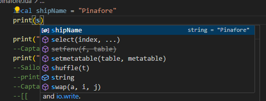

Save pinafore.lua, and load the script in the Lua Console.  The first line printed will be Pinafore:

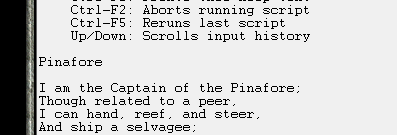

Printing the `shipName` is nice, but what we really want to do is combine the variable with other strings that we're printing.  In Lua, we can join strings together using 2 periods together: `..`.  This means that in pinafore.lua, we replace the line
```lua
print("I am the Captain of the Pinafore;")
```
with
```lua
print("I am the Captain of the "..shipName..";")
```
and the line
```lua
print("For the hardy Captain of the Pinafore!\n")
```
with
```lua
print("For the hardy Captain of the "..shipName.."!\n")
```
While we're at it, we can remove the line
```lua
print(shipName)
```

While typing these changes into VS Code, you may have had 2 `"` characters typed, when you only typed one.  You can remove this behaviour by going into the Settings and changing **Auto Closing Quotes**.  Note that typically, when VS Code automatically inserts a "closing" character after your cursor, when you type that character, it overwrites the inserted character.  So, the feature won't interrupt your typing as much as you might think.

The script will look like this:


Run the script, and the (abridged) song will once again be printed:

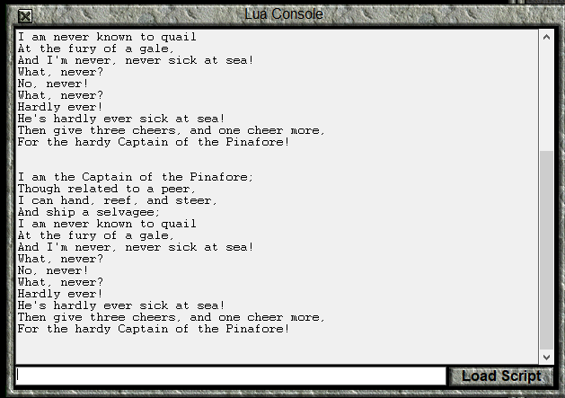

Now, we can easily change the name of the ship in the song simply by changing the `shipName` variable.

For example, we can change the ship name from Pinafore to Manticore by changing the variable assignment to:

```lua
local shipName = "Manticore"
```

Running the script again gives us:


## Manipulating Numbers

Let us turn our attention to manipulating numbers.  We will write a script which will convert a distance in kilometres to the equivalent distance in miles.

Create a new file in VS Code, and name it **conversion.lua**.  We will define a variable that is our distance to convert:

```lua
local distanceInKm = 12
```

When we want to create a number in Lua, we need only type that number out.  So, to assign `12` to the `distanceInKm`, we need only write `12` on the right hand side of the `=` sign.

Next, we will define some conversion factors to go between different distance units.

```lua
local cmPerKm = 100000
local kmPerCm = 1/cmPerKm
local cmPerInch = 2.54
local inchesPerCm = 1/cmPerInch
local inchesPerFoot = 12
local feetPerInch = 1/inchesPerFoot
local feetPerMile = 5280
local milesPerFoot = 1/feetPerMile
```
There are three things to notice here.  The first is that we can perform calculations on the right hand side of an `=` sign, and then assign the result to a variable.  The second is that the `/` symbol indicates division.  So, `a/b` computes a divided by b.  The last thing to note is that we can use the value of a variable in a calculation.

Thus far, **conversion.lua** looks like this:

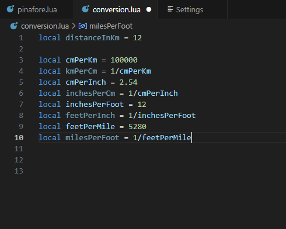

Note that some of the variable names are a bit faded.  That is because we're not using them anywhere in the code.  Let's now change that by actually performing calculations:

```lua
local convertedDistance = distanceInKm
convertedDistance = convertedDistance*cmPerKm -- converting to centimetres
convertedDistance = convertedDistance*inchesPerCm -- centimetres to inches
convertedDistance = convertedDistance*feetPerInch -- inches to feet
convertedDistance = convertedDistance*milesPerFoot -- feet to miles

print(convertedDistance) 
```
What is happening here is that on the right hand side of the `=` we're using the `*` symbol to multiply `convertedDistance` by one of the conversion factors, and then assigning the resulting number to the `convertedDistance` variable, replacing the existing value.

Before we move on, there is another setting I should mention: **Word Wrap** which is off by default.  Although you are probably using VS code in full screen, I have been using it in half a screen so that it fits better in the column of this webpage.  Without word wrapping, my image looks like this:


After enabling it, I can see my comments.  Notice how there are now gaps in the line numbers, because the lines in the text document are longer than a line on the screen.


Even though you will probably be using VS code in full screen, you will likely end up splitting your editor into several windows, so that you can refer to different files (or parts of the same file) easily.

Now, save **conversion.lua**, and run it to find out how many miles are in 12 kilometres.

It turns out there are this many miles in 12 kilometres:

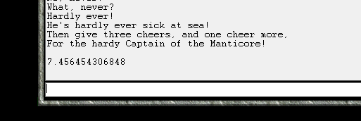

## Creating Functions

At this point, we can convert a distance from kilometres to miles by changing a value in this script, and running the script again.  If we want to make multiple conversions, we would have to copy and paste the part of the code with the `convertedDistance` variable for each conversion.  This is inconvenient.  It would also be more convenient if we could make conversions from the command line in the Lua Console, rather than changing and reloading the script.  A _function_ will let us do both these things.

We can write a function like this:
```lua
kmToMiles = function(kilometres)
    local convertedDistance = kilometres*cmPerKm -- km -> cm
    convertedDistance = convertedDistance*inchesPerCm -- cm -> in
    convertedDistance = convertedDistance*feetPerInch -- in -> ft
    convertedDistance = convertedDistance*milesPerFoot -- ft -> mi
    return convertedDistance
end
```
Let's break down this section of code:

```lua
kmToMiles = 
```
This means that we are going to assign the function that we create to the global variable `kmToMiles`.  That's right.  Lua considers a series of instructions bundled into a _function_ to be a value, the same as a string or number. 

```lua
function(kilometres)
```
The special word `function` tells Lua that we want to define a function, and that the subsequent commands are a part of the function.

The parentheses `()` enclose the function _parameter_ `kilometres`.  A function parameter is a local variable (only good within the function) whose value is unknown until the function is executed.
```lua
    local convertedDistance = kilometres*cmPerKm -- km -> cm
    convertedDistance = convertedDistance*inchesPerCm -- cm -> in
    convertedDistance = convertedDistance*feetPerInch -- in -> ft
    convertedDistance = convertedDistance*milesPerFoot -- ft -> mi
```
This section contains the commands to perform in order to convert the value supplied by `kilometres` into a number representing an equivalent number of miles.  This time, `convertedDistance` is a local variable only accessible from within the defined function.

It is also worth noting that these lines are indented.  In Lua, this is just a convention to make code more readable.  The code would work just fine if it were not indented.

```lua
    return convertedDistance
```

The `return` keyword tells the function to stop executing.  The value to the right of `return` (in this case, `convertedDistance`) will be supplied to the part of the program that "called" the function in the first place.  Functions do not have to return values.  For example, the function `print` that we've been using doesn't return anything.

```lua
end
```
The special word `end` tells the Lua Interpreter that we have reached the end of the function, and there are no more instructions to include.  The function execution also stops here if the code has not reached a `return` line before this.

Now that we have a function, let's see how we would use it to convert 12 kilometres to miles:

```lua
print(kmToMiles(12))
```
What happens here is that the function `kmToMiles` is evaluated with value `12` as the _argument_.  _Argument_ is the term used for the value that is assigned to a function parameter, in this case `kilometre`.  After `kmToMiles` performs calculations on `12`, it returns the result: `7.456454306848`.  At that point, the above line is equivalent to

```lua
print(7.456454306848)
```
and at this point, the `print` function prints the answer to the console.

If we eliminate the redundant code, **conversion.lua** looks like this:


You may notice that kmToMiles is underlined in blue.  Hover your cursor over it to see the complaint:

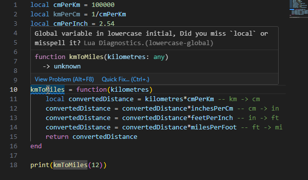

The Lua Language Server has noticed that `kmToMiles` is a global variable, and the convention that Lua Language Server follows is that global variables start with a capital letter.  I don't follow that convention (and didn't even know that Lua LS would note this until writing this lesson) because I only use global variables to make functionality available to the console.  The reasons why will be discussed in a [future lesson](06_variableScopeAndSharingData.html).

A light bulb appears near the "spelling mistake" and offers options:

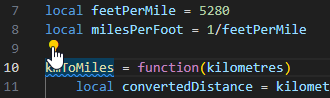


Clicking the first option makes VS Code accept that kmToMiles can be a global variable.

On the topic of spell checking, I use the Code Spell Checker extension by Street Side Software:

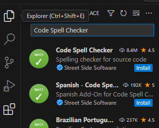

I will be using this spell checker in lessons from now on.

Now, run **conversion.lua** in the Console.  The result of converting 12 kilometres to miles is once again printed to the console.  However, something that isn't immediately obvious is that you can now access `kmToMiles` from the console command line.  Type the following command to convert 20 kilometres to miles:

```lua
kmToMiles(20)
```
You will find that 20 kilometres is some 12.4 miles:

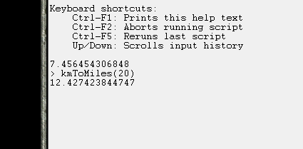

Now, let's write a function to convert from miles to kilometres.  We've already defined the unit conversion rates.

```lua
function milesToKm(miles)
    return miles*feetPerMile*inchesPerFoot*cmPerInch*kmPerCm
end
```

The first thing to note is that the line that begins the function is different from last time.
```lua
function milesToKm(miles)
```
Is an equally valid alternative to 
```lua
milesToKm = function(miles)
```
and is, in fact, the way that I usually define functions.  The typical exception would be when I'm defining a function that I'm not assigning to a variable because I only want to use it once.

The other things to note are that I perform calculations on the return line rather than specifying the value of a variable to return and that I can, in fact, perform several multiplications on the same line.

Add this function to your **conversion.lua** file, and a line to print the result of converting 7 miles to kilometres.  Run the resulting script in the console, and test out the `milesToKm` function on the command line.

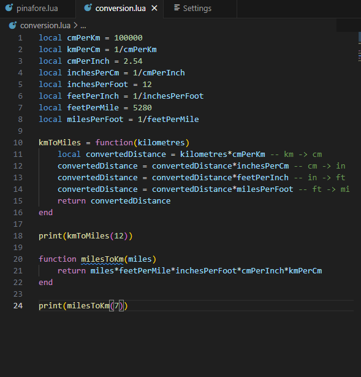

And the result of running the script, and converting 50 miles to kilometres in the console.  (Note that the first 3 lines were there from earlier.)


## Invalid Value Errors

When programming, sometimes we will make a mistake and cause an error.  We've now got enough experience to understand one of the error messages.  If you closed the game at the end of the last section, load the **conversion.lua** script again.

Now, in the command line, enter the following code
```lua
kmToMiles("Twelve")
```
You will receive the following error:
```
> kmToMiles("Twelve")
C:\Games\Test of Time\lua\conversion.lua:11: attempt to perform arithmetic on a string value (local 'kilometres')
stack traceback:
	C:\Games\Test of Time\lua\conversion.lua:11: in function 'kmToMiles'
	(...tail calls...)
```
First, we look at this part of the error:
```
C:\Games\Test of Time\lua\conversion.lua:11
```
This tells us what file the error was detected in (the path may be different for you, based on where you installed Test of Time), and the line it was detected on, line 11.  (If your **conversion.lua** file doesn't match mine exactly, the line number may be different.)

Looking at line 11, we see:


Next, we look at this part of the message:
```
attempt to perform arithmetic on a string value (local 'kilometres')
```
This part of the message tells us the detected problem.  We're trying to do some form of arithmetic (in this case multiplication) on a string (`"twelve"`).  This isn't allowed, so Lua throws an error.

For this part of the error
```
stack traceback:
	C:\Games\Test of Time\lua\conversion.lua:11: in function 'kmToMiles'
	(...tail calls...)
```
we will re-generate the error, but inside **conversion.lua** by adding our bad code to line 25 (along with a print command):
```lua
print(kmToMiles("twelve"))
```
After doing this, the "stack traceback" section looks like this:
```
stack traceback:
	C:\Games\Test of Time\lua\conversion.lua:11: in function 'kmToMiles'
	C:\Games\Test of Time\lua\conversion.lua:25: in main chunk
```
Now, we have 2 places referenced.  One is line 11, where the error was detected, and the other is line 25, where we _called_ `kmToMiles`.  In this example, line 11 is correct, and our mistake is on line 25.  Of course, the error handler doesn't know where the problem is.  As far as it is concerned, `"twelve"` could be a perfectly valid argument for `kmToMiles`, so, we're given both lines and we must sort it out for ourselves.

Of course, there is only so much the error generator can do for us.  Replace 
```lua
print(kmToMiles("twelve"))
```
with
```lua
local twelveVariable = "twelve"
print(kmToMiles(twelveVariable))

```
and run the script again.  The same error is generated (except that the line is different), so it is up to us to figure out why twelveVariable is a string when we were expecting it to be a number.

Fortunately, the Lua Language Server can detect possible errors, if we annotate our code properly.  On the line above the `kmToMiles` definition, type 3 dashes `---`, and press enter for the following suggestion:

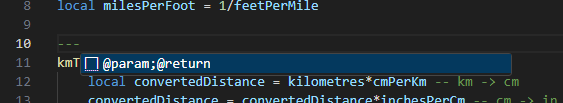

The following code is generated

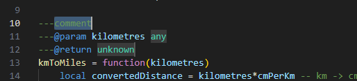

Replace `comment` with a basic description of the function, `any` with `number` and `unknown` with `number` also.

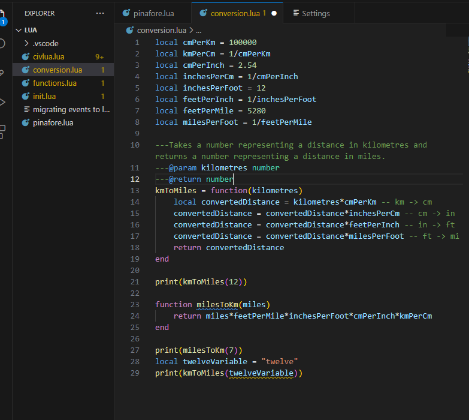

With this annotation, the name **conversion.lua** is now yellow, and on line 29, `twelveVariable` is underlined in yellow.  The Lua Language Server has detected a possible error.  If we hover over the underlined code, we get the following explanation:

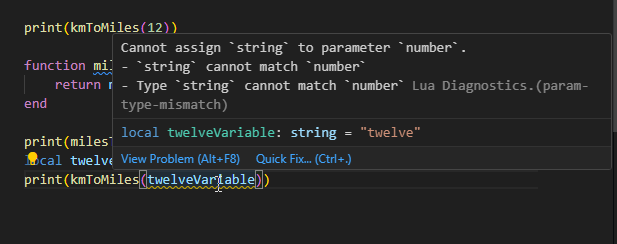

While we're at it, we can also hover over `kmToMiles` and see the documentation that we've written for the function:


Change `twelveVariable` to `12` and the yellow will disappear.

This power to document code so it appears in tooltips later (and export it so I could make this website), along with the ability to detect mismatched values is why I chose VS Code with Lua Language Server as the example coding environment for these lessons.  Lua Language Server is open source, so it is available for other programming environments as well.  It should be noted that as far as the Lua Interpreter is concerned, these annotations are just comments, even if VS Code colours them differently, because they all start with `--`.

## Register an On Turn Event

We have now reached the point where we can write a simple event, and register it.  We will begin by creating a new file, **onTurnEvent.lua** in the lua folder.

We will use the function [civ.scen.onTurn](/auto_doc/civ.html#onturn), which has the following relevant documentation:

>
>### onTurn
>```
>function civ.scen.onTurn(code: fun(turn: integer))
>```
>Registers a function that is called at the start of a turn. 

(There is some more information explaining how it relates to other events.)

Let's have a look at the code block:
```lua
function civ.scen.onTurn(code: fun(turn: integer))
```
This part of the documentation tells us how to use this function.  `function civ.scen.onTurn` tells us that this is a function that we can call, and that we call it by writing `civ.scen.onTurn` (You may notice that `.` is not a valid character for a variable name.  This will be explained [in a later lesson](05_loopsAndTables.html#the-tablekey-syntax-for-tables).)

The part within the `()` tells us the parameter name and the kind of argument the function expects for the parameter.  `code` tells us that the function's parameter name is "code" .  We don't _need_ the parameter name to use the function, but the parameter name can give insight into how the designer expects the function to be used.

`: fun()` tells us that the `code` parameter expects a function as an argument.  `turn: integer` means that the function supplied should have one parameter, `turn` and that parameter should accept integer arguments.

At the moment, the above couple paragraphs may have been as clear as mud.  Let's build the event, and hopefully the meaning will be more obvious.

```lua
local function onTurnEvent(turn)

end
```
Here, we define a local function, which has a single parameter, called `turn`.  We will add an annotation that the parameter `turn` is an integer.

```lua
---@param turn integer
local function onTurnEvent(turn)

end
```
Here I should note that, unlike many programming languages, Lua doesn't distinguish between integers and numbers that can have a fractional part (often called ["floats"](https://en.wikipedia.org/wiki/Single-precision_floating-point_format) or ["doubles"](https://en.wikipedia.org/wiki/Double-precision_floating-point_format)).  As far as Lua is concerned, they are both part of the same type.  However, Lua Language Server allows us to make the distinction, since many functions only accept integer arguments.

Our function is now technically suitable to use as an argument for `civ.scen.onTurn`, although it doesn't do anything yet.  So, let's add a line where we use the function with `onTurnEvents` as the argument:

```lua
civ.scen.onTurn(onTurnEvent)
```
When you try to type in `civ.`, you might find that VS Code tries to autocomplete to `civlua.` and that you get a box appearing that looks like this:

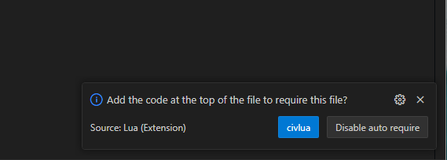

Ignore the box (it will go away in a moment), and use backspace to go back to `civ`.  If pressing `.` again autocompletes, backspace back to `civ` then press Escape, which should let you press `.` and continue typing.  We got that behaviour because VS Code saw the **civlua.lua** file in our directory, and thought we might want to use code from that file.  The Lua Scenario Template has documentation that tells VS Code that `civ.` is a perfectly fine way to start a function, but we're not using the template yet, so VS Code has no way to know this.

Thus far, our "event" looks like this:

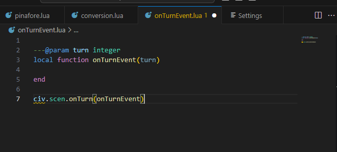

In the code `civ` is underlined as a possible mistake.  When we hover the cursor over it, we get the following message:

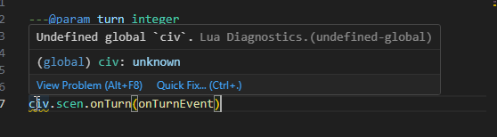

The Lua Language Server warns us when we're trying to use a global variable that hasn't been specified elsewhere, since that often means we've made a typo or a mistake.  As I've said before, we'll discuss this more in the [lesson on variable scope](06_variableScopeAndSharingData.html).

For now, click on the "Quick Fix..." option, and then select "Disable diagnostics on this line (undefined-global)."

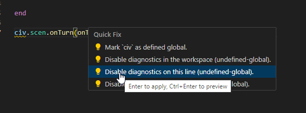

If you know that the Lua Language Server is making a mistake flagging a particular line, this option creates an annotation that will suppress it.

At this point, although we have an "event," the event doesn't actually do anything.  We'll gain tools over the next couple of lessons to make much more interesting events, but, for now, we will just show a text box telling the player what turn it is.

From the first lesson, we know that [`civ.ui.text`](/auto_doc/civ.html#text) can create text boxes.  Let's look at the documentation:

>### text
>```
>function civ.ui.text(string: string, ...string)
>```
>Display a pop-up text box with the given string as text.
>
>@*param* `string` — text to show in a text box
>
>@*param* `...` — more text

The first thing that's different about this documentation is the parameter information: `(string: string, ...string)`.  Although we haven't written a function like that yet, functions are allowed to have more than one parameter/argument.  When they do, each parameter (or argument, when the function is called) is separated by a `,`.  This is very common, and we'll see a lot of that in the upcoming lessons.  What is uncommon is the `...string` in place of a `parameterName: valueType`.  This means that an arbitrary number of strings can be given as additional arguments.  We won't use that feature now.

The other different thing is that in this piece of documentation, there is extra information about the function parameters:

>@*param* `string` — text to show in a text box
>
>@*param* `...` — more text

The `string` parameter has the extra information that it is the text to show in the text box, and `...` is more text (to be shown).  Sometimes documentation is expressive, and other times it is brief, and we must experiment a bit if the documentation isn't fully clear.

Since there isn't much point in doing arithmetic on the turn number, we will settle for a simple message displaying the current turn:

```lua
    civ.ui.text("It is now turn "..tostring(turn)..".")
```
The `tostring` function is native to Lua and converts a value into a suitable string equivalent.  If you hover your cursor over `tostring` in VS Code, you will see the following documentation (ignore the part about "metatables," that's advanced stuff).


We use `tostring` in order to convert `turn`, which is a _number_, to a _string_ which can be joined to other strings using `..`.

The Lua Language Server has once again identified `civ` as a possible problem, so have diagnostics ignore that line.  Once you're done, **onTurnEvent.lua** should look like this:


Save this file, and save your active Civ II game, so that you can easily reload later.

Open the console, and load the **onTurnEvent.lua** script.  The console will look the same as it did before, since we didn't have any kind of print statement in this script.  Close the Lua Console, end your turn, and allow the AI to move.  Before you move again, you should get this event message:


Proceed to play, and note how you get a message every turn, with a different turn number.

Now, load your saved game, and play a couple turns.  You will notice that the event does not happen.  Load the **onTurnEvent.lua** script again, verify that it is active by playing until the next turn, and then save the game.  Load this more recent saved game, and play.  You will still find that the event doesn't happen.  

That's because Lua Events must be registered every time a game is loaded.  When a game is loaded, the Game will automatically check if there is an available file named **events.lua** in its folder, and, if so, run **events.lua** as a script in order to register all of the scenario's events.  As we'll see, **events.lua** doesn't have to contain _all_ the code; it can reference other files to get the necessary code.

When we program events for Civilization II, what we are doing is creating a giant script which defines functions like `onTurnEvent`, and then registering them with functions like `civ.scen.onTurn`.  Once these functions have been registered, a player plays the game, and, at certain ["execution points"](/executionPoints.html) the game runs a registered function, supplying certain data.  In our **onTurnEvent.lua** example, at the start of every game turn (between tribe 7 and the barbarian turn), the game feeds the new game turn into the `onTurnEvent` function, which uses that information to display a text box with the current turn.

Let's turn our attention back to **onTurnEvent.lua**.  We will create another text box event:

```lua
local function aSecondEvent(turn)
---@diagnostic disable-next-line: undefined-global
    civ.ui.text("This is a second message for turn "..turn..".")
end

---@diagnostic disable-next-line: undefined-global
civ.scen.onTurn(aSecondEvent)
```
Before I have you add this code to **onTurnEvent.lua** and run the script, I should admit to telling a lie a bit earlier.  In the `onTurnEvent` function, I said that we had to use the `tostring` function to convert the value for `turn` into a string, before we concatenated it using `..`.  That is true for most data types, but the `..` operator will automatically transform numbers into strings, so we can save a bit of typing.

Now, add this code to **onTurnEvent.lua**, to get:

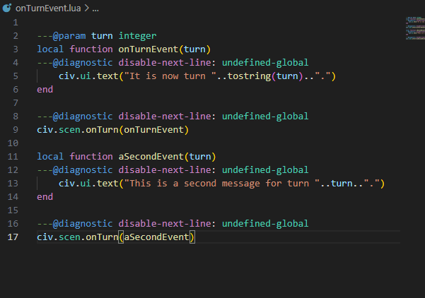

Load this script, and play until the next turn.  You will find that only the second message box appears.  Why is that?  Well, that is because the second call to `civ.scen.onTurn` _replaced_ `onTurnEvent` with `aSecondEvent`, rather than registering `aSecondEvent` _in addition to_ `onTurnEvent`.  The Lua Scenario Template provides a function `discreteEvents.onTurn` which allows you to register onTurn events in discrete blocks, and hides away the call to `civ.scen.onTurn` in a file that a scenario designer is not expected to change.

However, we don't have access to `discreteEvents.onTurn` just yet, so let's continue using `civ.scen.onTurn`.  Since we can't register two functions, we must combine both of the effects into a single function, and only register that one.  This is the result:


Load this script, and get two messages for the onTurn event.

## Parameter and Variable Names

In the last section, we chose to call the parameter for `onTurnEvent` `turn` because the documentation said that `civ.scen.onTurn` expected a function with a parameter named `turn`.  This wasn't necessary.  "Turn" is how we should interpret the argument passed to `onTurnEvent`, but we could name the parameter whatever we wanted.  

Let's try that now.  Move the cursor to one of the `turn` variable references, and right click.


Select "Rename Symbol", and change the name from "turn" to "money".


Save the script, and run it again.  Even though the onTurn event has nothing to do with money, the event works just fine.  

This arbitrary choice of name extends to variable names as well.  Let's take another look at **conversion.lua**:


We can, for example, rename the variable `inchesPerFoot` to `inchesPerFurlong` (without changing its value), and our program will work just as well as before.  Parameter and variable names are chosen for human convenience.  The Lua Interpreter doesn't care what they are, as long as they don't conflict with special words or other assigned variable names.  For example, if we changed the parameter name of `kmToMiles` from `kilometres` to `cmPerKm`, that would break the code.  That's because the Lua interpreter wouldn't know that only _one_ of the `cmPerKm` variables referred to the function parameter, while the _other_ referred to a variable defined outside the function.

## Conclusion

In this lesson, we've learned how to create variables, in order to use data later, and how to write functions, so that we can easily repeat entire sets of instructions.  We've also learned about the _string_ and _number_ data types, and registered a function to create an in game event.

In the next lesson, we will use the Lua Scenario Template and write some events for the "Rome" scenario that came with the original Civilization II game.  In doing so, we will learn about more data types and how to make functions that choose whether or not to execute instructions based on the values of the arguments they are supplied.

Previous: [Writing Programs](02_writingScripts.html) | Next: [Civilization II Objects and If Statements](04_civObjectsAndIfStatements.html)
