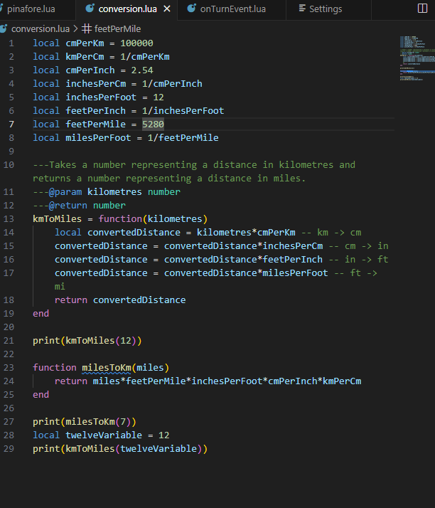
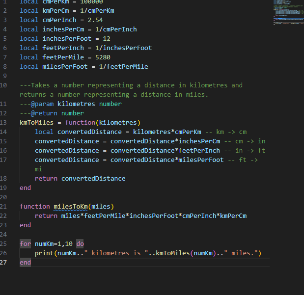
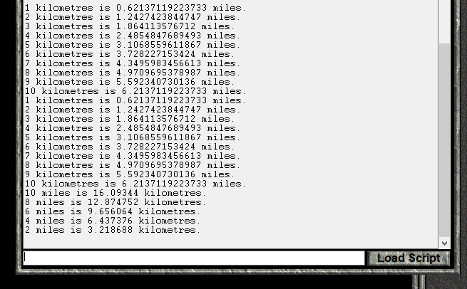
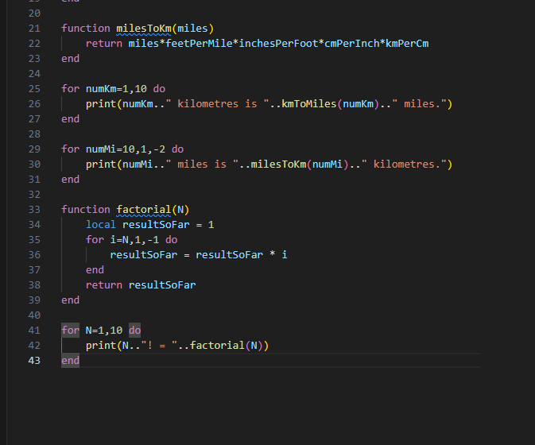
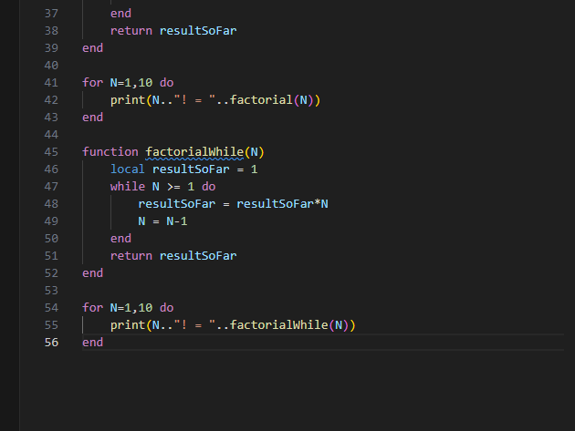
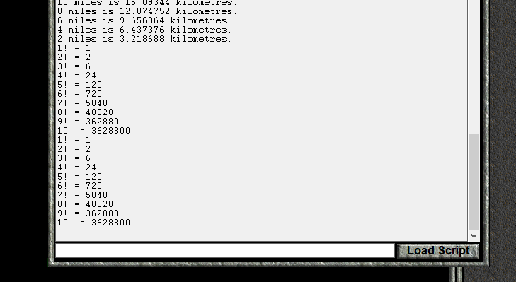
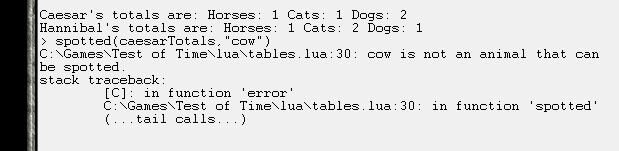

|Previous: [Civilization II Objects and If Statements](04_civObjectsAndIfStatements.html) | Next: [Variable Scope and Sharing Data](06_variableScopeAndSharingData.html) |

# Loops and Tables

## Introduction

Over the past lessons, we've been gradually learning about different parts of the Lua Programming Language, and the basics of how they are used.  In this lesson, we'll introduce the last two major components of the language: Loops and Tables.  Loops are a way to execute a section of code multiple times and tables are a way to manipulate multiple values at once and to store data.

[//]: # (## File Update (Temporary Section) If you downloaded the ClassicRome scenario for lesson 4 on or before November 26, 2023, then there is a file update that you need to make.  Download [this zip file](lesson_downloads/documentationUpdate.zip), and replace the following two files in the ClassicRome Scenario: **LuaCore\generalLibrary.lua** and **LuaDocumentation\civ.lua**.  (Alternatively, you could download the [new version of the scenario](lesson_downloads/ClassicRome-lesson-4.zip) and replace **discreteEvents.lua** with the copy you made in the last lesson.) I don't intend to make a habit of retroactively changing files in these lessons, but I changed the documentation of iterators (which you'll learn about in this lesson) to match what LuaLS expects. )


## The Numeric For Loop

In programming, a "loop" is how you tell the program to run the same portion of code more than once.  In Lua, loops come in a couple different varieties.  We'll introduce loops by looking at the _numeric for_ loop.  In VS Code, open the **lua** folder within your **Test of Time** directory, which we worked with during lessons 2 and 3.  Open a tab with the **conversion.lua** file.  It should look something like this:



In this file, we convert 3 numbers between miles and kilometres.  Until now, if we wanted to print many conversions, we would have to copy and paste each command over and over, and then change the numbers.  Now, however, we can use a loop to simplify the process, and reduce typos.

```lua
for numKm=1,10 do
    print(numKm.." kilometres is "..kmToMiles(numKm).." miles.")
end
```

Let's break down this code:

```lua
for 
```
The _for_ keyword tells Lua that a _for loop_ is being created.
```lua
numKm=1,10
```
`numKm` is a local variable to be created for use within the loop.  `=1,10` means that `numKm` will first take on a value of `1`, then `2`, then `3`, and so on, incrementing by 1 each time until `10` is reached.

```lua
            do
    print(numKm.." kilometres is "..kmToMiles(numKm).." miles.")
end
```
The code between `do` and `end` will be executed for each value of `numKm` that the loop specifies.  In this case, a message with a unit conversion is printed to the console for each value of `numKm`.  **conversion.lua** will look like this:



Load a saved game in the **Original** folder (not **ClassicRome**) and run the script.  (The ClassicRome scenario disables global variables, and this file has some.)


_For loop_ variables do not have to increment by 1.  In fact, they can decrement if you prefer.  Let's look at an example:

```lua
for numMi=10,1,-2 do
    print(numMi.." miles is "..milesToKm(numMi).." kilometres.")
end
```
The following part is different from the previous example:
```lua
numMi=10,1,-2
```
In this case, `numMi` starts with a value of `10`, and has an ending value of `1`.  What's new is that the third number, `-2`, is the increment value for `numMi`.  In this case, the "increment" actually reduces the value by 2 each time.  So, `numMi` will be `10`, then `8`, then `6`, `4`, and, finally `2`.  The next value after `2` would be `0`, but `0` is outside of the values of `10` through `1`, so the loop stops there.  The loop is not run for the case when `numMi` is `1` because the increment and starting value didn't cause it to take on a value of exactly `1`. 

Add this loop to **conversion.lua**, save, and run the script again.



## A For Loop in a Function

Now, let's do something slightly more complicated.  In math, $6!$ is called "six factorial" and means $6 \times 5 \times 4 \times 3 \times 2 \times 1=720$.  In general, $N!=N\times(N-1)\times(N-2)...3\times2\times1$.  We will write a Lua function to compute factorials:

```lua
function factorial(N)
    local resultSoFar = 1
    for i=N,1,-1 do
        resultSoFar = resultSoFar * i
    end
    return resultSoFar
end
```
Let's look at this code:

```lua
function factorial(N)
```
We've seen this before.  Since there is no `local` keyword, we're writing a global function, called `factorial`, and which has a parameter `N`.

```lua
    local resultSoFar = 1
```

In this function, we're going to perform the multiplication over multiple "steps," and at each step, we're going to keep track of the result that we have computed thus far into the computation.  Since the factorial involves multiplication, it is natural to initialize `resultSoFar` to `1`, because anything multiplied by 1 gets itself back.

```lua
    for i=N,1,-1 do
```
This time, the loop variable is called `i`.  `i` is a standard name for a loop variable if you can't think of anything better.  The `N` means that the initial value of `i` is set to whatever the current value of `N` is.  The factorial definition requires us to multiply each integer value between $N$ and $1$ inclusive, so we increment by `-1` and end the loop at `1`.
```lua
        resultSoFar = resultSoFar * i
    end
```
This is the actual "work" of the function.  The current integer `i` is multiplied by the current `resultSoFar` in order to get a new `resultSoFar`.  When `i` is `N`, `resultSoFar` is `1`, and it is set to `N` to start the calculation.  After that, the code effectively progresses left to right on the calculation $N\times(N-1)\times(N-2)...3\times2\times1$ multiplying the next integer into the result, until `1` is reached.

```lua
    return resultSoFar
```

After the loop is complete, the `resultSoFar` is, in fact, the result, so it can be returned.

We can add a nice loop to **conversion.lua** to print the factorials for 1 through 10.




## While Loops

Now, let's look at a different kind of loop, the _while loop_.  The _numeric for loop_ repeated the loop body a predetermined number of times.  The _while loop_, on the other hand, keeps performing a set of instructions as long as a certain condition is met, and then stops.  In fact, if the condition is not met when the _while loop_ is first reached, it won't be executed even once.

Let's look at _while loop_ version of the factorial function:

```lua
function factorialWhile(N)
    local resultSoFar = 1
    while N >= 1 do
        resultSoFar = resultSoFar*N
        N = N-1
    end
    return resultSoFar
end
```
```lua
function factorialWhile(N)
    local resultSoFar = 1
```
These are the same as the function with the _numeric for loop_.

```lua
    while N >= 1 do
```
This line checks that `N` is greater than or equal to `1`.  The `>=` operator returns `true` if the number to the left is at least as much as the the number on the right, and `false` otherwise.  If `true` is returned, the loop body (between `do` and `end`) is executed, otherwise, the code skips to the `end`.  

```lua
        resultSoFar = resultSoFar*N
        N = N-1
    end
```
This is the loop body.  Once again, we're multiplying the `resultSoFar` by the current integer.  However, this time we must also increment `N`, since there is no loop variable this time.  This may be the first time in these lessons that I've changed the value of a variable that is defined in the function parameters list, but it is allowed.  (We could also have just defined another variable if we wanted.)

Once the `end` is reached, the `N >=1 ` check is made again, and the code keeps executing as long as `N` is greater than 1.

```lua
    return resultSoFar
end
```
As with the numeric for loop, once we exit the loop, the `resultSoFar` is the final result.

Adding a loop to test this function gives the code:





In this example, the _while loop_ is a bit more work than the _numeric for loop_, since we had to increment a counter ourselves.  _While loops_ are useful in situations where you don't know ahead of time how many times you will need to execute the loop body.  This is more likely to be the case when solving more complicated problems, so we will have to wait for future lessons to see some in action.

You should also note that if you choose your condition poorly the _while loop_ will never stop, and you will be forced to close Civ II through the task manager.

Later in this lesson, we'll look at the _generic for loop_, but, for now we will turn our attention to Lua _tables_.

## Tables

Thus far, we have always stored a single _value_ in a _variable_.  This can be inconvenient for a couple of reasons.  The first reason is that sometimes it is much more convenient to manipulate multiple _values_ at once.  The second reason is that sometimes we don't know how how many variables that we'll need ahead of time.  For example, if we're gathering a list of cities, we will probably not know ahead of time how many cities will be in that list.  Lua _tables_ help us get around both of these problems.

A Lua _table_ is a programming object that associates _keys_ with _values_.  Every _key_ can have an associated _value_.  Several _keys_ can have the same _value_ associated with each of them, but the same _key_ can't have multiple different _values_.  Another way of saying it is that _values_ can be repeated in a _table_, but there can only be one of each _key_.  I think that Lua uses the name _table_ because behind the scenes they are [hash tables](https://en.wikipedia.org/wiki/Hash_table), but reading up on hash tables won't be of any help programming in Lua.

We will begin by creating a new _table_.  In the **lua** folder, create a new file called **tables.lua**, which we will program in during this next section.  You should also reload your saved game in the **Original** folder, to clear the console from earlier in the lesson.

In order to create a _table_, we use the following syntax:

```lua
local myTable = {}
```
At the moment, `myTable` doesn't have any _key_-_value_ associations.  Although any data type except _nil_ can be a _table_ _key_, we will usually restrict ourselves to _numbers_ and _strings_.  To start, we will assign the value `"one"` to the _key_ `1`:

```lua
myTable[1] = "one"
```
The `[]` brackets are used to specify that what is inside of them is a _table_ _key_, which is also sometimes called an _index_.  So, `[1]` tells Lua that we're interested in the _key_ `1` of a _table_, and `myTable[1]` tells Lua that `myTable` is the _table_ in question.  Since this is all on the left hand side of the `=` sign, Lua knows that a _value_ is being assigned to that _table_ and _key_.  In this case, the value is `"one"`.

In order to get the _value_ associated with a _table's_ _key_, very similar syntax is used:

```lua
print(myTable[1])
```
Once again, the `[1]` tells Lua that we're interested in the _value_ assigned to the _index_ `1`, and `myTable[1]` tells that we want the value from the _table_ stored in the `myTable` variable.  Since it is not to the left of an `=` sign, Lua knows that we want to get the _value_ rather than assign it.

Save and run the script.


![myTable\[1\]](05_lesson_images/myTable-one.png)

Next, let's assign another _value_ to `myTable`.  This time, we'll assign the _value_ `2` to the _key_ `"two"`:

```lua
myTable["two"] = 2

print(myTable["two"].." is 2")
```

We can also use the values of variables as _keys_ or _values_ in a _table_.

```lua
local trois = "trois"
local three = 3

local four = "quatre"

myTable[3] = trois
myTable[four] = 4

print(myTable[three].." is trois")
print(myTable["quatre"].." is 4")
```


Another characteristic of _tables_ is that if you try to get the _value_ of a _key_ that doesn't have an assigned _value_, `nil` will be returned as the corresponding _value_.

```lua
print(tostring(myTable[5]).." is nil")
```


## Counting Animals

Let's create a little example where we record animals that we've "seen".  Whenever we "see" an animal, we'll call the function `spotted` to record the animal.

We comment out the previous code, and add this new code:

```lua
caesarTotals = {["horse"]=0,["cat"]=0,["dog"]=0}
hannibalTotals = {["horse"]=0,["cat"]=0,["dog"]=0}

function spotted(totals,animal)
    totals[animal] = totals[animal] + 1
end

spotted(caesarTotals,"dog")
spotted(caesarTotals,"dog")
spotted(hannibalTotals,"cat")
spotted(caesarTotals,"horse")
spotted(hannibalTotals,"horse")
spotted(hannibalTotals,"dog")
spotted(caesarTotals,"cat")
spotted(hannibalTotals,"cat")

function printTotals()
    print("Caesar's totals are: Horses: "..caesarTotals["horse"].." Cats: "..caesarTotals["cat"].." Dogs: "..caesarTotals["dog"])
    print("Hannibal's totals are: Horses: "..hannibalTotals["horse"].." Cats: "..hannibalTotals["cat"].." Dogs: "..hannibalTotals["dog"])
end

printTotals()
```
Let's go through the code:
```lua
caesarTotals = {["horse"]=0,["cat"]=0,["dog"]=0}
hannibalTotals = {["horse"]=0,["cat"]=0,["dog"]=0,}
```

Here, we're defining two _tables_, one table to keep track of how many animals Caesar spotted, and the other to keep track of how many animals Hannibal spotted.  These have been made into global variables, so that they can be accessed from the Lua Console if desired.

This time, we're defining a _table_ with some stuff between the `{}` brackets. `["horse"]=0` means that the _key_ `"horse"` should be created with the new _table_, and that it should be initialised with a _value_ of `0`.  Each of these initialisations must be separated with a `,`.  It is allowed to have or not have a `,` after the last _key_ (`["dog"]=0` vs `["dog"]=0,`).  So, for these two _tables_, the _keys_ `"horse"`, `"cat"`, and `"dog"` are all assigned  _values_ of `0`.

```lua
function spotted(totals,animal)
    totals[animal] = totals[animal] + 1
end
```

Here, we define the global function `spotted`, which has two parameters: `totals` and `animal`.  `totals` is a _table_ that keeps track of the number of each animal spotted, and `animal` is a string that represents a particular kind of animal, and which is also a _key_ in a `totals` _table_.

The `animal` _key_ of the `totals` _table_ is updated by adding `1` to the previous _value_.

There is something important to note here: the `totals` _table_ is not returned by the `spotted` function.  It doesn't have to be.  When a variable containing an integer or string is updated, the new value must be assigned to the variable to replace the existing one:


However, _tables_ are different.  It is best to think of _tables_ as "things" that just exist, and that what we're storing in the variable is just the _name_ of the _table_.  We don't need to update the name of the _table_ when we make a change to the _table_ itself.

```lua
spotted(caesarTotals,"dog")
spotted(caesarTotals,"dog")
spotted(hannibalTotals,"cat")
spotted(caesarTotals,"horse")
spotted(hannibalTotals,"horse")
spotted(hannibalTotals,"dog")
spotted(caesarTotals,"cat")
spotted(hannibalTotals,"cat")
```
Here, Caesar and Hannibal are "spotting" different animals.

```lua
function printTotals()
    print("Caesar's totals are: Horses: "..caesarTotals["horse"].." Cats: "..caesarTotals["cat"].." Dogs: "..caesarTotals["dog"])
    print("Hannibal's totals are: Horses: "..hannibalTotals["horse"].." Cats: "..hannibalTotals["cat"].." Dogs: "..hannibalTotals["dog"])
end
```
This function just prints the contents of the two _tables_.
```lua
printTotals()
```
Here, we print the the totals of the _tables_, based on the "spotted" animals in our script.

Save the file, and run the script.  (Remember to comment out the code from the previous section.)


In the console, we can call the `spotted` and `printTotals` functions to increment the values further, and see the new ones.  Here are some sample commands that I've done:


Tip: You can use the up and down arrows to bring up previous commands, so you don't have to type the entire command each time.

## Handling Absent Table Keys

Continuing from the previous section, let's cause an error.  Try to "spot" a `"cow"`:


```
C:\Games\Test of Time\lua\tables.lua:29: attempt to perform arithmetic on a nil value (field '?')
stack traceback:
	C:\Games\Test of Time\lua\tables.lua:29: in function 'spotted'
	(...tail calls...)
```
This is line 29:
```lua
    totals[animal] = totals[animal] + 1
```
and the error is "attempt to perform arithmetic on a nil value (field '?')".

This error means that you're trying to do arithmetic (basic math like addition or subtraction) but one of the values is `nil`.  Why did we get this error?  Let's perform the calculations.  First, we replace `totals` with `caesarTotals` and `animal` with `"cow"`, since those are the values that the `spotted` function was called with:

```lua
    caesarTotals["cow"] = caesarTotals["cow"] +1
```
On the Left Hand Side, we're trying to assign a value to the `"cow"` _key_ of `caesarTotals`, so that's fully simplified.  On the Right Hand Side, however, we still have to replace `caesarTotals["cow"]` with the corresponding value.  Since the _table_ `caesarTotals` does not yet have anything assigned to the `"cow"` _key_, `nil` is considered to be the _value_:

```lua
    caesarTotals["cow"] = nil +1
```
And, here, we see that `nil` can't be added to `1`, so we get an error.

We should do something when the `spotted` function is called for a _key_ that isn't already in the `totals` _table_.

One option is to use the `error` function.  This will still cause an error, but the error will be more informative:

```lua
function spotted(totals,animal)
    if totals[animal] == nil then
        error(animal.." is not an animal that can be spotted.")
    end
    totals[animal] = totals[animal] + 1
end
```
```lua
    if totals[animal] == nil then
```
This line checks if the _value_ for the _key_ `animal` in the `totals` _table_ is `nil`.  If it is, we go inside the if statement to find
```lua
        error(animal.." is not an animal that can be spotted.")
```
The `error` command will create an error on this line, and print its argument as part of the error.  Change the `spotted` function, save **tables.lua**, load the script again, and try to "spot" a `"cow"` once again:



Now, we get the more helpful error that "cow is not an animal that can be spotted."

However, maybe we don't want to generate an error.  An alternative is to simply do nothing.  Let's look at a different version of `spotted`:

```lua
function spotted(totals,animal)
    if totals[animal] then
        totals[animal] = totals[animal] + 1
    end
end
```
We only need to look at 
```lua
    if totals[animal] then
```
In the last lesson I wrote that an if statement of the form
```lua
if value then
```
executes if the `value` is `true` and explained the way if statements worked as if the `value` must be a _boolean_.  I did that for simplicity.  In fact, the `value` between `if` and `then` can be _any_ data type.  The body of the if statement is executed if the value is "truthy," and is't executed if the value is "falsy."  In Lua, **all** values are "truthy" **except** `false` and `nil`.  (This is different from a lot of other programming languages, where some other values like `0` and `""` are _falsy_.)

Since only `nil` and `false` are _falsy_, `if table[key] then` is a compact way to execute code only if a `table` has an assigned value for `key`, as long as `false` isn't a _value_ in the `table`.

That means that this version of the `spotted` function increments the total if `animal` is a _key_ in the `totals` _table_, and does nothing if it isn't.

Save this version of `spotted`, reload **tables.lua** and try to "spot" a `"cow"` again.  Call `caesarTotals["cow"]` to check that nothing has been assigned to the `"cow"` _key_:


We have another option for dealing with a new _key_: we can initialize it to 0 before adding 1 to it:

```lua
function spotted(totals,animal)
    if not totals[animal] then
        totals[animal] = 0
    end
    totals[animal] = totals[animal] + 1
end
```
```lua
    if not totals[animal] then
```
The `not` operator converts a _truthy_ value to `false`, and a _falsy_ value to `true`.  If the `totals` _table_ already has a _value_ for the `animal` _key_, then `totals[animal]` is _truthy_, so `not totals[animal]` is `false`, and the body of the if statement is ignored.

If, on the other hand, `totals[animal]` is `nil`, it is _falsy_ and so `not totals[animal]` is `true`, and the body of the if statement is executed.

```lua
        totals[animal] = 0
    end
```
This sets the _value_ of the `animal` _key_ of the `totals` _table_ to 0.  As long as we don't assign a `false` _value_ to any _key_ of our `totals` _tables_, we will only get to this section of code when the `animal` _key_ has not yet been initialised.  This line sets the _value_ of the _key_ to `0`, so that the next line can do arithmetic on it.
```lua
    totals[animal] = totals[animal] + 1
```
This line adds `1` to the existing total for `animal`.  If there was already a _value_ for `animal`, the above if statement was ignored, so it was not set to `0`, and so we add `1` to the total (as long as other code didn't assign a non-numeric _value_ to the _key_).

If there was no _value_ for the `animal` _key_, the if statement assigned it a _value_ of `0`, to which we now add `1`.  The resulting _value_ is `1` for the `animal` _key_, which makes sense, since we've just "spotted" the first instance of the `animal`.

Running the script, and spotting a couple `"cow"`s gives:


You will notice that the `"cow"` count wasn't displayed by the `printTotals` function call.  This is because we didn't know to check for `"cow"`s when we wrote the function.  The next section will provide us the tools to correct this deficiency.

## `pairs`, Iterators, and the Generic For Loop

We ended the last section with a problem.  We wrote code that could add arbitrary _keys_ to a _table_, but we couldn't write a function to print that information without knowing what the _keys_ would be ahead of time.

A `print` call on the table itself is no help:


The solution to our problem is to write a loop that will execute code for every _key_-_value_ pair in the _table_.  We will use a _generic for loop_ and the function `pairs` to achieve this.

Here is the new version of `printTotals`, which we shall examine:

```lua
function printTableValues(totals)
    for key,value in pairs(totals) do
        print("\t"..key..": "..value)
    end
end

function printTotals()
    print("Caesar's totals are:")
    printTableValues(caesarTotals)
    print("Hannibal's totals are:")
    printTableValues(hannibalTotals)
end
```
```lua
    for key,value in pairs(totals) do
```
This is the _generic for loop_ syntax.  There are two loop variables, `key` and `value`, and they will take on the values of each (non-`nil`) _key_-_value_ pair in the _table_.  These variables serve the same role as the `numKm` or `i` variables we saw earlier in the lesson, with the difference being that there are two loop variables instead of one.

The function `pairs` takes a _table_ and returns an _iterator_.  An _iterator_ is a special kind of function that makes a _generic for loop_ work.  All you need to know about _iterators_ for now is that they make _generic for loops_ work, and, so, if the documentation says "iterator," you use it as part of the _generic for loop_.

The basic TOTPP functionality provide [these](/auto_doc/civ.html#iteratecities) [three](/auto_doc/civ.html#iterateunits) [ways](/auto_doc/tileObject.html#units) to create iterators (although a few more have been written):

> ### iterateCities
> ```
> function civ.iterateCities()
>  -> fun():cityObject
> ```
> Returns an iterator yielding all cities in the game.

> @*return* — 

> ### iterateUnits
> ```
> function civ.iterateUnits()
>   -> fun():unitObject
> ```
> Returns an iterator yielding all units in the game.
> 
> @*return* — 

> ### units
> ```
> tileObject.units --> fun():unitObject
> ```
> (get) Returns an iterator yielding all units at the tile's location.

We will see these used in due course.  Returning to the code at hand, we have the loop body:

```lua
        print("\t"..key..": "..value)
    end
```

For each `key` and `value`, a line is printed that shows the value associated with the _key_.  Since the _keys_ and _values_ are strings and integers, we don't worry about using the `tostring` function.  Note that the character `\t` is the "tab" character, which indents the lines.  This will just make the presentation a little bit nicer.

```lua
function printTotals()
    print("Caesar's totals are:")
    printTableValues(caesarTotals)
    print("Hannibal's totals are:")
    printTableValues(hannibalTotals)
end
```
This function has been changed to print "preamble" lines and then run the `printTableValues` function that was defined above.  Here are the results, after running **tables.lua** and adding some extra "spotting" afterward.


Something important to note is that the _order_ of the _key_-_value_ pairs provided by the `pairs` function isn't guaranteed.  The _generic for loop_ will go through the _keys_ and _values_ in whatever order is convenient for the Lua Interpreter.  The order isn't _random_, but it also isn't necessarily what you think it might be.

Also, a loop generated by the `pairs` function will never process a `nil` value, even if you explicitly assign `nil` to a key in the table, like this:

```lua
myTable["someKey"] = nil
```

## The `table.key` Syntax for Tables

Thus far, when we've wanted to get or set the _value_ associated with a _key_, we have used syntax of the form:

```lua
table[key]
```
However, there is an alternate, and sometimes more convenient syntax.  If a _table's_ _key_ is a string that is also a valid variable name, we can use a syntax of the form:

```lua
table.key
```
Let's make the details clearer with an example:
```lua
local trois = "three"
local sampleTable = {[1] = 1, ["two"] = 2, [trois] = 3, ["4"] = 4, ["one thousand"] = 1000}
```
Given this setup, these are legal commands:
```lua
print(sampleTable.two)
print(sampleTable.three)
sampleTable.two = "2"
sampleTable.three = "3"
```
However, these commands are illegal or won't do what is expected:
```lua
print(sampleTable.1)
```
The _key_ `1` is not a string, so it can't be used with `.` syntax.
```lua
print(sampleTable.trois) 
```
This is `nil`; the `.` syntax doesn't evaluate variables to get a _key_.  This code is equivalent to `print(sampleTable["trois"])`

```lua
print(sampleTable.4)
```
The _key_ `"4"` is a string, but `4` is not a valid variable name in Lua, so the `.` syntax is invalid.

```lua
print(sampleTable.one thousand)
```
The _key_ `"one thousand"` is a string, but `one thousand` is not a valid variable name in Lua, so the `.` syntax can't be used.

If you haven't noticed it yet, this `.` syntax is the same syntax that is used for the special _civilization objects_ that were introduced last lesson.  In fact, if you want to, you can also use the `[]` syntax with _civ objects_, but it is unusual for that to be convenient.

As a final note on the alternate syntax for _tables_, it can also be used in a _table constructor_, like this:
```lua
local trois = "three"
local sampleTable = {[1] = 1, two = 2, [trois] = 3, ["4"] = 4, ["one thousand"] = 1000}
```
Note that `["two"] = 2` was replaced by `two = 2` in this _table constructor_.

## The Twelve Days of Christmas

In this section, we will put together code to efficiently print the lyrics to the Christmas carol "The Twelve Days of Christmas".  If you're not familiar with it, you can read the first two sections of the [Wikipedia article](https://en.wikipedia.org/wiki/The_Twelve_Days_of_Christmas_(song)).  The song is highly repetitive, so it is a good candidate to generate programmatically.  

We will first begin by creating a new file **twelveDays.lua**.

Here is the code to print the song:
```lua
local dayInfo = {
    [1] = {day="first", line="And a partridge in a pear tree."},
    [2] = {day="second", line="Two turtle doves,"},
    [3] = {day="third", line="Three French hens,"},
    [4] = {day="fourth", line="Four calling birds,"},
    [5] = {day="fifth", line="Five gold rings,"},
    [6] = {day="sixth", line="Six geese a-laying,"},
    [7] = {day="seventh", line="Seven swans a-swimming,"},
    [8] = {day="eighth", line="Eight maids a-milking,"},
    [9] = {day="ninth", line="Nine ladies dancing,"},
    [10] = {day="tenth", line="Ten lords a-leaping,"},
    [11] = {day="eleventh", line="Eleven pipers piping,"},
    [12] = {day="twelfth ", line="Twelve drummers drumming,"},
}

local function makeVerse(verse)
    if verse == 1 then
        print("On the first day of Christmas, my true love sent to me")
        print("A partridge in a pear tree.")
        return
    end
    print("On the "..dayInfo[verse].day.." day of Christmas, my true love sent to me")
    for i=verse,1,-1 do
        print(dayInfo[i]["line"])
    end
end

local function printTwelveDaysOfChristmas()
    for i=1,12 do
        print("")
        makeVerse(i)
    end
end

printTwelveDaysOfChristmas()
```

Let's begin with the `dayInfo` _table_:
```lua
local dayInfo = {
    [1] = {day="first", line="And a partridge in a pear tree."},
    [2] = {day="second", line="Two turtle doves,"},
    [3] = {day="third", line="Three French hens,"},
    [4] = {day="fourth", line="Four calling birds,"},
    [5] = {day="fifth", line="Five gold rings,"},
    [6] = {day="sixth", line="Six geese a-laying,"},
    [7] = {day="seventh", line="Seven swans a-swimming,"},
    [8] = {day="eighth", line="Eight maids a-milking,"},
    [9] = {day="ninth", line="Nine ladies dancing,"},
    [10] = {day="tenth", line="Ten lords a-leaping,"},
    [11] = {day="eleventh", line="Eleven pipers piping,"},
    [12] = {day="twelfth ", line="Twelve drummers drumming,"},
}
```
This _table_ has integers as _keys_, and each _key_ corresponds to one of the twelve days of Christmas.  The _values_ for the `dayInfo` _table_ are also _tables_, since we want to store more than one piece of information for each of the days.  In this case, there are two pieces of information, the adjective for the day, stored in the `day` _key_, and the song line corresponding to that day's gift, in the `line` _key_.

Next, let's look at the `makeVerse` function:
```lua
local function makeVerse(verse)
    if verse == 1 then
        print("On the first day of Christmas, my true love sent to me")
        print("A partridge in a pear tree.")
        return
    end
    print("On the "..dayInfo[verse].day.." day of Christmas, my true love sent to me")
    for i=verse,1,-1 do
        print(dayInfo[i]["line"])
    end
end
```
The `verse` is an integer, so we know what verse of the song this is.
```lua
    if verse == 1 then
        print("On the first day of Christmas, my true love sent to me")
        print("A partridge in a pear tree.")
        return
    end
```
We have to treat the first verse differently, because the second line is "A partridge in a pear tree." instead of "**And** a partridge in a pear tree."  Since the first verse is so short, it makes sense to just print it, rather than trying to work with the loop in any way.

```lua
    print("On the "..dayInfo[verse].day.." day of Christmas, my true love sent to me")
```
The new thing here is repeatedly applying _keys_ to a _table_.  Let's do an example evaluation, with verse 3.
```lua
dayInfo[verse].day
dayInfo[3].day
{day="third", line="Three French hens,"}.day
"third"
```
Now, for the loop that prints the rest of the verse:
```lua
    for i=verse,1,-1 do
        print(dayInfo[i]["line"])
    end
```
This is a loop, starting at the `verse`, and being reduced by `1` each time until `1` is reached.
Within the body, we again have multiple _keys_ "_indexing_" the _table_, since `dayInfo`'s values are also _tables_.  In this case, I used the `[]` syntax twice, even though the `line` key can use `.` syntax.

```lua
local function printTwelveDaysOfChristmas()
    for i=1,12 do
        print("")
        makeVerse(i)
    end
end

printTwelveDaysOfChristmas()
```
This function is pretty simple.  We loop from verse `1` to verse `12`, and for each verse, we print an empty line and then the corresponding verse.  I called the loop variable `i` because I was lazy and didn't take the time to remember to call it `verse` or something.  If the loop body were more complicated, I would have taken the time to give it a more useful name.

Finally, the script runs `printTwelveDaysOfChristmas` to actually print the song to the console.  This is the result:


## A Create Unit Event

Thus far in this lesson, we haven't done anything specific to Test of Time Events.  It has all been generic Lua programming.  However, we now have the tools to do some interesting events that create new units.


Load a saved game in the **ClassicRome** scenario, and open the **ClassicRome** scenario folder in VS Code as well.

We will begin by writing an event that generates reinforcements for a tribe whenever that tribe loses a city, as long as they still control their original capital.  The unit type will be different for each tribe, and the number of units created will depend on the size of the captured city.  The Independent Greeks, Celts and the Barbarians will not benefit from this event, because they aren't centralized empires.

Here is the code for the event, which I will go through section by section below:

```lua
local reinforcementData = {}
reinforcementData[1] = {capitalTile = {40,28,0}, 
    unitType = civ.getUnitType(5)} -- Rome/Legion
reinforcementData[2] = {capitalTile = {36,62,0}, 
    unitType = civ.getUnitType(17)} -- Carthage/Elephant
reinforcementDate[3] = {capitalTile = {57,31,0}, 
    unitType = civ.getUnitType(3)} -- Pella/Phalanx
reinforcementData[4] = {capitalTile = {69,69,0}, 
    unitType = civ.getUnitType(3)} -- Alexandria/Phalanx
reinforcementData[5] = {capitalTile = {78,46,0}, 
    unitType = civ.getUnitType(3)} -- Antioch/Phalanx

discreteEvents.onCityTaken(function (city, defender)
    if not reinforcementData[defender.id] then
        return
    end
    local coords = reinforcementData[defender.id].capitalTile
    local capitalLocation = civ.getTile(coords[1],coords[2],coords[3]) --[[@as tileObject]]
    if not capitalLocation.city then
        return
    end
    if capitalLocation.city.owner ~= defender then
        return
    end
    local quantity = city.size
    local unitType = reinforcementData[defender.id].unitType
    local plural = ""
    if quantity > 1 then
        plural = "s"
    end
    civ.ui.text("Alarmed by the loss of "..city.name..
    ", the "..defender.name.." recruit "..quantity.." "
    ..unitType.name.." unit"..plural.." in "..
    capitalLocation.city.name..".")
    for i=1,quantity do
        local newUnit = civ.createUnit(unitType,defender,capitalLocation)
        newUnit.homeCity = nil
    end
end)
```

We begin with the data table:

```lua
local reinforcementData = {}
reinforcementData[1] = {capitalTile = {40,28,0}, 
    unitType = civ.getUnitType(5)} -- Rome/Legion
```
The `id` number for the Roman tribe is `1`, so we use that as the _key_ for the `reinforcementData` _table_.  Why not use the Roman _tribeObject_ itself as the _key_?  The answer is that _tables_ don't work the way we've come to expect when you use TOTPP objects as _keys_.  Open the Lua Console and begin by typing this command, to allow global variables to be used:

```lua
console.restoreGlobal()
```
Now, let's create a _table_, which we'll used to show the "problem":
```lua
tribeKeys = {}
```
Next, enter these commands:
```lua
tribeKeys[civ.getTribe(1)] = "Romans 1"
```
```lua
tribeKeys[civ.getTribe(1)] = "Romans 2"
```
Now, applying the rules governing _tables_ that we've learned in this lesson, what has happened is that the `tribeKeys` _table_ has had the _value_ `"Romans 1"` assigned to the _key_ _`romanTribeObject`_.  Then, the _`romanTribeObject`_ _key_ had its _value_ replaced with `"Romans 2"`.

Therefore, when we type the command `tribeKeys[civ.getTribe(1)]`, we will expect to get `"Romans 2"` printed back to us (without the `"` marks, of course).

Enter this command,
```lua
tribeKeys[civ.getTribe(1)]
```
What you get back is `nil`!


What's going on?  We might get an idea by using `pairs` to loop over the entries in the _table_.  The following command is a loop that prints the _key_ and _value_ for each entry in a _table_, but written on one line instead of three.

```lua
for key,value in pairs(tribeKeys) do print(key,value) end
```
Enter this command, and you get:


Our commands have managed to assign 2 _key-value_ pairs, both with the _`romanTribeObject`_ as the _key_.

I don't know for sure why this behaviour exists, and my explanation would be confusing to most people reading this anyway.  For now, restrict yourself to using numbers and strings as _table keys_, unless documentation asks you to do otherwise.

Returning to the line we were analysing, 
```lua
local reinforcementData = {}
reinforcementData[1] = {capitalTile = {40,28,0}, 
    unitType = civ.getUnitType(5)} -- Rome/Legion
```
Here, we are assigning a _table_ as the _value_.  The second _key_ in the _table_ is `"unitType"`, and it is being assigned the unitTypeObject associated with the 5th `id` number (6th "slot", since ids start counting at 0).  My comment mentions that this is the Legion.  The first key is `"capitalTile"`, and its value is yet another _table_, given by `{40,28,0}`.

We've seen _table constructors_ before, but they've always been of the form

```lua
{key1 = value1, [key2] = value2}
```
In this instance, however, the _keys_ have been omitted.  The Lua Interpreter deals with this by assigning the leftmost _value_ to the _key_ `1`, the next _value_ to _key_ `2`, and so on.  This means that
```lua
{40,28,0}
``` 
is simply a compact way of writing
```lua
{[1]=40,[2]=28,[3]=0}
```

The entries in this table represent the coordinates of the tile where Rome is located.  They'll be converted to a tileObject during the actual event.

```lua
reinforcementData[2] = {capitalTile = {36,62,0}, 
    unitType = civ.getUnitType(17)} -- Carthage/Elephant
reinforcementDate[3] = {capitalTile = {57,31,0}, 
    unitType = civ.getUnitType(3)} -- Pella/Phalanx
reinforcementData[4] = {capitalTile = {69,69,0}, 
    unitType = civ.getUnitType(3)} -- Alexandria/Phalanx
reinforcementData[5] = {capitalTile = {78,46,0}, 
    unitType = civ.getUnitType(3)} -- Antioch/Phalanx
```
Here, we see the same kind of data for other tribes that we want to participate in this event.  The tribes that don't get the benefit of this event are simply omitted from this _table_.  We'll see how that works shortly.

Now, we look at the code that executes the event

```lua
discreteEvents.onCityTaken(function (city, defender)
    if not reinforcementData[defender.id] then
        return
    end
    local coords = reinforcementData[defender.id].capitalTile
    local capitalLocation = civ.getTile(coords[1],coords[2],coords[3]) --[[@as tileObject]]
    if not capitalLocation.city then
        return
    end
    if capitalLocation.city.owner ~= defender then
        return
    end
    local quantity = city.size
    local unitType = reinforcementData[defender.id].unitType
    local plural = ""
    if quantity > 1 then
        plural = "s"
    end
    civ.ui.text("Alarmed by the loss of "..city.name..
    ", the "..defender.name.." recruit "..quantity.." "
    ..unitType.name.." unit"..plural.." in "..
    capitalLocation.city.name..".")
    for i=1,quantity do
        local newUnit = civ.createUnit(unitType,defender,capitalLocation)
        newUnit.homeCity = nil
    end
end)
```
```lua
discreteEvents.onCityTaken(function (city, defender)
```
We've seen this before.  We're registering a function with two parameters, `city` (a _cityObject_ representing the captured city) and `defender` (a _tribeObject_ representing the tribe that lost the city).
```lua
    if not reinforcementData[defender.id] then
        return
    end
```
This if statement checks that `reinforcementData[defender.id]` is either `false` or `nil`.  It won't be `false`, but if it is `nil`, that means that the tribe in question doesn't benefit from this event, and, so, the function can return, which stops the event.

```lua
    local coords = reinforcementData[defender.id].capitalTile
```
In this line, I'm simply assigning the value on the right hand side to a variable with a short name, since it will be repeated three times in the next line.

```lua
    local capitalLocation = civ.getTile(coords[1],coords[2],coords[3]) --[[@as tileObject]]
```
Here, I'm using the function `civ.getTile` to convert the coordinates for the tile to an actual _tileObject_.  Here's the [documentation](/auto_doc/civ.html#gettile) of the function:

>### getTile
>```
>function civ.getTile(x: integer, y: integer, z: integer)
>  -> tile: tileObject|nil
>```
>Returns the tile with coordinates `x`, `y`, `z`, or `nil` if it doesn't exist.
>
>@*param* `x` — the 'x' coordinate of the tile
>
>@*param* `y` — the 'y' coordinate of the tile
>
>@*param* `z` — the 'z' coordinate of the tile ([0,3])

The three parameters are the three coordinates of the tile, so I get them with `coords[1]`, `coords[2]`, and `coords[3]`.

The annotation `--[[@as tileObject]]` is necessary so that Lua LS doesn't complain that `capitalLocation` might be `nil` later in the code.  Since we've chosen the coordinates, we don't need to worry about them not corresponding to a real tile.


```lua
    if not capitalLocation.city then
        return
    end
    if capitalLocation.city.owner ~= defender then
        return
    end
```
Here, we check if `capitalLocation.city` is `nil`.  If it is, the function returns, so we execute no more code.  This means that the tribe's capital city was destroyed.

Next, we check that `capitalLocation.city` is still owned by the `defender`.  If it isn't, the function returns so that the event doesn't take place.

```lua
    local quantity = city.size
    local unitType = reinforcementData[defender.id].unitType
```
Here, we get the `quantity` of units to be created, as well as the `unitType` that must be created.  This information will be used later in the function.  `city.size` returns the size of the city when it is captured.  (When you test this event, you will see that the city loses the population point due to conquest before this event happens.)

```lua
    local plural = ""
    if quantity > 1 then
        plural = "s"
    end
    civ.ui.text("Alarmed by the loss of "..city.name..
    ", the "..defender.name.." recruit "..quantity.." "
    ..unitType.name.." unit"..plural.." in "..
    capitalLocation.city.name..".")
```
Look at `civ.ui.text` first.  We're joining strings together to make a message when a tribe receives reinforcements.  Most of this consists of getting the names of the objects in question, but have a look at this bit of code:

```lua
" unit"..plural.." in "
```
Here, I want to use the `plural` variable to append an "s" to "unit" if more than one unit is created.

At the start of this section, I define the string `plural`, and initialise it as an empty string `""`.  If it stays like this, then

```lua
" unit"..plural.." in"
" unit".."".." in"
" unit in"
```
However, if the quantity to create is greater than `1`, the `plural` variable is changed to `"s"`, and we get the following evaluation instead:

```lua
" unit"..plural.." in"
" unit".."s".." in"
" units in"
```
This way, our message looks good even if only one unit is created.

```lua
    for i=1,quantity do
        local newUnit = civ.createUnit(unitType,defender,capitalLocation)
        newUnit.homeCity = nil
    end
```
In the loop body, we use the [`civ.createUnit` function](/auto_doc/civ.html#createunit) to create a `newUnit` which is of type `unitType`, owned by `defender`, and created at `capitalLocation`.  Then, we set [`newUnit.homeCity`](/auto_doc/unitObject.html#homecity) to `nil`, which is how you make sure a unit has no home city.  This way, we don't need to worry about whether the capital produces enough shields to support the extra units.

>### createUnit
>```
>function civ.createUnit(unitType: unitTypeObject, tribe: tribeObject, tile: tileObject)
>  -> unit: unitObject
>```
>Creates a unit of type `unittype`, owned by `tribe`, at the location given by `tile`.


>### homeCity
>```
>unitObject.homeCity --> cityObject|nil
>```
>(get/set) Returns the unit's home city, or `nil` if it doesn't have one.

If you don't change the home city, the unit is (at least as far as I can tell) assigned a home city the same way it would be if you used the cheat menu to create a unit.

We use a loop to to create the desired `quantity` of units, since `civ.createUnit` doesn't give an option for the number of units to be created.  A for loop from `1` to `quantity` will execute the loop body `quantity` times, and, hence, create `quantity` units.

That's the end of the function.  It should look something like this in your VS Code file.  Use cheat mode to try it out and capture cities.  Check that it creates units when desired, and doesn't when not appropriate.


## `gen.createUnit`

The `civ.createUnit` function will create a unit on the tile you specify, regardless of whether the tile is occupied by another tribe, or if a land unit is being placed on the ocean.  This is a useful ability to have at our disposal, but it also means that it we want to have an event that behaves like the "Legacy" or "Macro" version of Create Unit, we will have to program some extra checks and conditions.

Or, at least _somebody_ has to do that, and I've already done it.  The [General Library](/auto_doc/gen.html) is a file that contains a bunch of functions that I've already written, many of which exist to be a more convenient way to do things.  The function [`gen.createUnit`](/auto_doc/gen.html#createunit) provides the ability to use the same functionality as the old Create Unit event.


>### createUnit
>```
>function gen.createUnit(unitType: unitTypeObject, tribe: tribeObject, locations: table|table<integer, table|tileObject>|tileObject, options: table)
>  -> table
>```
>This is a createUnit function, meant to supersede civlua.createUnit.
>Returns a table of units, indexed by integers starting at 1 (unless no units were created).
>
>@*param* `unitType` — The type of unit to create.
>
>@*param* `tribe` — The owner of the new unit or units.
>
>@*param* `locations` — locations is one of the following:<br><br>tileObject<br>{xCoord,yCoord}<br>{xCoord,yCoord,zCoord}<br>{x=xCoord,y=yCoord}<br>{x=xCoord,y=yCoord,z=zCoord}<br>table<integer,above_types>
>
>@*param* `options` — options is a table with the following keys: <br><br> count : integer\|nil <br> The number of units to create.  `nil` means 1.<br><br>randomize : boolean\|nil <br> If true, randomize the list of locations.  If false or nil, try to place at the tile with the smallest index in the table first.<br><br>scatter : boolean\|nil <br> If true, and if randomize is true, each unit is created on a random tile in the location table.<br><br>inCapital : boolean\|nil <br> If true, attempt to place in the capital before other locations.  IN case of multiple capitals, capitals are ranked with smallest city id first.  randomize/scatter applies to list of capitals if this is selected.<br><br>veteran : boolean\|number\|nil <br> If true, make the created units veteran.  If a fraction between 0 and 1, each unit has this probability of being veteran.  If number 1 or more, this many of the count are made veteran (take floor).  If nil or false, no veterans.<br><br>homeCity : city\|true\|nil <br> If city, that city is the home city.  If true, the game selects the home city (probably the way a city is chosen if you crate a unit using the cheat menu).  If nil, no home city.<br><br>overrideCanEnter : boolean\|nil <br> If true, the units will be placed even if unitType : canEnter(tile) returns false.  False or nil means follow the restriction.  civ.canEnter appears to check if the terrain is impassible, or if the unit can cross impassible.<br><br>overrideDomain : boolean\|nil <br> If true, sea units can be created on land outside cities, and land units at sea.  False or nil means units can only be created where they could travel naturally.<br><br>overrideDefender : boolean\|nil <br> If true, unit can be placed on tiles with enemy units or cities.  False or nil means the tile must have no enemy city, and no enemy defender.

This piece of documentation is much larger than those we've previously, mostly because there are a lot of options that need explaining.

The `unitType` and `tribe` parameters are straight forward.  

The `locations` parameter is a bit more interesting.  It specifies 5 different ways that a location can be defined.  The first is a _tileObject_.  The second is a coordinate pair, expressed as a _table_ with key `1` for the x-coordinate, and `2` for the y-coordinate.  In General Library functions, if a _table_ representing coordinates has only 2 values, the third is set to `0`.  This is because the [`gen.toTile`](/auto_doc/gen.html#totile) function is used to make the conversion.


>### toTile
>```
>function gen.toTile(tileAnalog: table|tileObject)
>  -> tileObject
>```
> If given a tile object, returns the tile.
> If given coordinates for a tile, returns the tile.
> Causes error otherwise
>
>@*param* `tileAnalog` — Can be:<br><br>tileObject<br><br>{[1]=xCoord,[2]=yCoord,[3]=zCoord}<br>Converted to civ.getTile(xCoord,yCoord,zCoord) <br><br>{[1]=xCoord,[2]=yCoord}<br>Converted to civ.getTile(xCoord,yCoord,0)<br><br>{x=xCoord,y=yCoord,z=zCoord}<br>Converted to civ.getTile(xCoord,yCoord,zCoord) <br><br>{x=xCoord,y=yCoord}<br>Converted to civ.getTile(xCoord,yCoord,0)

The third option for a "tile" is a coordinate triple, with the `3` _key_ corresponding to the map, or z-coordinate.  The Fourth option uses a table where the _keys_ `"x"` and `"y"` give the x,y coordinates (with `"z"` interpreted as 0), and the fifth option adds a `"z"` value.

The final thing that can be done is to supply a _table_ of _tileObjects_ or coordinate tables as the argument for the `locations` parameter.  In fact, the precursor to `gen.createUnit`, `civlua.createUnit`, required a table as the argument, even if only one location was being provided. 

Now, we come to the `options` parameter, which is a _table_ that contains some options for how `gen.createUnit` is to behave.  The _keys_ `veteran`, `count`, `inCapital`, and `homeCity` correspond directly to parameters from the CreateUnit Legacy Event.

```
--------------------------------------------------------------------
CreateUnit			owner=			civilization name
				unit=				name of a type of unit
				[Count=]			number from 1 to 255
				veteran=			[Yes], [No], [False], or [True]
				homecity=			city name or [None]
				[InCapital]			
				locations
								x1,y1,z1
								...
								x10,y10,z10
				endlocations
--------------------------------------------------------------------
CreateUnit:

Creates from 1 to 255 new units (at no expense) with specified 
characteristics and places them at the first of the specified 
locations. If that placement is invalid for any reason, the program 
tries the subsequent locations (there can be up to 10), in order, until
one works or it reaches the EndLocations parameter. The x and y in 
these locations represent horizontal and vertical coordinates on the
scenario map. The z is an optional coordinate specifying on which map 
the units should be created; if no z is entered, this defaults to map 0.
The optional parameter InCapital forces the unit to be created in the
capital city of the specified civilization. Even though this causes 
the locations to be ignored, you still must include the required
Locations and EndLocations parameters and at least one location. 
Finally, you can use the optional Randomize modifier to have the
location chosen at random from the list.
```
The `randomize` key in the `options` table also corresponds to the Randomize modifier.  The three keys `overrideCanEnter`, `overrideDomain`, and `overrideDefender` allow you to place units on a tile, even if the Legacy CreateUnit event wouldn't allow it.  `overrideDomain` is probably the one you'd most likely use in practice, since that allows you to place land units on a transport.

The `scatter` key represents a new option.  Instead of choosing one (valid) tile from the `locations` on which to place the entire `count` of units, each created unit is placed on a random tile individually.  This can be particularly useful if you're trying to create a guerrilla resistance event.

For now, let's just write an event that would make sense in the old Macro system.  We want the Carthaginians to get reinforcements every third turn once they start attacking the Romans.  We'll make a Create Unit event which attempts to place some units on each tile belonging to a Roman city at the start of the game.  If any of these cities are owned by the Carthaginians, they'll get the reinforcements.

However, to add some "Lua Flavour" we'll damage these units, since they've just arrived from Carthage and so will not be fully battle ready on the current turn.

```lua
local phalanx = civ.getUnitType(3) --[[@as unitTypeObject]]
discreteEvents.onTurn(function (turn)
    if turn % 3 ~= 0 then
        return
    end
    local unitsCreated = gen.createUnit(phalanx,carthaginians,
    {
        {40,28}, -- Rome
        {42,22}, -- Sena
        {41,33}, -- Tarracina
        {45,37}, -- Neapolis
        {38,20}, -- Pisae
        {49,43}, -- Heraclea
    }, {count = 2, homeCity=nil})
    for _,unit in pairs(unitsCreated) do
        unit.damage = 3
    end
end)
```
Here is the code for the event. 

```lua
local phalanx = civ.getUnitType(3) --[[@as unitTypeObject]]
discreteEvents.onTurn(function (turn)
    if turn % 3 ~= 0 then
        return
    end
```
First, we define a variable for the Phalanx unit, (which I really should have done before the previous event).  A variable for the Carthaginian Tribe was defined earlier in the code.

This is an event that happens between turns, so we use `discreteEvents.onTurn`.

We saw the modulo calculation in the last lesson.  `turn % 3` will evaluate to `0`, `1`, or `2` depending on the current `turn` number.  Every third turn, it will be `0`.  If it is `0`, then we want to continue the event.  If `turn % 3` is not `0`, then `turn % 3 ~= 0` is `true`, and the body executes.  That means the function returns, and the event doesn't happen.

```lua
    local unitsCreated = gen.createUnit(phalanx,carthaginians,
```
The function `gen.createUnits` returns a _table_ of unitObjects representing the units that were just created.  A _table_ is produced even if 1 or 0 units were created.  The _table_ is called `unitsCreated`.  The unitType to create and the tribe to create them for need no further explanation.

```lua
    {
        {40,28}, -- Rome
        {42,22}, -- Sena
        {41,33}, -- Tarracina
        {45,37}, -- Neapolis
        {38,20}, -- Pisae
        {49,43}, -- Heraclea
    },
```
This is a _table_ of coordinate pairs, for each of the 6 Roman cities.  Since the `overrideDefender` option isn't activated, no units will be created if the Carthaginians don't own any of these cities.

```lua
    {count = 2, homeCity=nil})
```
Setting the value of `count` to `2` means that two Phalanx units will be created.  Setting `homeCity=nil` is redundant, since it would be `nil` anyway, but it makes it clear that there will be no home city.

```lua
    for _,unit in pairs(unitsCreated) do
        unit.damage = 3
    end
```
This _generic for loop_ loops over all the units in the `unitsCreated` table.  It is common practice to use an underscore `_` as the variable name for the key if we're not going to use that information.

For each _unitObject_ in the `unitsCreated` _table_, the command [`unit.damage = 3`](/auto_doc/unitObject.html#damage) sets the damage the `unit` has taken to 3.  If the `unitsCreated` _table_ is empty (because no units were created), this loop does nothing.

In VS Code, this event should look something like this:


You will notice that the coordinate pairs are underlined in yellow.  This is due to a mistake in my documentation, which will be corrected in a future template release.  We will just ignore it for now.

Test out this event, and see how it works.  You might find it convenient to delete all the existing units on the map, so that turns pass quicker, and you can observe whether the event takes place.  To do that, copy this code into the console:

```lua
for unit in civ.iterateUnits() do civ.deleteUnit(unit) end
```
If we expand this code into multiple lines, it looks like this:
```lua
for unit in civ.iterateUnits() do
    civ.deleteUnit(unit)
end
```
The function `civ.deleteUnit` does exactly what it says: it deletes the unit.  The _generic for loop_ uses the _iterator_ generated by the function `civ.iterateUnits`.  Note that the `()` after `civ.iterateUnits` is important.  `civ.iterateUnits` _returns_ an _iterator_ when the function is executed, it is not an iterator itself.

When you create a loop using `civ.iterateUnits()`, all the units in the game are looped over (any units you create _during_ the loop might not be "visited").  In this case, it means that one loop will let us delete all the units currently on the map.

Test this event out.  You should find that it works as desired, except for one thing.  Although the Phalanxes have 3 damage when they are created, they are healed at the start of the Carthaginian turn.  

We can avoid this by changing when the event takes place.  Instead of producing the Phalanxes during the onTurn execution point, we can instead use `onCityProcessingComplete`.  Here's the changed code:

```lua
discreteEvents.onCityProcessingComplete(function (turn, tribe)
    if tribe ~= carthaginians then
        return
    end
```
The `onCityProcessingComplete` execution point takes place after the `tribe` has processed its cities, but before it starts moving units.  For this event, we must check if the `tribe` is in fact the Carthaginians and return if it is not.  Otherwise, every third turn, the Carthaginians will receive 2 Phalanxes per tribe in their city.

Change the code, and test the new event.  The Phalanxes will start the turn damaged.


## Copying Tables

I have an important point to make about tables before this lesson is finished, but I'll do so as part of a key press event.  In **discreteEvents.lua**, search for "onKeyPress".  You should bind this section of code around line 395 (your file may be off by a few lines if you've added extra spaces or something).


The `onKeyPress` execution point is triggered every time a key on the keyboard is pressed, and the "code" for that key is provided as the argument to the registered function.

Replace the existing testing "event" with the following code:

```lua
discreteEvents.onKeyPress(function(keyCode)
    if keyCode ~= keyboard.backspace then
        return
    end
    local a = "Hello"
    local b = a
    a = a .." World"
    local t = {message = "Hello"}
    local u = t
    t.message = t.message.." World"
    civ.ui.text("a: "..a,"^b: "..b,
    "^t.message: "..t.message,"^u.message: "..u.message)
end)
```
Let's look at the code
```lua
discreteEvents.onKeyPress(function(keyCode)
    if keyCode ~= keyboard.backspace then
        return
    end
```
The first line creates the `onKeyPress` event, and specifies the parameter name as `keyCode`.

The if statement checks if the `keyCode` is not equal to `keyboard.backspace`, and, if they are in fact not equal, the body returns the function and, therefore, stops the event.

`keyboard.backspace` gives the number that corresponds to the code when the "Backspace" button is pressed on your computer, so the rest of this event will only happen if backspace is pressed.  The list of key codes is found on [this page](/custom_doc/keyboard.html).

Now, what's going on in the rest of the code?

```lua
    local a = "Hello"
    local b = a
    a = a .." World"
    local t = {message = "Hello"}
    local u = t
    t.message = t.message.." World"
```
Here, I'm creating the variable `a`, and assigning it the value `"Hello"`.  I then copy the contents of `a` into the new variable `b`, and afterwards, I change `a` into the string `"Hello World"`.

Next, I create a variable `t`, and assign it a _table_, with a `message` _key_ having the _value_ `"Hello"`.  I copy the value of `t` into the `u` variable, and then change `t.message` to `"Hello World"`.

```lua
    civ.ui.text("a: "..a,"^b: "..b,
    "^t.message: "..t.message,"^u.message: "..u.message)
```
In [lesson 3](03_valuesAndVariables.html#text) I introduced `civ.ui.text` and pointed out that it can have multiple arguments.  We will use that here.  If an argument to `civ.ui.text` begins with a `^` character, that will start a new line in the text box.  This will format our information a bit more nicely, since this text box will be displaying the current values of our variables.

Save the file, reload the game, and press "Backspace" to activate this event.


This is noteworthy.  The line 
```lua
    local b = a
```
assigned `b` the value of `"Hello"`, because that was the value of `a` at the time.  Changing the value of `a` after the fact leaves `b` unchanged.

However, when I changed the value of `t`, the value of `u` changed as well.  The best way that I have to think about this is to say that a _table_ is just "something" that exists, sort of like a _unitObject_.  What we're storing in `t` and `u` is not the _table itself_, but the _name of the table_.  

If I stored the same _unitObject_ in two variables `unit1` and `unit2`, and damaged the unit using `unit1.damage`, it makes perfect sense that `unit2.damage` would also change, since they're both "pointing" to the same thing.  We wouldn't expect `unit2 = unit1` to create a brand new unit, instead we're just copying the "name" of the unit.

So, what do you do if you want to copy a _table_ and not just its "name?"  The General Library has a [function](/auto_doc/gen.html#copytable) for that:


>### copyTable
>```
>function gen.copyTable(table: any)
>  -> any
>```
> Constructs (and returns) a new table with the same keys as the input.
> Tables within the table are also copied.
> Note: although this is meant for copying tables, 
> the way the function is constructed, any value can be input and
> returned.

So, in order to get `t` and `u` to behave like `a` and `b`, we change the line copying `t` to `u` to this:

```lua
    local u = gen.copyTable(t)
```

Saving the file, loading the game, and running the event gives:


## Conclusion

This has been a long lesson, but we've completed our look at the most fundamental parts of the Lua Programming Language.  In the coming lessons, we'll gain practice with these tools to build events.  We will also learn how to fill out settings tables in order to activate and customize the many game mechanics that Lua has made possible, and which are programmed into the Lua Scenario Template.

But before we get to that, I'll have to explain variable scope, how to share information between files, and the reason why global variables are disabled in the Lua Scenario Template.


|Previous: [Civilization II Objects and If Statements](04_civObjectsAndIfStatements.html) | Next: [Variable Scope and Sharing Data](06_variableScopeAndSharingData.html) |