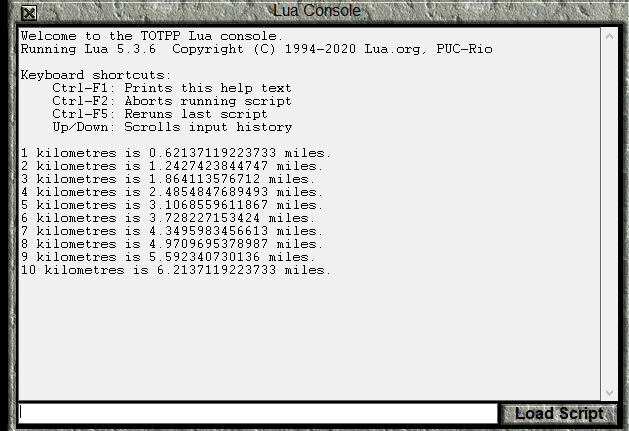
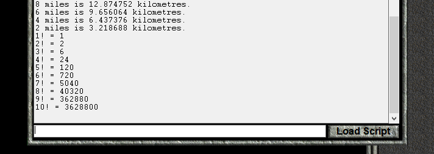
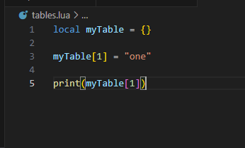
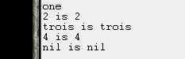

|Previous: [Civilization II Objects and If Statements](04_civObjectsAndIfStatements.html) | Next: []() |

# Loops and Tables

## Introduction

Over the past lessons, we've been gradually learning about different parts of the Lua Programming Language, and the basics of how they are used.  In this lesson, we'll introduce the last two major components of the language: Loops and Tables.  Loops are a way to execute a section of code multiple times and tables are a way to manipulate multiple values at once.

## File Update (Temporary Section)

If you downloaded the ClassicRome scenario for lesson 4 on or before November 26, 2023, then there is a file update that you need to make.  Download [this zip file](lesson_downloads/documentationUpdate.zip), and replace the following two files in the ClassicRome Scenario: **LuaCore\generalLibrary.lua** and **LuaDocumentation\civ.lua**.  (Alternatively, you could download the [new version of the scenario](lesson_downloads/ClassicRome-lesson-4.zip) and replace **discreteEvents.lua** with the copy you made in the last lesson.)

I don't intend to make a habit of retroactively changing files in these lessons, but I changed the documentation of iterators (which you'll learn about in this lesson) to match what LuaLS expects.

## The Numeric For Loop

In Lua, loops come in a couple different varieties.  We'll introduce loops by looking at the _numeric for_ loop.  In VS Code, open the **lua** folder within your **Test of Time** directory, which we worked with during lessons 2 and 3.  Open a tab with the **conversion.lua** file.  It should look something like this:


In this file, we convert 3 numbers between miles and kilometres.  Until now, if we wanted to print many conversions, we would have to copy and paste each command over and over, and then change the numbers.  Now, however, we can use a loop to simplify the process, and reduce typos.

```lua
for numKm=1,10 do
    print(numKm.." kilometres is "..kmToMiles(numKm).." miles.")
end
```

Let's break down this code:

```lua
for 
```
The _for_ keyword tells Lua that a _for loop_ is being created.
```lua
numKm=1,10
```
`numKm` is a local variable to be created for use within the loop.  `=1,10` means that `numKm` will first take on a value of `1`, then `2`, then `3`, and so on, incrementing by 1 each time until `10` is reached.

```lua
            do
    print(numKm.." kilometres is "..kmToMiles(numKm).." miles.")
end
```
The code between `do` and `end` will be executed for each value of `numKm` that the loop specifies.  In this case, a message with a unit conversion is printed to the console for each value of `numKm`.  **conversion.lua** will look like this:


Load a saved game in the **Original** folder, not **ClassicRome** and run the script.  (The ClassicRome scenario disables global variables, and this file has some.)



For loop variables do not have to increment by 1.  In fact, they can decrement if you prefer.  Let's look at an example:

```lua
for numMi=10,1,-2 do
    print(numMi.." miles is "..milesToKm(numMi).." kilometres.")
end
```
The following part is different from the previous example:
```lua
numMi=10,1,-2
```
In this case, `numMi` starts with a value of `10`, and has an ending value of `1`.  What's new is that the third number, `-2`, is the increment value for `numMi`.  In this case, the "increment" actually reduces the value by 2 each time.  So, `numMi` will be `10`, then `8`, then `6`, `4`, and, finally `2`.  The next value after `2` would be `0`, but `0` is outside of the values of `10` through `1`, so the loop stops there.  The loop is not run for the case when `numMi` is `1` because the increment and starting value didn't cause it to take on a value of exactly `1`. 

Add this loop to **conversion.lua**, save, and run the script again.


## A For Loop in a Function

Now, let's do something slightly more complicated.  In math, $6!$ is called "six factorial" and means $6 \times 5 \times 4 \times 3 \times 2 \times 1=720$.  In general, $N!=N\times(N-1)\times(N-2)..3\times2\times1$.  We will write a Lua function to compute factorials:

```lua
function factorial(N)
    local resultSoFar = 1
    for i=N,1,-1 do
        resultSoFar = resultSoFar * i
    end
    return resultSoFar
end
```
Let's look at this code:

```lua
function factorial(N)
```
We've seen this before.  Since there is no `local` keyword, we're writing a global function, called `factorial`, and which has a parameter `N`.

```lua
    local resultSoFar = 1
```

In this function, we're going to perform the multiplication over multiple "steps," and at each step, we're going to keep track of the result that we have computed thus far into the computation.  Since the factorial involves multiplication, it is natural to initialize `resultSoFar` to `1`, because anything multiplied by 1 gets itself back.

```lua
    for i=N,1,-1 do
```
This time, the loop variable is called `i`.  `i` is a standard name for a loop variable if you can't think of anything better.  The `N` means that the initial value of `i` is set to whatever the current value of `N` is.  The factorial definition requires us to multiply each integer value between $N$ and $1$ inclusive, so we increment by `-1` and end the loop at `1`.
```lua
        resultSoFar = resultSoFar * i
    end
```
This is the actual "work" of the function.  The current integer `i` is multiplied by the current `resultSoFar` in order to get a new `resultSoFar`.  When `i` is `N`, `resultSoFar` is `1`, and it is set to `N` to start the calculation.  After that, the code effectively progresses left to right on the calculation $N\times(N-1)\times(N-2)..3\times2\times1$ multiplying the next integer into the result, until `1` is reached.

```lua
    return resultSoFar
```

After the loop is complete, the `resultSoFar` is, in fact, the result, so it can be returned.

We can add a nice loop to **conversion.lua** to print the factorials for 1 through 10.




## While Loops

Now, let's look at a different kind of loop, the _while loop_.  The _numeric for loop_ repeated the loop body a predetermined number of times.  The _while loop_, on the other hand, keeps performing a set of instructions as long as a certain condition is met, and then stops.  In fact, if the condition is not met when the _while loop_ is first reached, it won't be executed even once.

Let's look at _while loop_ version of the factorial function:

```lua
function factorialWhile(N)
    local resultSoFar = 1
    while N >= 1 do
        resultSoFar = resultSoFar*N
        N = N-1
    end
    return resultSoFar
end
```
```lua
function factorialWhile(N)
    local resultSoFar = 1
```
These are the same as the function with the _numeric for loop_.

```lua
    while N >= 1 do
```
This line checks that `N` is greater than or equal to `1`.  The `>=` operator returns `true` if the number to the left is at least as much as the the number on the right, and `false` otherwise.  If `true` is returned, the loop body (between `do` and `end`) is executed, otherwise, the code skips to the `end`.  

```lua
        resultSoFar = resultSoFar*N
        N = N-1
    end
```
This is the loop body.  Once again, we're multiplying the `resultSoFar` by the current integer.  However, this time we must also increment `N`, since there is no loop variable this time.  This may be the first time in these lessons that I've changed the value of a variable that is defined in the function parameters list, but it is allowed.  (We could also have just defined another variable if we wanted.)

Once the `end` is reached, the `N >=1 ` check is made again, and the code keeps executing as long as `N` is greater than 1.

```lua
    return resultSoFar
end
```
As with the numeric for loop, once we exit the loop, the `resultSoFar` is the final result.

Adding a loop to test this function gives the code:


In this example, the _while loop_ is a bit more work than the _numeric for loop_, since we had to increment a counter ourselves.  _While loops_ are useful in situations where you don't know ahead of time how many times you will need to execute the loop body.  This is more likely to be the case when solving more complicated problems, so we will have to wait for future lessons to see some in action.

You should also note that if you choose your condition poorly the _while loop_ will never stop, and you will be forced to close Civ II through the task manager.

Later in this lesson, we'll look at the _generic for loop_, but, for now we will turn our attention to Lua _tables_.

## Tables

Thus far, we have always stored a single _value_ in a _variable_.  This can sometimes be inconvenient for a couple of reasons.  The first reason is that sometimes it is much more convenient to manipulate multiple values at once.  The second reason is that sometimes we don't know how how many variables that we'll need ahead of time.  For example, if we're gathering a list of cities, we will probably not know ahead of time how many cities will be in that list.  Lua _tables_ help us get around both of these problems.

A Lua _table_ is a programming object that associates _keys_ with _values_.  Every _key_ can have an associated _value_.  Several _keys_ can have the same value associated with it, but the same _key_ can't have multiple different _values_.  Another way of saying it is that _values_ can be repeated in a _table_, but there can only be one of each _key_.  I think that Lua uses the name _table_ because behind the scenes they are [hash tables](https://en.wikipedia.org/wiki/Hash_table), but reading up on hash tables won't be of any help programming in Lua.

We will begin by creating a new _table_.  In the **lua** folder, create a new file called **tables.lua**, which we will program in during this next section.  You should also reload your saved game in the **Original** folder, to clear the console from earlier in the lesson.

In order to create a _table_, we use the following syntax:

```lua
local myTable = {}
```
At the moment, `myTable` doesn't have any _key_-_value_ associations.  Although any data type except _nil_ can be a _table_ _key_, we will usually restrict ourselves to _numbers_ and _strings_ for keys.  To start, we will assign the value `"one"` to the key `1`:

```lua
myTable[1] = "one"
```
The `[]` brackets are used to specify that what is inside of them is a _table_ _key_, which is also sometimes called an _index_.  So, `[1]` tells Lua that we're interested in the _key_ `1` of a _table_, and `myTable[1]` tells Lua that `myTable` is the _table_ in question.  Since this is all on the left hand side of the `=` sign, Lua knows that a _value_ is being assigned to that _table_ and _key_.  In this case, the value is `"one"`.

In order to get the _value_ associated with a _table's_ _key_, very similar syntax is used:

```lua
print(myTable[1])
```
Once again, the `[1]` tells Lua that we're interested in the _value_ assigned to the _index_ `1`, and `myTable[1]` tells that we want the value from the _table_ stored in the `myTable` variable.  Since it is not to the left of an `=` sign, Lua knows that we want to get the _value_ rather than assign it.

Save and run the script.



![myTable\[1\]](05_lesson_images/myTable-one.png)

Next, let's assign another _value_ to `myTable`.  This time, we'll assign the _value_ `2` to the _key_ `"two"`:

```lua
myTable["two"] = 2

print(myTable["two"].." is 2")
```

We can also use the _values_ of _variables_ as _keys_ or _values_ in a _table_.

```lua
local trois = "trois"
local three = 3

local four = "quatre"

myTable[3] = trois
myTable[four] = 4

print(myTable[three].." is trois")
print(myTable["quatre"].." is 4")
```


Another characteristic of _tables_ is that if you try to get the value of a _key_ that doesn't have an assigned value, _nil_ will be returned as the assigned value.

```lua
print(tostring(myTable[5]).." is nil")
```


## Counting Animals

Let's have a little example where we record animals that we've "seen".  Whenever we "see" an animal, we'll call the function `spotted` to record the animal.

We comment out the previous code, and add this new code:

```lua
caesarTotals = {["horse"]=0,["cat"]=0,["dog"]=0}
hannibalTotals = {["horse"]=0,["cat"]=0,["dog"]=0}

function spotted(totals,animal)
    totals[animal] = totals[animal] + 1
end

spotted(caesarTotals,"dog")
spotted(caesarTotals,"dog")
spotted(hannibalTotals,"cat")
spotted(caesarTotals,"horse")
spotted(hannibalTotals,"horse")
spotted(hannibalTotals,"dog")
spotted(caesarTotals,"cat")
spotted(hannibalTotals,"cat")

function printTotals()
    print("Caesar's totals are: Horses: "..caesarTotals["horse"].." Cats: "..caesarTotals["cat"].." Dogs: "..caesarTotals["dog"])
    print("Hannibal's totals are: Horses: "..hannibalTotals["horse"].." Cats: "..hannibalTotals["cat"].." Dogs: "..hannibalTotals["dog"])
end

printTotals()
```
Let's go through the code:
```lua
caesarTotals = {["horse"]=0,["cat"]=0,["dog"]=0}
hannibalTotals = {["horse"]=0,["cat"]=0,["dog"]=0,}
```

Here, we're defining two tables, one table to keep track of how many animals Caesar spotted, and the other to keep track of how many animals Hannibal spotted.  These have been made into global variables, so that they can be accessed from the Lua Console if desired.

This time, we're defining a table with some stuff between the `{}` brackets. `["horse"]=0` means that the _key_ `"horse"` should be created with the new table, and that it should be initialised with a _value_ of `0`.  Each of these initialisations bust be separated with a `,`.  It is allowed to have or not have a `,` after the last _key_ (`["dog"]=0` vs `["dog"]=0,`).  So, for these two tables, the _keys_ `"horse"`, `"cat"`, and `"dog"` are all assigned a value of `0`.

```lua
function spotted(totals,animal)
    totals[animal] = totals[animal] + 1
end
```

Here, we define the global function `spotted`, which as two parameters: `totals` and `animal`.  `totals` is a _table_ that keeps track of the number of each animal spotted, and `animal` is a string that represents a particular kind of animal, and which is also a key in a `totals` _table_.

The `animal` key of the `totals` table is updated by adding `1` to the previous value.

There is something important to note here: the `totals` _table_ is not returned by the `spotted` function.  It doesn't have to be.  When a variable containing an integer or string is updated, the new value must be assigned to the variable to replace the existing one:


However, _tables_ are different.  It is best to think of _tables_ as "things" that just exist, and that what we're storing in the variable is just the _name_ of the _table_.  We don't need to update the name of the _table_ when we make a change to the _table_ itself.

```lua
spotted(caesarTotals,"dog")
spotted(caesarTotals,"dog")
spotted(hannibalTotals,"cat")
spotted(caesarTotals,"horse")
spotted(hannibalTotals,"horse")
spotted(hannibalTotals,"dog")
spotted(caesarTotals,"cat")
spotted(hannibalTotals,"cat")
```
Here, Caesar and Hannibal are "spotting" different animals.

```lua
function printTotals()
    print("Caesar's totals are: Horses: "..caesarTotals["horse"].." Cats: "..caesarTotals["cat"].." Dogs: "..caesarTotals["dog"])
    print("Hannibal's totals are: Horses: "..hannibalTotals["horse"].." Cats: "..hannibalTotals["cat"].." Dogs: "..hannibalTotals["dog"])
end
```
This function just prints the contents of the two tables.
```lua
printTotals()
```
Here, we print the the totals of the tables, based on the "spotted" animals in our script.

Save the file, and run the script.  (Remember to comment out the code from the previous section.)


In the console, we can call the `spotted` and `printTotals` functions to increment the values further, and see the new ones.  Here are some sample commands that I've done:


Tip: You can use the up and down arrows to bring up previous commands, so you don't have to type the entire command each time.

Now, let's cause an error.  Try to "spot" a `"cow"`:


```
C:\Games\Test of Time\lua\tables.lua:29: attempt to perform arithmetic on a nil value (field '?')
stack traceback:
	C:\Games\Test of Time\lua\tables.lua:29: in function 'spotted'
	(...tail calls...)
```
This is line 29:
```lua
    totals[animal] = totals[animal] + 1
```
and the error is "attempt to perform arithmetic on a nil value (field '?')".

This error means that you're trying to do arithmetic (basic math like addition or subtraction) but one of the values is _nil_.  Why did we get this error?  Let's perform the calculations.  First, we replace `totals` with `caesarTotals` and `animal` with `"cow"`, since those are the values that the `spotted` function was called with:

```lua
    caesarTotals["cow"] = caesarTotals["cow"] +1
```
On the Left Hand Side, we're trying to assign a value to the `"cow"` _key_ of `caesarTotals`, so that's fully simplified.  On the Right Hand Side, however, we still have to replace `caesarTotals["cow"]` with the corresponding value.  Since the table `caesarTotals` does not yet have anything assigned to the `"cow"` _key_, `nil` is considered to be the value:

```lua
    caesarTotals["cow"] = nil +1
```
And, here, we see that `nil` can't be added to `1`, so we get an error.

We should do something when the `spotted` function is called for a _key_ that isn't already in the totals table.

One option is to use the `error` function.  This will still cause an error, but the error will be more informative:

```lua
function spotted(totals,animal)
    if totals[animal] == nil then
        error(animal.." is not an animal that can be spotted.")
    end
    totals[animal] = totals[animal] + 1
end
```
```lua
    if totals[animal] == nil then
```
This line checks if the _value_ for the _key_ `animal` in the `totals` _table_ is `nil`.  If it is, we go inside the if statement to find
```lua
        error(animal.." is not an animal that can be spotted.")
```
The `error` command will create an error on this line, and print its argument as part of the error.  Change the `spotted` function, save **tables.lua**, load the script again, and try to "spot" a `"cow"` once again:


Now, we get the more helpful error that "cow is not an animal that can be spotted."

However, maybe we don't want to generate an error.  An alternative is to simply do nothing.  Let's look at a different version of `spotted`:

```lua
function spotted(totals,animal)
    if totals[animal] then
        totals[animal] = totals[animal] + 1
    end
end
```
We only need to look at 
```lua
    if totals[animal] then
```
In the last lesson I wrote that an if statement of the form
```lua
if value then
```
executes if the `value` is `true` and explained the way if statements worked as if the `value` must be a _boolean_.  I did that for simplicity.  In fact, the `value` between `if` and `then` can be _any_ data type.  The body of the if statement is executed if the value is "truthy," and is't executed if the value is "falsy."  In Lua, **all** values are "truthy" except `false` and `nil`.  (This is different from a lot of other programming languages, where some other values like `0` and `""` are falsy.)

Since only `nil` and `false` are falsy, `if table[key] then` is a compact way to execute code only if a `table` has an assigned value for `key`, as long as `false` isn't a _value_ in the `table`.

That means that this version of the `spotted` function increments the total if `animal` is a _key_ in the `totals` table, and does nothing if it isn't.

Save this version of spotted, reload **tables.lua** and try to "spot" a `"cow"` again.  Call `caesarTotals["cow"]` to check that nothing has been assigned to the `"cow"` key:


We have another option for dealing with a new _key_: we can initialize it to 0 before adding 1 to it:

```lua

```
