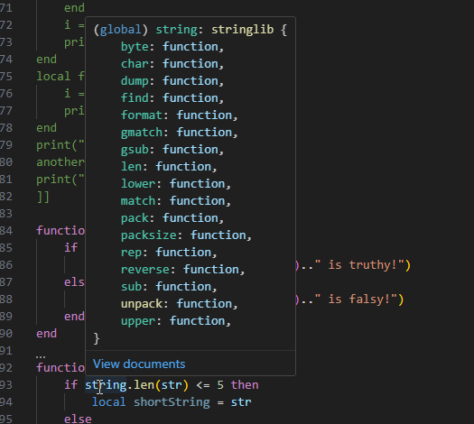
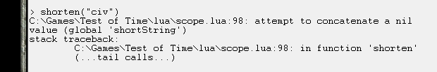
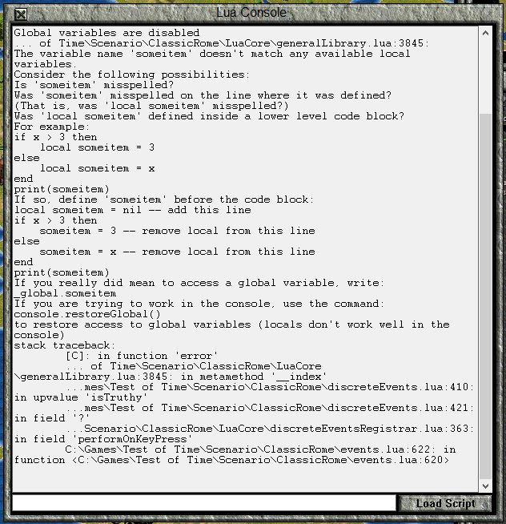
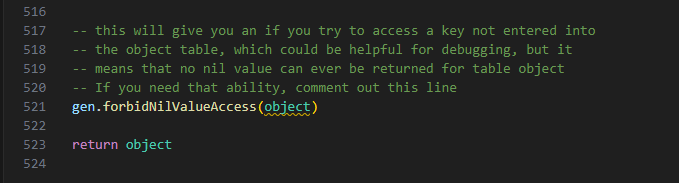

| Previous: [Loops and Tables](05_loopsAndTables.html) | Next: []() |

# Variable Scope and Sharing Data

## Introduction

Over the past few lessons, I've been writing about "local" and "global" variables, but I haven't given them a proper explanation.  I also haven't explained why the Lua Scenario Template disables global variables, even though it makes trying things out in the console inconvenient.  I'll explain all that in this lesson.

Because it is a related subject, we will also see how to share data and functions between files.  Having multiple files is convenient for organizing our code.  As part of this, we'll see how to use the **object.lua** file to make our code more readable.


## Variable Scope Gone Wrong

A variable's _scope_ is the term used for the part of a program that can access or change the value stored by that variable.  It is very common for a file to have multiple variables with the same name.  Variable names like `unit`, `tribe`, or `city` can appear dozens of times in a large file with lots of events or functions.  By limiting the _scope_ of a variable, we can reuse variable names within a file (or between files) without creating a conflict.

Let's create an example conflict to illustrate what can go wrong if a variable's scope is too expansive.  Open VS Code, and the **Lua** folder.  When the time comes, load the saved game in the **Original** folder that you've been using to run scripts.  This example will involve global variables.

Create a new file, **scope.lua**.

In math, the $N^{th}$ [triangle number](https://en.wikipedia.org/wiki/Triangular_number) is defined to be $T_{N} = 1 + 2 + 3 + ... + (N-1) + N $, which is to say, the sum of the first $N$ counting numbers.  There is a formula for the triangle numbers, but we'll write a function that adds all these numbers up:

```lua
local function getTriangleNumber(N)
    sumSoFar = 0
    for i=1,N do
        sumSoFar = sumSoFar + i
    end
    return sumSoFar
end
```
Since we're creating an example with a scope conflict, we omit the `local` designation of `sumSoFar`, so that its _scope_ goes beyond the function `getTriangleNumber`.  The logic of this code is very similar to that of the [factorial function](05_loopsAndTables.html#a-for-loop-in-a-function) from the last lesson.

We can get a list of triangle numbers from the Wikipedia page and put the list in a table.  Then, we can compare the numbers our function generates with the actual numbers.

```lua
local triangleNumbers = {1, 3, 6, 10, 15, 21, 28, 36, 45, 55}
for k=1,10 do
    print("The "..k.."th triangle number is "..
    getTriangleNumber(k).." ("..triangleNumbers[k]..")")
end
```

Now, it turns out that the $M^{th}$ [tetrahedral number](https://en.wikipedia.org/wiki/Tetrahedral_number) is the sum of the first $M$ triangle numbers, so we can write this function:

```lua
local function getTetrahedralNumber(M)
    sumSoFar = 0
    for j=1,M do
        sumSoFar = getTriangleNumber(j) + sumSoFar
    end
    return sumSoFar
end
```
And check that it works with the following list and loop:

```lua
local tetrahedralNumbers = {1, 4, 10, 20, 35, 56, 84, 120, 165, 220,}
for k=1,10 do
    print("The "..k.."th tetrahedral number is "..
    getTetrahedralNumber(k).." ("..tetrahedralNumbers[k]..")")
end
```


The triangle numbers are correct, but the tetrahedral numbers are not.  To prove this is an issue with variable _scope_, we can add `local` to the definition of `sumSoFar` and try again:


So, what was the problem? The problem is that both `getTriangleNumber` and `getTetrahedralNumber` were sharing the _same_ variable `sumSoFar`.  Look again at `getTriangleNumber`:

```lua
local function getTriangleNumber(N)
    sumSoFar = 0
    for i=1,N do
        sumSoFar = sumSoFar + i
    end
    return sumSoFar
end
```
When `getTriangleNumber` is executed, the first thing it does is set `sumSoFar` to 0.  It then updates `sumSoFar` until the variable has taken on the value of the `N`<sup>th</sup> triangle number.  During the execution of `getTriangleNumber`, `sumSoFar` is first set to `0`, then only updated when the function's logic calls for it.  So, calling this function returns the value of the `N`<sup>th</sup> triangle number and causes `sumSoFar` to take on that value.

Now, let's evaluate `getTetrahedralNumber` for `M = 2`, knowing that `getTriangleNumber` changes the value of `sumSoFar`.  The comments at the top of the code represent the current value of variables:

```lua
local function getTetrahedralNumber(M)
    sumSoFar = 0
    for j=1,M do
        sumSoFar = getTriangleNumber(j) + sumSoFar
    end
    return sumSoFar
end
```
The first line:
```lua
-- M = 2
    sumSoFar = 0
```
This is a straightforward variable assignment, so proceed to the next line
```lua
-- M = 2
-- sumSoFar = 0
    for j=1,M do
```
Substitute 2 for M
```lua
-- M = 2
-- sumSoFar = 0
    for j=1,2 do
```
Now, proceed to the next line, where `j` will be `1` because of the loop:
```lua
-- M = 2
-- sumSoFar = 0
-- j = 1
        sumSoFar = getTriangleNumber(j) + sumSoFar
```
We need to evaluate `getTriangleNumber(j)`, so replace `j` with `1`:
```lua
-- M = 2
-- sumSoFar = 0
-- j = 1
        sumSoFar = getTriangleNumber(1) + sumSoFar
```
Now, `getTriangleNumber(1)` is evaluated, which does two things.  First, `getTriangleNumber(1)` is replaced with `1`, and the `sumSoFar` variable is updated to be `1`
```lua
-- M = 2
-- sumSoFar = 1
-- j = 1
        sumSoFar = 1 + sumSoFar
```
Next, replace `sumSoFar` on the right hand side with `1`.  This is the point where the code logic breaks.  `getTetrahedralNumber` was written based on the logic that `sumSoFar` would be `0` at this point, but it has been "unexpectedly" changed to `1`.
```lua
-- M = 2
-- sumSoFar = 1
-- j = 1
        sumSoFar = 1 + 1
```
```lua
        sumSoFar = 2
```
Now, `sumSoFar` is set to `2` and we proceed ot the next line.  

```lua
-- M = 2
-- sumSoFar = 2
-- j = 1
    end
```
This is the `end` of the loop body, so start over, incrementing `j` to 2:
```lua
-- M = 2
-- sumSoFar = 2
-- j = 2
        sumSoFar = getTriangleNumber(j) + sumSoFar
```
```lua
        sumSoFar = getTriangleNumber(2) + sumSoFar
```
`getTriangleNumber(2)` evaluates as `3`, so replace the function call and update `sumSoFar`:
```lua
-- M = 2
-- sumSoFar = 3
-- j = 2
        sumSoFar = 3 + sumSoFar
```
Now, replace the right hand side `sumSoFar` with the current value of the variable:

```lua
-- M = 2
-- sumSoFar = 3
-- j = 2
        sumSoFar = 3 + 3
```
```lua
        sumSoFar = 6
```
```lua
-- M = 2
-- sumSoFar = 6
-- j = 2
    end
```
At this point, the loop ends since `j = 2` is the maximum value for `j`.

```lua
-- M = 2
-- sumSoFar = 6
-- j = 2
    return sumSoFar
```
```lua
    return 6
```
And so, `6` is returned, which is incorrect.  If `getTriangleNumber` didn't modify `sumSoFar` for `getTetrahedralNumber`, the computation would work correctly.  Here's an abbreviated demonstration of the computation.

```lua
-- M = 2
    local sumSoFar = 0
```
```lua
-- M = 2
-- sumSoFar = 0
    for j=1,M do
```
```lua
-- M = 2
-- sumSoFar = 0
    for j=1,2 do
```
```lua
-- M = 2
-- sumSoFar = 0
-- j = 1
        sumSoFar = getTriangleNumber(j) + sumSoFar
```
```lua
-- M = 2
-- sumSoFar = 0
-- j = 1
        sumSoFar = getTriangleNumber(1) + sumSoFar
```
```lua
-- M = 2
-- sumSoFar = 0
-- j = 1
        sumSoFar = 1 + sumSoFar
```
```lua
-- M = 2
-- sumSoFar = 0
-- j = 1
        sumSoFar = 1 + 0
```
```lua
        sumSoFar = 1
```
```lua
-- M = 2
-- sumSoFar = 1
-- j = 1
    end
```
```lua
-- M = 2
-- sumSoFar = 1
-- j = 2
        sumSoFar = getTriangleNumber(j) + sumSoFar
```
```lua
        sumSoFar = getTriangleNumber(2) + sumSoFar
```
```lua
-- M = 2
-- sumSoFar = 1
-- j = 2
        sumSoFar = 3 + sumSoFar
```

```lua
        sumSoFar = 3 + 1
```
```lua
        sumSoFar = 4
```
```lua
-- M = 2
-- sumSoFar = 4
-- j = 2
    end
```
```lua
-- M = 2
-- sumSoFar = 4
    return sumSoFar
```
```lua
-- M = 2
-- sumSoFar = 4
    return 4
```
And, the second tetrahedral number is, in fact, 4.

This example illustrates one of the reasons why global variables are disabled in the Lua Scenario Template.  If you forget to write `local` before your variable when you define and initialize it, by default Lua sees that not as a mistake, but as an indication that you wanted to use a global variable in that instance.  So, because we "forgot" to write `local` a couple times, these very simple functions didn't behave as expected, and the error is not obvious.

## Determining a Variable's Scope

Now that we have an example of the problems that arise when a variable's _scope_ is too large, let's explore the rules that determine a variable's _scope_.  These rules are mostly described if we have the idea of a _code block_.

A _code block_ is a portion of code that begins with `for`, `if`, `while`, or `function`, and finishes with a corresponding `end`.  (Lua has a `repeat`-`until` loop structure that I will discuss in a [future lesson](lessonLinkPlaceHolder.html), which is also a _code block_.) Additionally, the entire file is considered a _code block_ as well. 

Here is the current **scope.lua** code:

```lua
local function getTriangleNumber(N)
    local sumSoFar = 0
    for i=1,N do
        sumSoFar = sumSoFar + i
    end
    return sumSoFar
end

local triangleNumbers = {1, 3, 6, 10, 15, 21, 28, 36, 45, 55}
for k=1,10 do
    print("The "..k.."th triangle number is "..
    getTriangleNumber(k).." ("..triangleNumbers[k]..")")
end

local function getTetrahedralNumber(M)
    local sumSoFar = 0
    for j=1,M do
        sumSoFar = getTriangleNumber(j) + sumSoFar
    end
    return sumSoFar
end

local tetrahedralNumbers = {1, 4, 10, 20, 35, 56, 84, 120, 165, 220,}
for k=1,10 do
    print("The "..k.."th tetrahedral number is "..
    getTetrahedralNumber(k).." ("..tetrahedralNumbers[k]..")")
end
```
The following code blocks exist in the file code (in addition to the file itself):
```lua
local function getTriangleNumber(N)
    local sumSoFar = 0
    for i=1,N do
        sumSoFar = sumSoFar + i
    end
    return sumSoFar
end
```
```lua
    for i=1,N do
        sumSoFar = sumSoFar + i
    end
```

```lua
for k=1,10 do
    print("The "..k.."th triangle number is "..
    getTriangleNumber(k).." ("..triangleNumbers[k]..")")
end
```

```lua
local function getTetrahedralNumber(M)
    local sumSoFar = 0
    for j=1,M do
        sumSoFar = getTriangleNumber(j) + sumSoFar
    end
    return sumSoFar
end
```

```lua
    for j=1,M do
        sumSoFar = getTriangleNumber(j) + sumSoFar
    end
```
```lua
for k=1,10 do
    print("The "..k.."th tetrahedral number is "..
    getTetrahedralNumber(k).." ("..tetrahedralNumbers[k]..")")
end
```

The file **twelveDays.lua** has the following code blocks:

```lua
local dayInfo = {
    [1] = {day="first", line="And a partridge in a pear tree."},
    [2] = {day="second", line="Two turtle doves,"},
    [3] = {day="third", line="Three French hens,"},
    [4] = {day="fourth", line="Four calling birds,"},
    [5] = {day="fifth", line="Five gold rings,"},
    [6] = {day="sixth", line="Six geese a-laying,"},
    [7] = {day="seventh", line="Seven swans a-swimming,"},
    [8] = {day="eighth", line="Eight maids a-milking,"},
    [9] = {day="ninth", line="Nine ladies dancing,"},
    [10] = {day="tenth", line="Ten lords a-leaping,"},
    [11] = {day="eleventh", line="Eleven pipers piping,"},
    [12] = {day="twelfth ", line="Twelve drummers drumming,"},
}

local function makeVerse(verse)
    if verse == 1 then
        print("On the first day of Christmas, my true love sent to me")
        print("A partridge in a pear tree.")
        return
    end
    print("On the "..dayInfo[verse].day.." day of Christmas, my true love sent to me")
    for i=verse,1,-1 do
        print(dayInfo[i]["line"])
    end
end

local function printTwelveDaysOfChristmas()
    for i=1,12 do
        print("")
        makeVerse(i)
    end
end

printTwelveDaysOfChristmas()
```

```lua
local function makeVerse(verse)
    if verse == 1 then
        print("On the first day of Christmas, my true love sent to me")
        print("A partridge in a pear tree.")
        return
    end
    print("On the "..dayInfo[verse].day.." day of Christmas, my true love sent to me")
    for i=verse,1,-1 do
        print(dayInfo[i]["line"])
    end
end
```

```lua
    if verse == 1 then
        print("On the first day of Christmas, my true love sent to me")
        print("A partridge in a pear tree.")
        return
    end
```

```lua
    for i=verse,1,-1 do
        print(dayInfo[i]["line"])
    end
end
```


```lua
local function printTwelveDaysOfChristmas()
    for i=1,12 do
        print("")
        makeVerse(i)
    end
end
```

```lua
    for i=1,12 do
        print("")
        makeVerse(i)
    end
```

The _scope_ of a local variable is the _code block_ that it is defined in, starting at the line containing `local`, except for any smaller _code blocks_ within the block, where a local variable with the same name is also defined.  

A global variable has its _scope_ everywhere, except in _code blocks_ where a local variable of the same name is defined.

Those definitions were a mouthful, so let's look at some examples.  Comment out the triangular/tetrahedral number code and add this code:

```lua
local i = 7
print("file i: "..i.."(7)")
for i=2,2 do
    print("for i:"..i.."(2)")
end
print("file i: "..i.."(7)")
if true then
    local i = 3
    i = i + 2
    print("if i: "..i.."(5)")
    if false then
        
    else
        local i = -3
        i = i + 1
        print("else i: "..i.."(-2)")
    end
    print("if i: "..i.."(5)")
end
print("file i: "..i.."(7)")
local function aFunction(i)
    i = i + 3
    print("function i: "..i.."(11)")
end
print("file i: "..i.."(7)")
aFunction(8)
print("file i: "..i.."(7)")

for j=1,1 do
    i = i+1
    print("file i: "..i.."(8)")
end
print("file i: "..i.."(8)")

if true then
    if false then
        
    else
        i = i - 2
        print("file i: "..i.."(6)")
    end
    i = i+1
    print("file i: "..i.."(7)")
end
local function anotherFunction()
    i = i+2
    print("file i: "..i.."(9)")
end
print("file i: "..i.."(7)")
anotherFunction()
print("file i: "..i.."(9)")
```
You can run this code to see that the values in parentheses are, in fact, the values of `i` at that particular point.  I'll go through the code, and explain anything interesting.
```lua
local i = 7
print("file i: "..i.."(7)")
```
Here, we define `i` in the _code block_ of the entire file (well, all lines after this point in any case) and immediately verify that it is `7`.

```lua
for i=2,2 do
    print("for i:"..i.."(2)")
end
print("file i: "..i.."(7)")
```
The `i` defined inside the for loop is local to the loop, so when we ask for `i` within this loop, we get the "for loop `i`", which has a value of `2`.  (The body of this loop executes only once.)

Once we're out of the loop, `i` once again corresponds to the "file `i`", which has a value of `7`. 

```lua
if true then
    local i = 3
    i = i + 2
    print("if i: "..i.."(5)")
```
Inside the body of this if statement, a new `i` is defined.  `i = i + 2` refers to the `i` that has been defined within the if statement.  This is also true of the `print` line, where the "if `i`" now has a value of `5`.
```lua
    if false then
        
    else
        local i = -3
        i = i + 1
        print("else i: "..i.."(-2)")
    end
    print("if i: "..i.."(5)")
end
print("file i: "..i.."(7)")
```
In this if statement, we proceed to the else section.  Here, yet another `i` is defined, calculated upon, and this time ends up with a value of `-2`.

After the first `end`, we're back to the "if `i`" version of `i`, which still has a value of `5`, since it wasn't the `i` that changed.

After the second `end`, we're back to looking at the "file `i`", which is unchanged.

```lua
local function aFunction(i)
    i = i + 3
    print("function i: "..i.."(11)")
end
```

Here, we define `aFunction`, which has a parameter `i`, which is a local variable within the function.  Note that this was just a function definition, so nothing was printed yet.

```lua
print("file i: "..i.."(7)")
aFunction(8)
print("file i: "..i.."(7)")
```
Defining a function leaves "file `i`" unchanged.

Executing `aFunction` with starts by giving "function `i`" a value of `8`, then adding `3` in order to get a value of `11`, which is printed at this point.

Since "function `i`" is different from "file `i`", the later still has a value of `7`.

```lua
for j=1,1 do
    i = i+1
    print("file i: "..i.."(8)")
end
print("file i: "..i.."(8)")
```
This time, the loop variable is `j`, so changing the value of `i` actually changes "file `i`", because there is no "loop `i`" that takes precedence.  Since this loop only executes the body once, "file `i`" still has a value of `8` after the loop.

```lua
if true then
    if false then
        
    else
        i = i - 2
        print("file i: "..i.."(6)")
    end
    i = i+1
    print("file i: "..i.."(7)")
end
```
Neither of these smaller _code blocks_ defines a local version of `i`, so "file `i`" is the variable that has calculations performed on it, and is the `i` referenced in the `print` lines.

```lua
local function anotherFunction()
    i = i+2
    print("file i: "..i.."(9)")
end
print("file i: "..i.."(7)")
```
This time, the function definition doesn't define `i` as a parameter, so it changes the "file `i`" when computing `i = i + 2`.  However, at this point "file `i`" is still `7`, since defining a function doesn't execute it.

```lua
anotherFunction()
print("file i: "..i.."(9)")
```
At this point, executing `anotherFunction` increases "file `i`" to `9`.  `anotherFunction` prints this new value, then the `print` line does so again.

Don't worry too much about about the details of scope, because it most of it doesn't really matter.  Instead of remembering the difference between "file `i`" and "if `i`", just name one of them `j` or `ifI`.  Your code will be much easier to read and understand that way.

In practice, the fact that local variables work the way they do is typically a source of protection for your code, rather than a source of bugs.  When you use `local` to create "if `i`", you don't have to worry about whether there is some "file `i`" in your code that you've forgotten about.

There is one caveat to the above assertions.  You have to make sure to define your local variable in the largest _code block_ that you intend to use it in.  That is, the following is incorrect:

```lua
if someValue then
    local a = 1
else
    local a = 2
end
print(a)
```
The "if `a`" and "else `a`" are only valid within the if-else statement, so `print(a)` either prints the global variable version of `a`, or produces an error in the Lua Scenario Template.

The proper way to write this section of code is:

```lua
local a = nil
if someValue then
    a = 1
else
    a = 2
end
print(a)
```

We will use this kind of mistake in a future example, where we see just how much trouble global variables can cause.

## The Treacherous Global Variable

This section title is a bit over the top, but only a little.  Global variables can turn errors that should be easy to detect and fix into subtle and inconsistent bugs, as we'll see.

The global variables are actually stored in a table.  If you like, you can reference it with the variable name `_G`.  So, if you wanted, you could write `_G.print` or `_G.someKey` and use it like any other table.  

However, we don't write `_G.print`, we just write `print`.  The reason is that whenever we write a variable name, Lua checks if that name corresponds to a local variable in _scope_.  If it doesn't, then Lua converts the variable name to a string and checks the global table `_G` for the value associated with the key.  If we want, say, the `print` function or the `civ` table of functions then everything's great.  

The problems arise when we use a global variable by mistake.  Since `_G` is a table, it will return `nil` for any key that doesn't already have an associated value.  If we type `myvariable` instead of `myVariable`, Lua dutifully assumes that we wanted to access the global variable `myvariable` and not that we've made a typo.  Instead of generating an error that we can notice and fix, we have to detect that our code isn't doing what we want it to do because somewhere that we want to use the value of `myVariable`, we're just getting `nil` because we accidentally typed `myvariable`.

Here is an example.  Comment out the previous code in **scope.lua** and add this code:

```lua
function isTruthy(someItem)
    if someitem then
        civ.ui.text(tostring(someItem).." is truthy!")
    else
        civ.ui.text(tostring(someItem).." is falsy!")
    end
end
```
This function is supposed to determine if `someItem` is truthy or falsy, and show a corresponding text box.  However, there is a misspelling `someitem` in the code.  


The Lua Language Server catches `someitem` as a possible mistake, but let's see what happens when we run the function.  Save and load the script to register the function.  Since `isTruthy` is global on purpose, we can access it from the console to test:


Well, `true` is definitely not falsy.  What we want in this situation is for Lua to generate an error, saying that `someitem` is not a registered variable name.  This would clue us in to the existence of the typo.  Instead, Lua just gets the `"someitem"` entry in `_G`, which is `nil`, and it is up to us to notice that our function is not working properly.  That's easy in this example, but even noticing there is a problem can quickly become difficult in a complicated event.

This Lua behaviour can even create bugs that sometimes cause errors, while not causing them at other times.  Add the following function to **scope.lua** and load the script again.

```lua
function shorten(str)
    if string.len(str) <= 5 then
        local shortString = str
    else
        shortString = string.sub(str,1,3).."~"..string.sub(str,-1,-1)
    end
    print(str.." -> "..shortString)
end
```

This function is supposed to "shorten" a string `str` to a five character representation, and print the original string and the shortened form.  Note that the function parameter is called `str` instead of `string`.  This isn't to save effort typing, but rather because `string` is already a global variable containing a table of functions for string manipulation.

Hovering over `string` can get you the list of string functions:



And you can find out more by clicking "view documents":


```lua
    if string.len(str) <= 5 then
        local shortString = str
    else
```
The function `string.len` returns the number of characters in the string (its length).  If it is less than or equal to `5`, the `shortString` is the same as `str`.
```lua
    else
        shortString = string.sub(str,1,3).."~"..string.sub(str,-1,-1)
    end
```
If the length of `str` is more than `5`, the `shortString` is created using the first `3` characters of `str`, a `~` character, and the last character of the string.

The function `string.sub` returns a "substring" of the provided string.  Positive numbers for the second and third arguments count characters from the beginning of the string.  Negative numbers mean to count from the end.  Here's the documentation:


```lua
    print(str.." -> "..shortString)
```
Finally, we print the original string and an arrow pointing towards the shortened form.

Now, in the Lua Console, call the `shorten` function on a string with five or fewer characters.  Here's an example using `"civ"` and the result:



The error "attempt to concatenate a nil value" means that our code is trying to join two strings together with `..`, but a variable that is supposed to have a string (or number) is in fact `nil`, and so can't be concatenated.  

Next, `shorten` a longer word, say `"civilization"`:


That works as expected.  However, if we again try `shorten("civ")`, we don't get an error this time:


This isn't the correct way to shorten `"civ"`, but this time no error was generated.  In this case, having global variables active have turned a simple mistake into code that, for the same argument, sometimes generates an error and sometimes does not.  I have actually made this kind of [mistake](https://forums.civfanatics.com/threads/lua-scripting-possibilities.627220/page-6#post-15188320), and had to [fix it](https://forums.civfanatics.com/threads/lua-scripting-possibilities.627220/page-6#post-15188320) later, once someone noticed it.

So, what happened?  The first time `shorten("civ")` was called, `"civ"` was assigned to "local `shortString`" and then promptly "forgotten" as the Lua Interpreter moved beyond that code block.  Then, the line
```lua
    print(str.." -> "..shortString)
```
asked for "global `shortString`", which was `nil`, and, therefore, caused an error.

After that, we called `shorten("civilization")` and, the line 

```
        shortString = string.sub(str,1,3).."~"..string.sub(str,-1,-1)
```
assigned `"civ~n"` to "global `shortString`", since the `local` keyword was absent.  The line
```lua
    print(str.." -> "..shortString)
```
worked as expected, since it also references "global `shortString`".

Finally, `shorten("civ")` was called again, and `"civ"` was once again assigned to "local `shortString`", and once again "forgotten".

However, upon reaching the line 
```lua
    print(str.." -> "..shortString)
```
"global `shortString`" is referenced once again, but this time it has a value of `"civ~n"`.  Since that is a string which can be concatenated, no error is produced.

Let's spend a bit of time improving the `shorten` function.  First, let's fix the error by defining `shortString` before the if statement:

```lua
function shorten(str)
    local shortString = nil
    if string.len(str) <= 5 then
        shortString = str
    else
        shortString = string.sub(str,1,3).."~"..string.sub(str,-1,-1)
    end
    print(str.." -> "..shortString)
end
```
Since we're here, let's cover a trick to allow us to rename `str` as `string`.  For the existing references to the `string` functions, we will prepend `_G.` so that the reference to the global variables table is explicit instead of implicit:

```lua
function shorten(str)
    local shortString = nil
    if _G.string.len(str) <= 5 then
        shortString = str
    else
        shortString = _G.string.sub(str,1,3).."~".._G.string.sub(str,-1,-1)
    end
    print(str.." -> "..shortString)
end
```
Now, since we're not using the "global `string`" variable in this function, we can rename `str` to `string` without causing problems.


```lua
function shorten(string)
    local shortString = nil
    if _G.string.len(string) <= 5 then
        shortString = string
    else
        shortString = _G.string.sub(string,1,3).."~".._G.string.sub(string,-1,-1)
    end
    print(string.." -> "..shortString)
end
```

If we reload **scope.lua** and run our tests again, we see that they now work correctly.


## Disabled Global Variables

I have hopefully convinced you by this point that disabling global variables is a good idea.  So, now, let's work within the **ClassicRome** scenario again.

In the last lesson, we made a Key Press event in **discreteEvents.lua** to test how tables work:


Now, we're going to change contents of this "event" to test out the bad code that we looked at earlier.  Let's begin with the triangle and tetrahedral numbers:

```lua
local function getTriangleNumber(N)
    sumSoFar = 0
    for i=1,N do
        sumSoFar = sumSoFar + i
    end
    return sumSoFar
end

local function getTetrahedralNumber(M)
    sumSoFar = 0
    for j=1,M do
        sumSoFar = getTriangleNumber(j) + sumSoFar
    end
    return sumSoFar
end

local triangleNumbers = {1, 3, 6, 10, 15, 21, 28, 36, 45, 55}
local tetrahedralNumbers = {1, 4, 10, 20, 35, 56, 84, 120, 165, 220,}

discreteEvents.onKeyPress(function(keyCode)
    if keyCode ~= keyboard.backspace then
        return
    end
    for k=1,10 do
        print("The "..k.."th triangle number is "..
        getTriangleNumber(k).." ("..triangleNumbers[k]..")")
    end
    for k=1,10 do
        print("The "..k.."th tetrahedral number is "..
        getTetrahedralNumber(k).." ("..tetrahedralNumbers[k]..")")
    end
end)
```
Note that I eliminated the nearby comments.  They were mostly there for information.  The `---&autoDoc` and `---&endAutoDoc` comments are there for me to more easily build this website's documentation from the template, and you don't need to keep them in your scenarios.

Save the **discreteEvents.lua** file, re-load the game, and press backspace.  We get the following error:


Let's examine the error to understand it.
```
... of Time\Scenario\ClassicRome\LuaCore\generalLibrary.lua:3874: 
```
This is telling us that Lua "discovered" the error in the **LuaCore\generalLibrary.lua** file at line 3874.  The reason for this is that the code I use to disable global variables is written in the General Library.  The General Library contains several functions that generate errors like this.  If an error with a customised message is triggered in **generalLibrary.lua**, another part of the Template is probably just using error checking code that is provided by the General Library, and the actual error is connected to that section.  Later on in the error message, you will get information about the other possible locations of the error.

```
You appear to have forgotten to put 'local' before 'sumSoFar' the first time you used it.
If you really did mean to make a global variable, write:
_global.sumSoFar
If you are trying to define a variable in the console, use the command:
console.restoreGlobal()
to restore access to global variables (locals don't work well in the console)
```
Here is my custom error message.  It suggests three possible problems that might cause the error.

The first is that we forgot to put the `local` keyword before the `sumSoFar` variable, the first time we used it (this is, in fact, our mistake).

A second possibility is that we really wanted to make a global variable.  Since ordinary global variables are disabled, the Lua Scenario Template provides an alternative with the `_global` table.  I'll explain that later in this lesson.

The last possibility is that you're trying to do some work in the console, where local variables don't work.  If that's the case, you can enable global variables with the `console.restoreGlobal()` command.

```
stack traceback:
	[C]: in function 'error'
	... of Time\Scenario\ClassicRome\LuaCore\generalLibrary.lua:3874: in metamethod '__newindex'
	...mes\Test of Time\Scenario\ClassicRome\discreteEvents.lua:391: in upvalue 'getTriangleNumber'
	...mes\Test of Time\Scenario\ClassicRome\discreteEvents.lua:415: in field '?'
	...Scenario\ClassicRome\LuaCore\discreteEventsRegistrar.lua:363: in field 'performOnKeyPress'
	C:\Games\Test of Time\Scenario\ClassicRome\events.lua:622: in function <C:\Games\Test of Time\Scenario\ClassicRome\events.lua:620>
```
The "stack traceback" is the list of files and lines associated with the error.  Starting at the line with the code that caused the error, Lua provides the part of the program that "asked" for the error to be executed.

```
	[C]: in function 'error'
	... of Time\Scenario\ClassicRome\LuaCore\generalLibrary.lua:3874: in metamethod '__newindex'
```
This says that the `error` function caused the error at **generalLibrary.lua** line 3874.  A "metamethod" is terminology associated with Lua "metatables."  A "metatable" is a way to change the ordinary rules for how tables work.  I won't be explaining how to use them for a while, but for now all you need to know is that I used a "metatable" to make the `_G` table create an error when you try to access a `nil` value in the table.

```
	...mes\Test of Time\Scenario\ClassicRome\discreteEvents.lua:391: in upvalue 'getTriangleNumber'
```
This tells us that the program was also at **discreteEvents.lua** line 391 at the time of the error.  (You might have a different line in your file.)  "in upvalue 'getTriangleNumber'" means that the error took place while executing a local variable `getTriangleNumber`.  Don't worry about remembering the meaning of "upvalue," or, later, "field." I had to lookup what "upvalue" meant while writing this lesson.  All you really need to pay attention to is the function name provided, if there is one.

This is the actual location of our error, since we failed to make `sumSoFar` a local variable.


Add the missing `local`, but we'll look through the rest of this error message, since, sometimes, the error might be in a different file.


```
	...mes\Test of Time\Scenario\ClassicRome\discreteEvents.lua:415: in field '?'
```
This tells us that `getTriangleNumber` was called on line 415 of **discreteEvents.lua**, but there isn't a name for the function.  This makes sense, because its within an "anonymous function" that we supplied as the argument to `discreteEvents.onKeyPress`.


If this were a different kind of error, the mistake could have been here if we had supplied an invalid argument.

```
	...Scenario\ClassicRome\LuaCore\discreteEventsRegistrar.lua:363: in field 'performOnKeyPress'
```
The next level up for the error is in **LuaCore\discreteEventsRegistrar.lua** at line 363.  Instead of "upvalue", "field" is used, because the function is defined as a value within the `discreteEvents` table, assigned to the key `performOnKeyPress`.


It will sometimes be helpful to look at code within the **LuaCore** directory in order to determine the cause of an error.  However, **discreteEventsRegistrar.lua** is not one of these files.  The code in this file registers events.  If you reach the point where you need to look inside this file for troubleshooting, ask for help in the Forum.  I can help you find the bug in your code, or fix the bug in this file if I made a mistake programming it.

```
	C:\Games\Test of Time\Scenario\ClassicRome\events.lua:622: in function <C:\Games\Test of Time\Scenario\ClassicRome\events.lua:620>
```

The "highest" level of the error is in **events.lua** at line 622, where the `discreteEvents.performOnKeyPress` is executed.  I don't know why the function beginning at line 620 is identified this time, while "field ?" was used earlier.


Like **LuaCore\discreteEventsRegistrar.lua**, if you've reached the point where you have to look inside **events.lua** in order to troubleshoot an error, it is time to seek help in the Forum, since this file is likely to be of limited use.  Also, if there is an error in this file, I'd like to know about it to fix it.

The **events.lua** file is the file that Test of Time loads and runs when loading a saved game.  All the other files in the template are executed based on instructions from this file.  **events.lua** functions mostly as an organisational file, as well as including some behind the scenes work to create some "extra" [execution points](/executionPoints.html) from the functions provided by the TOTPP. 


Now, add the missing `local` at line 391, save **discreteEvents.lua**, re-load the game, and press backspace once again.  This time, the triangle numbers are printed, before we get this error:


Since this error is so similar to the last one, I won't give instructions on how to correct it.  If you have any trouble making the fix, you can ask for help in [this thread](https://forums.civfanatics.com/threads/feedback-thread-for-totpp-get-started-with-lua-events.636239/).

Save the file, re-load the game, press backspace, and you should get the printed values of the first triangle and tetrahedral numbers printed:


Next, we'll look at the `isTruthy` function example.  Change **discreteEvents.lua** so that the backspace key press event now looks like this:

```lua
function isTruthy(someItem)
    if someitem then
        civ.ui.text(tostring(someItem).." is truthy!")
    else
        civ.ui.text(tostring(someItem).." is falsy!")
    end
end

discreteEvents.onKeyPress(function(keyCode)
    if keyCode ~= keyboard.backspace then
        return
    end
    isTruthy(true)
    isTruthy(false)
end)
```


Save the file, and reload the game.  During the process of loading the game, you will get this error:


This is the same error we've seen before, with the Lua Interpreter complaining that we've apparently forgotten to put local before `isTruthy`.

The reason this error is appearing now instead of when we press backspace is because the `isTruthy` function is created and assigned a variable during the code initialisation which happens when a game is loaded.

This time, code in **discreteEventsRegistrar.lua** part of the _stack traceback_, because this didn't occur during the execution of an event.  Instead, it happened during a call to the `require` function, which allows Lua files to access information from other files.  I will explain `require` later on in this lesson.

For now, change line 409 (or whatever it is in your version of **discreteEvents.lua**) to

```lua
local function isTruthy(someItem)
```
and try again to load the saved game.  This time it should work, and you can press backspace.  This error should appear:



Let's break down the error message:

```
The variable name 'someitem' doesn't match any available local variables.
Consider the following possibilities:
```
This tells us that there is something wrong with the variable named `someitem`, because there is no local variable with that name.  (Trying to access a global variable that doesn't already exist triggers this error.)  Next, a few possibilities and solutions are suggested.

```
Is 'someitem' misspelled?
```
The first possibility is that `someitem` is misspelled.  In fact, that is what is causing the error in this case.  If we think this is the mistake, the line in question will be one of the lines in the _stack traceback_, almost certainly the one after the **generalLibrary.lua** line.  In this example, it would be **discreteEvents.lua** line 410.

```
Was 'someitem' misspelled on the line where it was defined?
(That is, was 'local someitem' misspelled?)
```

The next possibility is that the line that has the "global" variable is fine, but the line that defined it as a local variable was misspelled.  The message suggests that there will be a line with `local` on it, but remember that local variables are also defined by function and loop parameters.

This time, the _stack traceback_ will be a bit less helpful.  The mistake is probably in the second file in the traceback (the one after **LuaCore\generalLibrary.lua:3845: in metamethod '__index'**) but you'll have to work backwards from the line to find the mistake.

```
Was 'local someitem' defined inside a lower level code block?
For example:
if x > 3 then
    local someitem = 3
else
    local someitem = x
end
print(someitem)
If so, define 'someitem' before the code block:
local someitem = nil -- add this line
if x > 3 then
    someitem = 3 -- remove local from this line
else
    someitem = x -- remove local from this line
end
print(someitem)
```
This possibility is the one that the local variable was defined within a particular code block, but is needed outside of it.  The example here is with an if statement, but, in principle, this could also happen in a loop.  A version of this was the cause of the problems with the `shorten` function, which we'll discuss soon.

```
If you really did mean to access a global variable, write:
_global.someitem
```
This reminds (or tells, since we haven't discussed it yet) you how the Lua Scenario Template wants you to use global variables, if that is your intention.
```
If you are trying to work in the console, use the command:
console.restoreGlobal()
to restore access to global variables (locals don't work well in the console)
```
This tells you how to enable global variables for use in the console.

```
stack traceback:
	[C]: in function 'error'
	... of Time\Scenario\ClassicRome\LuaCore\generalLibrary.lua:3845: in metamethod '__index'
	...mes\Test of Time\Scenario\ClassicRome\discreteEvents.lua:410: in upvalue 'isTruthy'
	...mes\Test of Time\Scenario\ClassicRome\discreteEvents.lua:421: in field '?'
	...Scenario\ClassicRome\LuaCore\discreteEventsRegistrar.lua:363: in field 'performOnKeyPress'
	C:\Games\Test of Time\Scenario\ClassicRome\events.lua:622: in function <C:\Games\Test of Time\Scenario\ClassicRome\events.lua:620>
```
The _stack traceback_ tells us where to start our investigation, and line 410 of **discreteEvents.lua** is the prime place to start. 


Looking at line 410, it is clear that `someitem` is a misspelling of `someItem`, the function parameter.  If we fix this, save the code, load the game, and press backspace, we find that the `isTruthy` function works as desired.

Now, change the key press event we've been working on in **discreteEvents.lua** as follows, in order to demonstrate the `shorten` example from earlier.

```lua
local function shorten(str)
    if string.len(str) <= 5 then
        local shortString = str
    else
        shortString = string.sub(str,1,3).."~"..string.sub(str,-1,-1)
    end
    print(str.." -> "..shortString)
end

discreteEvents.onKeyPress(function(keyCode)
    if keyCode ~= keyboard.backspace then
        return
    end
    shorten("civ")
    shorten("civilization")
    shorten("civ")

end)
```


I already made `shorten` a local function, but otherwise it is the version we looked at earlier that caused the errors.

Save the file, reload the game, and press backspace.


The second line in the _stack traceback_ is 

```
	...mes\Test of Time\Scenario\ClassicRome\discreteEvents.lua:423: in upvalue 'shorten'
```
This corresponds to the line
```lua
    print(str.." -> "..shortString)
```
Since the beginning of the error tells us that `shortString` doesn't match any local variables, we must look backwards in the code to find out why that is.

Upon inspection, all the previous references to `shortString` are within the if statement, and, therefore, not within the code block containing line 423.  We must fix this by defining `shortString` before the if-else statement where it must be modified.


You can check and see that this "event" now works properly.  (This event prints to the console, so you'll have to open it to see the result.)

## `require` and Sharing Data Between Files

Up to this point, we've only worked in one **.lua** file at a time.  Even though we've used code from **LuaCore\discreteEventsRegistrar.lua**, **LuaCore\keyboard.lua** and **LuaCore\generalLibrary.lua**, I have thus far simply told you what prefix to use and had you work in a file where those prefixes work.  Now, I will show you how code is shared between files in Lua.

Let's [create a file](02_writingScripts.html#writing-a-script) called **counting.lua**, which we will put in the main **ClassicRome** folder.  The **counting.lua** file will contain functions that count things, since that kind of functionality could be useful in several files, and we don't want to duplicate effort. 

The first thing we will do is create the `count` table:

```lua
local count = {}
```
Any value which we want to make available outside of **counting.lua** will have to be assigned to a key in the `count` table (or to a table which is itself assigned to the `count` table.  The name of this table can be anything, but the Lua Language Server will use it in the documentation it generates.

We tell Lua that `count` is the table that we want to make available to other files with the line:

```lua
return count
```
This line must be at the end of the file.  You can have extra spaces or comments after the return line, but no actual code to be executed.


Now, let's create a function to count units of a particular type and owner:

```lua
---Returns the number of `type` units owned by the `owner` tribe.
---@param type unitTypeObject
---@param owner tribeObject
---@return integer
function count.units(type,owner)
    local sumSoFar = 0
    for unit in civ.iterateUnits() do
        if unit.type == type and unit.owner == owner then
            sumSoFar = sumSoFar + 1
        end
    end
    return sumSoFar
end
```
Let's first look at the Lua Language Server documentation comments:

```lua
---Returns the number of `type` units owned by the `owner` tribe.
---@param type unitTypeObject
---@param owner tribeObject
---@return integer
```
The first line is a brief description of what the function does.  Since we're not writing a module to share with others, a short explanation is probably sufficient, unless we find that we're making mistakes using the function and we need a more detailed tooltip.

`---@param type unitTypeObject` and `---@param owner tribeObject` identify the `type` and `owner` parameters as being _unitTypeObjects_ and _tribeObjects_, respectively.  The Lua Language Server (Lua LS) will warn us if we appear to be providing the wrong kind of data to this function.

`---@return integer` tells the Lua LS that this function returns an _integer_, which helps it detect if the returned value is being used incorrectly in a future calculation.

```lua
function count.units(type,owner)
```
This syntax is how we assign our newly created function to the `"units"` key of the `count` table.  It is equivalent to 
```lua
count.units = function(type,owner)
```
```lua
    local sumSoFar = 0
```
Here, we define a variable to keep count of the units that we've found "so far" during the program.

```lua
    for unit in civ.iterateUnits() do
```
This loop goes through every unit in the game, assigning the corresponding _unitObject_ to the `unit` variable for evaluation in the loop body.

```lua
        if unit.type == type and unit.owner == owner then
            sumSoFar = sumSoFar + 1
        end
    end
```
If the type and owner of the `unit` match, then we've found a unit that must be counted, so we increment `sumSoFar` by `1`.

```lua
    return sumSoFar
end
```
Once we've finished the loop, the `sumSoFar` is the final total, since all units have been checked.  Hence, we return the `sumSoFar`.  Save **counting.lua**.


Change tabs to look at **discreteEvents.lua**, and scroll to the top.  There is a section called "Require Lines etc.", which is a place to use the `require` function and anything else that should go at the top of the file.  


At the end of this section, add the line 

```lua
local c = require("counting")
```
This code takes the table returned by **counting.lua** and assigns it to the local variable `c` in this file.  Using `count` instead of `c` would have been fine, but I wanted to make it clear that you can use any name.

The argument for the `require` function is the file name of the file you want, except that you omit the **.lua** from the end.

In the Lua Scenario Template, the `require` function will look in 5 folders for the file specified: The main scenario folder (**ClassicRome** in this example), **EventsFiles**, **LuaCore**, **LuaParameterFiles**, and **MechanicsFiles**.  If you want to place a file in a different folder, you should give the path relative to one of these five folders.  For example, `require("Scripts\\PolygonScript)` would reference the **Scripts\PolygonScript.lua** file.

The `require` function will only execute a file once, even if several files ask for it.

Now, scroll back down to the key press event that we worked with in the previous section (approximately line 430).  Re-write the event with the following contents:

```lua
discreteEvents.onKeyPress(function(keyCode)
    if keyCode ~= keyboard.backspace then
        return
    end
    local tribe = civ.getCurrentTribe()
    local activeUnit = civ.getActiveUnit()
    if not activeUnit then
        return
    end
    local number = c.units(activeUnit.type,tribe)
    civ.ui.text("The "..tribe.name.." have "..number.." "..activeUnit.type.name.." units.")
end)
```
With this event, pressing Backspace will display a message showing how many of the currently active unit are owned by the current tribe.

The first few lines should be familiar by now.
```lua
    local tribe = civ.getCurrentTribe()
    local activeUnit = civ.getActiveUnit()
```
The function `civ.getCurrentTribe` returns the currently active tribe when called.  Similarly, `civ.getActiveUnit` returns the currently active unit, or `nil` if there is no unit active.

```lua
    if not activeUnit then
        return
    end
```
If no unit is active, we want this event to do nothing.

```lua
    local number = c.units(activeUnit.type,tribe)
```
Using our `count.units` function, referred to here as `c.units` because of how we `require`d **counting.lua**, we get the count of the units.

```lua
    civ.ui.text("The "..tribe.name.." have "..number.." "..activeUnit.type.name.." units.")
```
This is a pretty standard message like we've seen before.

Trying out this event gives:


We don't need to return a table for `require`.  Sometimes, we may just want to `require` a file in order to make sure the file is executed when we load a game.  A good example is if we want to put some events in their own file for organizational reasons.

Let's create **trireme.lua** in the **ClassicRome** folder.  We're going to register trireme related events in this file, so we begin by `require`ing **discreteEventsRegistrar.lua**:

```lua
local discreteEvents = require("discreteEventsRegistrar")
```
We're also going to need the General Library in order to use `gen.createUnit`.
```lua
local gen = require("generalLibrary")
```

Let's begin with an event to "capture" a defeated trireme, if the trireme is at sea:

```lua
local trireme = civ.getUnitType(32) --[[@as unitTypeObject]]
local ocean = civ.getBaseTerrain(0,10) --[[@as baseTerrainObject]]

discreteEvents.onUnitKilled(function (loser, winner, aggressor, victim, loserLocation, winnerVetStatus, loserVetStatus)
    if loser.type == trireme 
    and loserLocation.baseTerrain == ocean then
        local capturedTable = gen.createUnit(trireme, 
            winner.owner, winner.location,
            {homeCity = winner.homeCity, veteran = false})
        local capturedTrireme = capturedTable[1]
        capturedTrireme.damage = trireme.hitpoints - 2
    end 
end)
```


```lua
local trireme = civ.getUnitType(32) --[[@as unitTypeObject]]
local ocean = civ.getBaseTerrain(0,10) --[[@as baseTerrainObject]]
```
Here, we're giving human readable names to civ objects, as we've done before.

```lua
discreteEvents.onUnitKilled(function (loser, winner, aggressor, victim, loserLocation, winnerVetStatus, loserVetStatus)
```
The [unit killed in combat](/executionPoints.html#unit-killed-in-combat) execution point registers a function with 7 parameters.  The `loser` is the unit that was killed in combat, while the `winner` is the unit that was victorious.  The `aggressor` is the unit that attacked, while the `victim` is the unit that was attacked.

The `loserLocation` is the tile where the `loser` was before combat.  This is provided because `loser.location` is sometimes a "tile" which is off of the map, which can cause errors.  `winnerLocation` is not provided because `winner.location` is always a valid tile.

`winnerVetStatus` and `loserVetStatus` give the veteran status of the combatants before combat took place.

Most of these function parameters will remain unused in most of your events, but they are there if necessary.

```lua
    if loser.type == trireme 
    and loserLocation.baseTerrain == ocean then
```
This checks if the `loser` is a trireme and if the defeat happened on an ocean tile.  In this example, I'm enclosing the event in the body of the if statement, instead of returning when conditions are not met.

```lua
        local capturedTable = gen.createUnit(trireme, 
            winner.owner, winner.location,
            {homeCity = winner.homeCity, veteran = false})
        local capturedTrireme = capturedTable[1]
```
`gen.createUnit` returns a table of the units produced, so we must get the first element of the `capturedTable` in order to get the `capturedTrireme`.

A `trireme` is the unit type we want to create, the winner's tribe should own it, so we use `winner.owner` to get that information.  We want the "captured" trireme to be created on the tile of the unit that captured it, which we can get with `winner.location`.  In the options, we set `homeCity = winner.homeCity` so the new trireme is homed to the same city that supports the trireme that captured it.  `veteran = false` means that the new trireme won't be a veteran. This wasn't necessary, since that is the default behaviour anyway.

```lua
        capturedTrireme.damage = trireme.hitpoints - 2
```
Since the trireme was captured in combat, it makes sense to heavily damage it.  I've decided that the trireme should have 2 hitpoints, but `unit.hitpoints` can't be set.  We have to set the amount of damage a unit has instead.  Since we have a "goal" of 2 hitpoints, we get the maximum hitpoint value using `unitType.hitpoints`, and subtract 2.

Save **trireme.lua**, reload the game, and try to trigger this event.  You will find you can't.

The reason for this is that we haven't called `require` on this file.  So, as far as Lua is concerned, **trireme.lua** is just an extra file that doesn't do anything.  In order for a file to do something, it must be `require`d by **events.lua**, or by a file which is itself `require`d by **events.lua**.  (A longer "chain" of `require`s is also permissible.)

So, we have to execute `require("trireme")` in at least one file.  Any file would be fine, but **MechanicsFiles\registerFiles.lua** is set aside for this purpose.  Sometimes files supplied by the Lua Scenario Template will be registered in this file, so that **events.lua** doesn't have to be updated so much.  However, at the moment, this **MechanicsFiles\registerFiles.lua** doesn't register any Template file.

In this file, call `require` for **trireme.lua**, save, and try the event again.


This time, the event works.  Note that, since we don't need a table from **trireme.lua**, we don't have to assign the returned value of `require` to anything.

## **object.lua** and the Object Table

Thus far, when we've been writing events, we've often created variables with human readable names to represent a specific _unitTypeObject_ or _tribeObject_.  Here are some examples:

```lua
local lilybaeum = civ.getTile(41,53,0).city --[[@as cityObject]]
local syracuse = civ.getTile(44,56,0).city --[[@as cityObject]]
local romans = civ.getTribe(1) --[[@as tribeObject]]
```
```lua
local carthaginians = civ.getTribe(2) --[[@as tribeObject]]
local carthage = civ.getTile(36,62,0).city --[[@as cityObject]]
```
```lua
local trireme = civ.getUnitType(32) --[[@as unitTypeObject]]
local ocean = civ.getBaseTerrain(0,10) --[[@as baseTerrainObject]]
```
There are two problems with this technique.  The first is that it using local variables means we need to re-create this code in every file where we want to reference a particular item.  The second problem is that this process is error prone, since we have to get the ID numbers exactly right.

The **LuaParameterFiles\object.lua** file solves both these problems.  By consolidating this kind of information into a single file, the "names" of items only have to be decided once.  Also, since the Lua Scenario Template provides a script to build this file, the chances of mistakes are greatly diminished.  I'll discuss how to build the **object.lua** file in a [future lesson](lessonLinkPlaceHolder.html).  For now, we will just use the one I provided with the ClassicRome scenario.  


There are a couple require lines, which are necessary to make stuff work.

This section defines the `object` table.  However, instead of using an "ordinary" table, the [`gen.makeDataTable`](/auto_doc/gen.html#makedatatable) function creates a special kind of table (which I named a _dataTable_).  The _dataTable_ uses metadata techniques to allow it to be given special properties.  The [`gen.forbidReplacement`](/auto_doc/gen.html#forbidreplacement) function, for example, causes an error if you change a key's value after it has been assigned.  The [`gen.forbidNewKeys`](/auto_doc/gen.html#forbidnewkeys) prevents you from assigning new key-value pairs to a table, and [`gen.forbidNilValueAccess`](/auto_doc/gen.html#forbidnilvalueaccess) stops you from trying to get the value from a key if that value is `nil`.  Depending on the use of the _dataTable_, these features can catch typos or accidental misuse of a table that is supposed to be storing data for your scenario.  Despite the fact that `object` is a _dataTable_, I'll usually just refer to it as the "`object` table."

The annotation
```lua
---@class object table
```
defines the new `object` _dataTable_ as a custom "class," similar to a _unitObject_ or _tribeObject_ for the purposes of the Lua Language Server.  This improves VS Code's autocompletion for the `object` table, even though it makes Lua LS think `object` is not a valid argument for `gen.forbidReplacement`.

The first section of **object.lua** lists the Civilization advances:


The keys of `object` which correspond to a _techObject_ have `a` as the first letter, for "advance" (`t` is used elsewhere).  This serves two functions.  The first is that it makes it easier to preserve the naming convention of the first "word" of a variable name being all lower case, while subsequent words in the name start with an uppercase letter.  Second, and more importantly, provides a clue as to the kind of object it is and makes it easier for autocomplete to suggest the name you want.


The next section of **object.lua** is the section for noteworthy _tileObjects_.  These keys are prefixed with the letter `l`, for "location."


The script to generate **object.lua** provides the locations of all cities that exist at the time the script is run.  These are organized according to the tribe that owned the cities at the time.

It is likely that you will want to add additional noteworthy locations to this section as you build your scenario.

Next, we have the list of all the _cityObjects_ that existed when the script was run.  The keys are prefixed with a `c`.


This section is special.  Note line 201 in the picture:

```lua
if false then
```
The cities section is disabled by default in the **object.lua** file.  The reason is that in a standard game of Civilization II, cities can get destroyed.  That means that, subsequently, the corresponding key in the `object` table will be `nil`.  However, at the end of this file, the `object` table is modified to produce an error if a `nil` value key is indexed (in order to catch typos).

If you've changed @COSMIC2 keys 'CityPopulationLossAttack' and 'CityPopulationLossCapture' to prevent city destruction, then simply change `false` to `true` and you can use this section.  Depending on the nature of your scenario, you may also have to consider if cities could be disbanded or starved away.

You could also remove the call to `gen.forbidNilValueAccess` at the end of this file, and actively check to make sure the relevant cities still exist.

If city destruction is on the table, the recommended way to reference a city is with the city's location.  E.g. `object.lRome.city` instead of `object.cRome`.  Of course, your code should check and handle the case that the city no longer exists.

The next section is the list of _unitTypeObjects_, which are prefixed with `u`.  (Since units are frequently created and destroyed, there is no list of _unitObjects_.)


The city improvements, prefixed with `i` are next.


Next comes the list of tribes, prefixed with `p` for "player."


Then, wonders of the world, prefixed with `w`.


The _baseTerrainObjects_ are prefixed with `b`.


The `t` prefix, which could fit so many kinds of objects goes to the _terrainObject_.


You may find it convenient to keep some text in the **object.lua** file.  If so, you should prefix it with `x`.  In a [future lesson](lessonLinkPlaceHolder.html) I will discuss how to make a message string that doesn't have to be broken up into little bits.


In a [future lesson](lessonLinkPlaceHolder.html), I'll explain how to add images to scenario text boxes.  In Lua, these images are represented by _imageObjects_, which can be stored in the `object` table, with `m` as the recommended prefix.


In a [future lesson](lessonLinkPlaceHolder.html), I'll discuss the [data module](/auto_doc/data.html).  You may find it convenient to place some definitions related to that module here.


Here, we've reached the end of the file, where you may decide to comment out `gen.forbidNilValueAccess` as I mentioned in the cities section.



Now that we understand how to use the **object.lua** file, go to **trireme.lua** and use the `object` table to replace the `trireme` and `ocean` variables that are currently being used in that file.

Your code should work after you remove the `trireme` and `ocean` local variables.

<details>
<summary>Expand to see modified version of **trireme.lua**</summary>


</details>

## `and` and `or` "Short Circuiting"

Let's look at one of the events in **discreteEvents.lua** (approximately line 133):

```lua
discreteEvents.onCityTaken(function(city,defender) 
    if (city == lilybaeum or city == syracuse) and
        syracuse.owner == romans and 
        lilybaeum.owner == romans then
        civ.ui.text("The "..romans.name.." have captured "..city.name..
        " from the "..defender.name.." and, in so doing, have "..
        "completed their conquest of the island of Sicily.")
    end        
end)
```

Before we re-write the event to use the `object` table, let's test out the event if a city is missing, which could happen if it is destroyed.  Destroy Lilybaeum.  Press CTRL+SHIFT+D to destroy all the units on the tile.  Then, press SHIFT+D to disband the city.  

Save this game (using a different name), and then load the game.

Now, use Roman units to capture Syracuse.  You will get the following error:


```
...mes\Test of Time\Scenario\ClassicRome\discreteEvents.lua:136: attempt to index a nil value (upvalue 'lilybaeum')
stack traceback:
	...mes\Test of Time\Scenario\ClassicRome\discreteEvents.lua:136: in field '?'
	...Scenario\ClassicRome\LuaCore\discreteEventsRegistrar.lua:174: in field 'performOnCityTaken'
	C:\Games\Test of Time\Scenario\ClassicRome\events.lua:1027: in function <C:\Games\Test of Time\Scenario\ClassicRome\events.lua:1022>
```
This is the heart of this message:
```
...mes\Test of Time\Scenario\ClassicRome\discreteEvents.lua:136: attempt to index a nil value (upvalue 'lilybaeum')
```
The term "indexing" refers to asking for the value associated with a key.  So, `myTable["myKey"]` is "indexing" `myTable`, as is `myTable.myKey`.  So, the phrase "attempt to index a nil value" means that our code is trying to get a value associated with a key from `nil`.  This obviously isn't allowed, so we get an error.

Since the upvalue (local variable) is `lilybaeum`, that means that `lilybaeum` is a `nil` value.  It is defined on line 129:
```lua
local lilybaeum = civ.getTile(41,53,0).city --[[@as cityObject]]
```
When we re-loaded the game, the tile (41,53,0) no longer had a city on it.  Therefore, `civ.getTile(41,53,0).city` was `nil`, and `lilybaeum` was set to `nil`.  Then, line 136 was evaluated during our event:

```lua
        lilybaeum.owner == romans then
```
The variable `lilybaeum` is indexed with the key `owner`, which causes an error since `lilybaeum` is actually `nil`.

Now, let's re-write the event using the `object` table. We're going to make this event robust to the possibility that one or both of Lilybaeum and Syracuse are destroyed.  The event won't take place in that instance, but we won't get an error.

```lua
discreteEvents.onCityTaken(function(city,defender) 
    if city.location ~= object.lLilybaeum and
        city.location ~= object.lSyracuse then
            return
    end
    if object.lLilybaeum.city and 
        object.lLilybaeum.city.owner == object.pRomans
        and object.lSyracuse.city and
        object.lSyracuse.city.owner == object.pRomans then
        civ.ui.text("The "..object.pRomans.name.." have captured "..city.name..
        " from the "..defender.name.." and, in so doing, have "..
        "completed their conquest of the island of Sicily.")     
    end      
end)
```
```lua
    if city.location ~= object.lLilybaeum and
        city.location ~= object.lSyracuse then
            return
    end
```
This section of code replaces the check that `(city == lilybaeum or city == syracuse)`.  Since we haven't assigned cityObject keys in the `object` table, we have to rely on tiles instead.  It is easy to compare `city.location` to the tiles where those cities are supposed to be.  If the captured `city` is not on either tile, the event should not take place, therefore the function returns.

```lua
    if object.lLilybaeum.city and 
        object.lLilybaeum.city.owner == object.pRomans
        and object.lSyracuse.city and
        object.lSyracuse.city.owner == object.pRomans then
```
We're looking to check these two conditions 

```lua

        syracuse.owner == romans and 
        lilybaeum.owner == romans then
```
However, simply checking `object.lLilybaeum.city.owner == object.pRomans` has the exact same flaw as `lilybaeum.owner == romans`.  Before trying to evaluate `object.lLilybaeum.city.owner`, we must first establish that `object.lLilybaeum.city` is not `nil`.  We can do this because the `and` (as well as `or`) operator "[short circuits](https://en.wikipedia.org/wiki/Short-circuit_evaluation)" when evaluating.

What does this mean?  Well, in [lesson 4](04_civObjectsAndIfStatements.html#the-and--or-operators) I explained how the `and` and `or` operators "combined" `true` and `false` values.  I said that `a and b` returns `true` if both `a` and `b` are `true`, and false otherwise.  I also said that `a or b` returns `true` if one or both of `a` and `b` are `true`, and returns `false` only if both `a` and `b` are `false`.

This is correct when `a` and `b` are boolean values, but it is not the whole truth about `and` and `or`.  The actual definition of `and` is that `a and b` returns `a` if `a` is falsy, otherwise it returns `b`.  So, 

```lua
7 and false --> false
false and 7 --> false
nil and false --> nil
false and nil --> false
7 and 8 --> 8
true and "spain" --> "spain"
7 or false --> 7
false or 7 --> 7
nil or false --> false
false or nil --> nil
true or 7 --> true
7 or true --> 7
7 or 8 --> 7
```

Where does "short circuiting" come in?  Well, in most cases, Lua will evaluate all arguments to a function or operator before executing the function or operator itself.  However, `and` and `or` are different.  If the `a` value will be returned, then `b` is never looked at or evaluated.  Now, have a look at this expression:

```lua
object.lLilybaeum.city and object.lLilybaeum.city.owner == object.pRomans
```
If `object.lLilybaeum.city` is `nil`, then `object.lLilybaeum.city.owner` will generate an error, which we don't want.  However, because of short circuiting, if `object.lLilybaeum.city` is `nil`, Lua will not try to evaluate `object.lLilybaeum.city.owner == object.pRomans`, and, so, no error will be caused.  So, the section of code,

```lua
    if object.lLilybaeum.city and 
        object.lLilybaeum.city.owner == object.pRomans
        and object.lSyracuse.city and
        object.lSyracuse.city.owner == object.pRomans then
```
checks first if `object.lLilybaeum.city` is truthy.  If not, the falsy `nil` is returned, and the if statement is not exectued.  

If it is truthy, `object.lLilybaeum.city.owner == object.pRomans` is evaluated.  The only way for `object.lLilybaeum.city` to be truthy is for it to be a city, therefore, `object.lLilybaeum.city.owner` will not cause an error.

If `object.lLilybaeum.city.owner == object.pRomans` is `true`, we move on to checking if `object.lSyracuse.city` is truthy.  If it isn't, we stop and the if statement doesn't execute.  If it is, `object.lSyracuse.city.owner == object.pRomans` can be evaluated without causing an error.

The final section of this event code is the loop body.

```lua
        civ.ui.text("The "..object.pRomans.name.." have captured "..city.name..
        " from the "..defender.name.." and, in so doing, have "..
        "completed their conquest of the island of Sicily.")     
```
Here, the local variable `romans` has simply been replaced with `object.pRomans`.

## Using Global Variables

So far in this lesson, I haven't had good things to say about global variables.  The closest I've come is the fact that they must be used in the Lua Console, which could be taken as a criticism of the Console.

Well, most of the "treachery" of global variables comes from the fact that Lua makes it easy to use them by accident.  When used on purpose, global variables make it easy to share variables between files.

But, you may say, we can use `require` to share data between files.  Why bother with global variables?  The answer I have is that `require` makes sharing relatively easy in one direction, but it requires some work if you want to share in the other direction.

For example, in **events.lua**, I defined the global variable `_global.eventTesting`:


Many of the sample events are structured like this:

```lua
discreteEvents.onBribeUnit(function(unit,previousOwner)
    if _global.eventTesting then
        civ.ui.text("Bribe unit discrete event test")
    end
end)
```
If I change the value of `_global.eventTesting` to `true` in **events.lua**, I can easily test whether events are working if I make substantial changes to the template.  (The alternate method is to uncomment tests and hope I remember to comment them out again when I'm finished.)

Since **discreteEvents.lua** is `require`d by **events.lua**, it can't `require` that file itself.  Therefore, the value of an "eventTesting" variable couldn't be passed through a table provided by `require`.  There is a way to "pass back" information without using global variables, but it is more work, and I won't discuss it now.

In case it wasn't obvious by the `_global.eventTesting` example, the Lua Scenario Template provides global variables through use of the `_global` table.  `_global` is a "real" global variable (a key in the `_G` table), so you can use it in any file without a `require` line, like you can do with `print`.

If you want to assign a value to a global variable, you assign a key and value like you would any other table:

```lua
_global.myVariable = "myValue"
```
and to use it, you simply index the `_global` table:
```lua
print(_global.myVariable)
```
You can use the `console` table in the same way as the `_global` table.  `console` is another "real" global variable, and you can assign key-value pairs to it.  I think I've only assigned the `eventTesting` variable to `_global`, but I assign stuff to the `console` table that I anticipate would be useful in the Lua Console.

If, for some reason, you find it desirable or necessary to use a "true" global variable, you can add a new key to the `_G` table by using the `rawset` function:

```lua
rawset(table,key,value)
```
Initializing `myGlobalVariable` to `10` would be done like this: 
```lua
rawset(_G,"myGlobalVariable",10)
```
This works because the `rawset` function ignores "metatables" (the feature that changes table behaviour, which I won't explain here) when assigning a value to a table key. 

## The `gen.original` and `gen.constants` Table

Earlier in this lesson, we learned how to use the `object` table from **object.lua** in order to make our code more readable.  Sometimes, however, code will be more understandable if we use the a name for the object corresponding to its name in the original game.  If this is the case, the General Library has a table similar to the `object` table called `gen.original`.

For example, it may make more sense for your code to reference the technology giving access to the "Communism" government type as

```lua
gen.original.aCommunism
```
instead of, say,
```lua
object.aTwinMonarchy
```
Even if you don't find it convenient to use the `gen.original` table yourself, you should be aware of it because when I write examples for settings modules, I use the `gen.original` table instead of the `object` table.

[This is the reference page](/auto_doc/gen_original.html) for the `gen.original` table.

The General Library also includes another useful reference table, the `gen.constants` table, with [this reference page](/auto_doc/gen_constants.html).  There are many fields for _civ objects_ that have integer values which represent a list of possible options, rather than numbers.  For example, a _unitTypeObject_ has these fields:

### domain
```
unitTypeObject.domain --> integer
```
(get/set - ephemeral) Returns the domain of the unit type (0 - Ground, 1 - Air, 2 - Sea).

### role
```
unitTypeObject.role --> integer
```
(get/set - ephemeral) Returns the role of the unit type.

For these fields, and others like them, making checks like
```lua
if unit.type.role == gen.c.roleSettle then
```
```lua
if unit.type.domain ~= gen.c.domainAir then
```
```lua
if tech.epoch  == gen.constants.categoryMilitary then
```
is more readable and less error prone than
```lua
if unit.type.role == 5 then
```
```lua
if unit.type.domain ~= 1 then
```
```lua
if tech.epoch  == 0 then
```

The `gen.constants` table also includes some other noteworthy integers, such as `gen.c.maxTechID`. 

This table is a relatively recent innovation, so if you're looking through older code that I've written, you will still find a lot of "magic" integers that have no context.  If you notice an omission of a noteworthy number, feel free to [let me know](https://forums.civfanatics.com/threads/totpp-lua-scenario-template.660244/).

## Methods and `require("someModule"):minVersion(4)`

Earlier in this lesson, we learned the following way to use the `require` function:

```lua
local object = require("object")
```

This syntax is adequate, unless you plan to write Lua code for others.  However, since I wrote the Lua Scenario Template for others to use, you will sometimes come across a slightly different syntax.

If you scroll to the top of **discreteEvents.lua**, you will find some require lines with the following form:
```lua
---@module "discreteEventsRegistrar"
local discreteEvents = require("discreteEventsRegistrar"):minVersion(4)
```


The reason for this different syntax is to cause an error if you have outdated files.  Since the Lua Scenario Template is a work in progress, I sometimes update modules or provide entirely new ones.  It is pretty easy to give someone an updated file, if they want to use a feature that didn't exist when they started building their scenario.  

What isn't so easy, however, is making sure that all the dependencies are updated.  Sometimes, adding new features to a module involves updating another module, such as the General Library.  Having an outdated version of the General Library will eventually produce an error when the new module asks for a function that isn't in the obsolete version, but that probably won't be right when the scenario is loaded.

It is much more convenient to be told right away that a file is obsolete, but the `require` function doesn't have any sort of version check.  I therefore had to implement this myself, and the syntax `:minVersion(version)` seemed to be the best.  (There is also a `:recommendedVersion(version)` syntax, which I seldom use.)

The `:` character is used for _methods_.  A _method_ is just a kind of function, but where one of the function arguments is the item just before the `:`.  The [_cityObject_](/auto_doc/cityObject.html) has several methods associated with it.  Here are a few of them:

>### addImprovement
>```
>(method) cityObject:addImprovement(improvement: improvementObject)
>```
>Alias for `civ.addImprovement(city, improvement)`.

>### hasImprovement
>```
>(method) cityObject:hasImprovement(improvement: improvementObject)
>  -> boolean: boolean
>```
>Alias for `civ.hasImprovement(city, improvement)`.

>### removeImprovement
>```
>(method) cityObject:removeImprovement(improvement: improvementObject)
>```
>Alias for `civ.removeImprovement(city, improvement)`.

>### relocate
>```
>(method) cityObject:relocate(tile: tileObject)
>  -> boolean: boolean
>```
>Relocates the city to the location given by `tile`. Returns `true` if successful, `false` otherwise (if a city is already present for example).

Open the Lua Console in a **ClassicRome** saved game, and enter the following code to move Rome to an adjacent square:

```lua
civ.getTile(40,28,0).city:relocate(civ.getTile(39,29,0))
```
Let's break down this line.  Since this is a _method_, the form takes `cityObject:relocate(tileObject)`.  Note the `:` between `cityObject` and the name of the method, `relocate`.

Before executing this command, Rome is located on the tile (40,28,0), so, in order to get the `cityObject` that we want, we call `civ.getTile(40,28,0).city` to get the Rome _cityObject_.  We call `civ.getTile(39,29,0)` to get the `tileObject` that is the destination.  Put it all together, and we get the code to move Rome southwest by one tile.

While the `relocate` method returns a boolean to tell you if the relocation was successful, the `minVersion` method returns the the same table that called it.  This way, it can simply be appended to the `require` line.  Unfortunately, the Lua Language Server doesn't realize that the `minVersion` method returns the table that was originally `require`d, so I had to add the `---@module` annotation (e.g. `---@module "discreteEventsRegistrar"`) on the previous line so that autocomplete and tooltips would work properly.  Sometimes LuaLS underlines the `minVersion` method in yellow.  I presume this is because the method is created via a function (rather than explicitly defined), but I don't know why it is inconsistent at the time of writing this.

Although writing functions is very common, writing methods is quite rare, so I won't explain how to give a table a method now.  


![](06_lesson_images
![](06_lesson_images
![](06_lesson_images
![](06_lesson_images
![](06_lesson_images
![](06_lesson_images